

  <a href="COLORS.md">中文</a> | <strong>English</strong>

# Classic Monochrome Colors Visual Sheet (30 Colors)

> Visual previews and color prompts for all **30 curated monochrome theme colors** (Classic Blue, Fresh Green, Vintage Red & Classical, Romantic Pink & Purple, Warm Sun & Earth). Specify color IDs (e.g. `C-01`, `C-10`, `C-15`) or color names (e.g. 'Klein Blue', 'Sage Green') during AI image generation to precisely control color palettes and visual moods.

## Table of Contents

- [1. Classic Blue (6 Colors)](#sheet-01)
- [2. Fresh Green (6 Colors)](#sheet-02)
- [3. Classic Red & Vintage (6 Colors)](#sheet-03)
- [4. Romantic Pink & Purple (6 Colors)](#sheet-04)
- [5. Warm Sun & Earth (6 Colors)](#sheet-05)

---

## 1. Classic Blue (6 Colors)

Calm, rational, and timeless pure blue tones, ideal for tech, reflection, nocturnal, and ocean themes.

| Visual Preview | Visual Preview | Visual Preview |
| :---: | :---: | :---: |
| 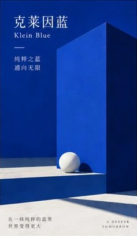 **C-01** · Klein Blue <small>A DEEPER TOMORROW</small> 

View Color Prompt
 `Theme color: Klein Blue.`
 | 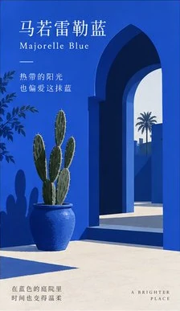 **C-02** · Majorelle Blue <small>A BRIGHTER PLACE</small> 

View Color Prompt
 `Theme color: Majorelle Blue.`
 | 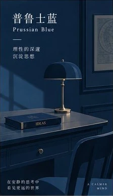 **C-03** · Prussian Blue <small>A CALMER MIND</small> 

View Color Prompt
 `Theme color: Prussian Blue.`
 |
| 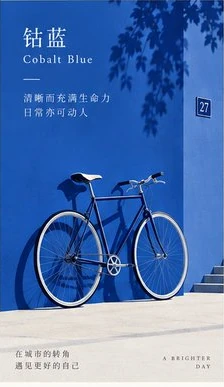 **C-04** · Cobalt Blue <small>A BRIGHTER DAY</small> 

View Color Prompt
 `Theme color: Cobalt Blue.`
 | 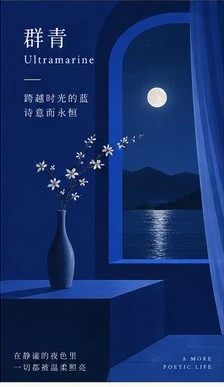 **C-05** · Ultramarine <small>A MORE POETIC LIFE</small> 

View Color Prompt
 `Theme color: Ultramarine.`
 | 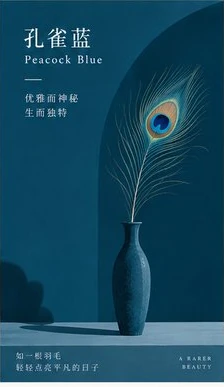 **C-06** · Peacock Blue <small>A RARER BEAUTY</small> 

View Color Prompt
 `Theme color: Peacock Blue.`
 |

---

## 2. Fresh Green (6 Colors)

Natural, healing, and breezy green tones, ideal for lifestyle, wellness, flora, and food themes.

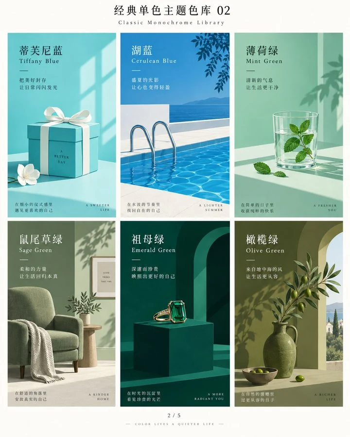

| Visual Preview | Visual Preview | Visual Preview |
| :---: | :---: | :---: |
| 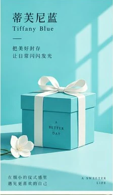 **C-07** · Tiffany Blue <small>A SWEETER LIFE</small> 

View Color Prompt
 `Theme color: Tiffany Blue.`
 | 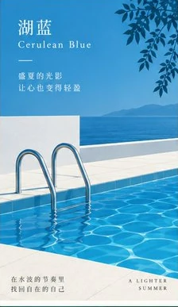 **C-08** · Cerulean Blue <small>A LIGHTER SUMMER</small> 

View Color Prompt
 `Theme color: Cerulean Blue.`
 | 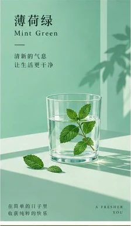 **C-09** · Mint Green <small>A FRESHER YOU</small> 

View Color Prompt
 `Theme color: Mint Green.`
 |
| 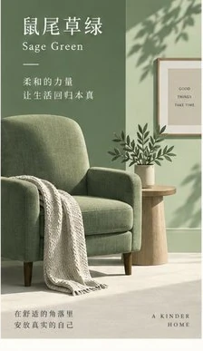 **C-10** · Sage Green <small>A KINDER HOME</small> 

View Color Prompt
 `Theme color: Sage Green.`
 | 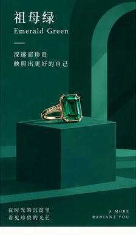 **C-11** · Emerald Green <small>A MORE RADIANT YOU</small> 

View Color Prompt
 `Theme color: Emerald Green.`
 | 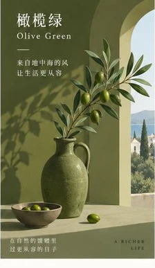 **C-12** · Olive Green <small>A RICHER LIFE</small> 

View Color Prompt
 `Theme color: Olive Green.`
 |

---

## 3. Classic Red & Vintage (6 Colors)

Historical and rich classical tones, ideal for festivals, heritage, vintage, and narrative themes.

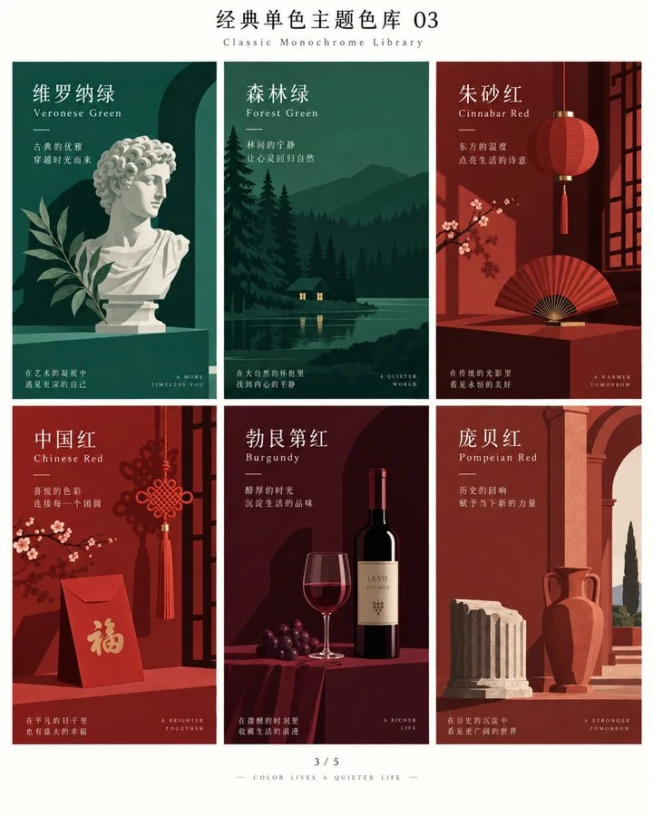

| Visual Preview | Visual Preview | Visual Preview |
| :---: | :---: | :---: |
| 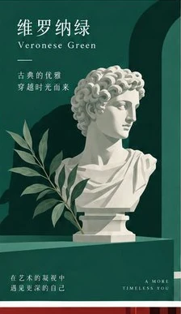 **C-13** · Veronese Green <small>A MORE TIMELESS YOU</small> 

View Color Prompt
 `Theme color: Veronese Green.`
 | 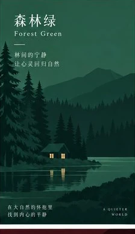 **C-14** · Forest Green <small>A QUIETER WORLD</small> 

View Color Prompt
 `Theme color: Forest Green.`
 | 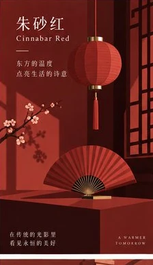 **C-15** · Cinnabar Red <small>A WARMER TOMORROW</small> 

View Color Prompt
 `Theme color: Cinnabar Red.`
 |
| 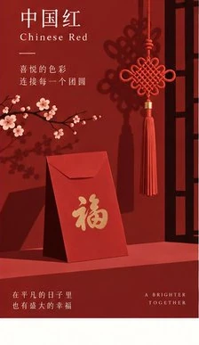 **C-16** · Chinese Red <small>A BRIGHTER TOGETHER</small> 

View Color Prompt
 `Theme color: Chinese Red.`
 | 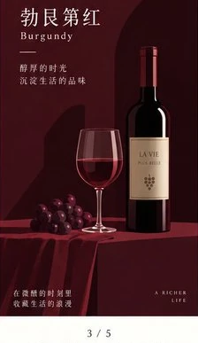 **C-17** · Burgundy <small>A RICHER LIFE</small> 

View Color Prompt
 `Theme color: Burgundy.`
 | 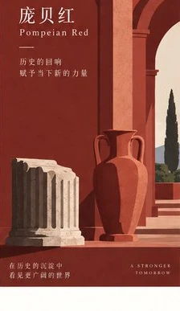 **C-18** · Pompeian Red <small>A STRONGER TOMORROW</small> 

View Color Prompt
 `Theme color: Pompeian Red.`
 |

---

## 4. Romantic Pink & Purple (6 Colors)

Gentle, elegant, and romantic palettes, ideal for feminine lifestyle, poetry, cosmetics, and self-expression.

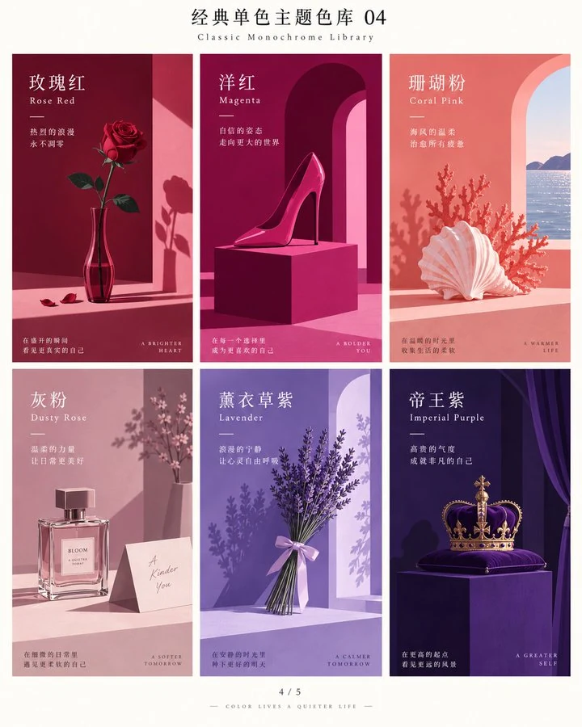

| Visual Preview | Visual Preview | Visual Preview |
| :---: | :---: | :---: |
| 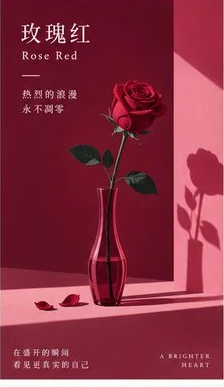 **C-19** · Rose Red <small>A BRIGHTER HEART</small> 

View Color Prompt
 `Theme color: Rose Red.`
 | 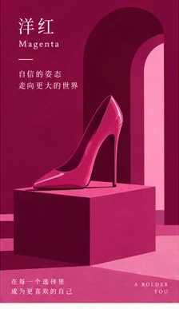 **C-20** · Magenta <small>A BOLDER YOU</small> 

View Color Prompt
 `Theme color: Magenta.`
 | 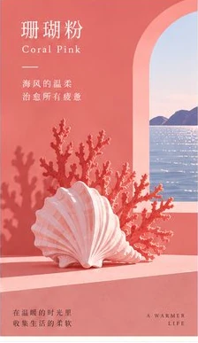 **C-21** · Coral Pink <small>A WARMER LIFE</small> 

View Color Prompt
 `Theme color: Coral Pink.`
 |
| 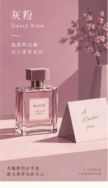 **C-22** · Dusty Rose <small>A SOFTER TOMORROW</small> 

View Color Prompt
 `Theme color: Dusty Rose.`
 | 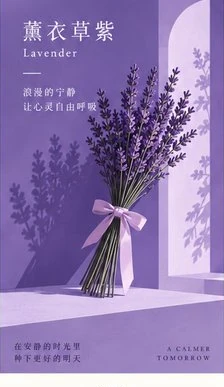 **C-23** · Lavender <small>A CALMER TOMORROW</small> 

View Color Prompt
 `Theme color: Lavender.`
 | 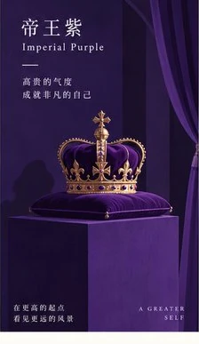 **C-24** · Imperial Purple <small>A GREATER SELF</small> 

View Color Prompt
 `Theme color: Imperial Purple.`
 |

---

## 5. Warm Sun & Earth (6 Colors)

Warm, sunny, and grounded earth tones, ideal for morning light, coffee, autumn, and cozy daily life.

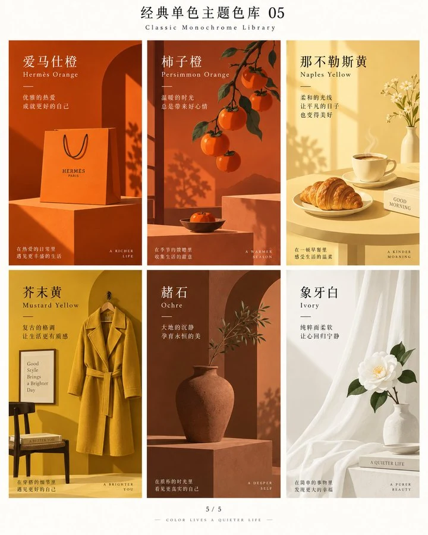

| Visual Preview | Visual Preview | Visual Preview |
| :---: | :---: | :---: |
| 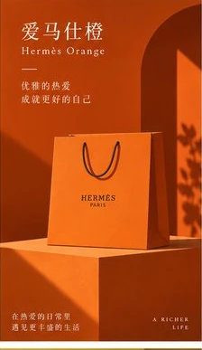 **C-25** · Hermès Orange <small>A RICHER LIFE</small> 

View Color Prompt
 `Theme color: Hermès Orange.`
 | 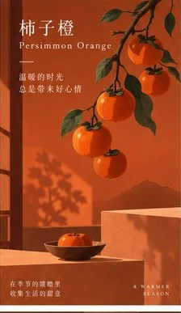 **C-26** · Persimmon Orange <small>A WARMER SEASON</small> 

View Color Prompt
 `Theme color: Persimmon Orange.`
 | 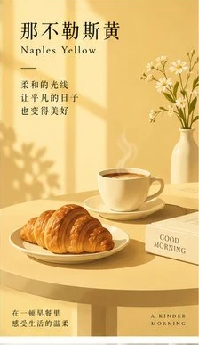 **C-27** · Naples Yellow <small>A KINDER MORNING</small> 

View Color Prompt
 `Theme color: Naples Yellow.`
 |
| 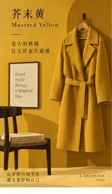 **C-28** · Mustard Yellow <small>A BRIGHTER YOU</small> 

View Color Prompt
 `Theme color: Mustard Yellow.`
 | 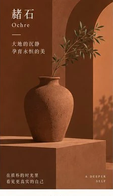 **C-29** · Ochre <small>A DEEPER SELF</small> 

View Color Prompt
 `Theme color: Ochre.`
 | 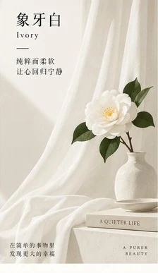 **C-30** · Ivory <small>A PURER BEAUTY</small> 

View Color Prompt
 `Theme color: Ivory.`
 |

---
