

  <a href="LAYOUTS.md">中文</a> | <strong>English</strong>

# Layout Composition Visual Sheet (119 Layouts)

> Visual previews and layout prompts for all **119 layout compositions** (Social Cards, Infographics, Comic Storyboards). Specify layout IDs (e.g. `SC-001`, `IG-003`, `SB-002`) during AI image generation to control compositions, text placements, and visual hierarchy.

## Table of Contents

- [1. Social Cards (19 Layouts)](#social-cards)
- [2. Infographics (31 Layouts)](#infographics)
- [3. Comic Storyboards (68 Layouts)](#comic-storyboards)

---

## 1. Social Cards (19 Layouts)

Ideal for Xiaohongshu, Instagram, newsletter hero images, and quote cards. Includes top-bottom split, text-driven cards, two-column contrasts, and sticky notes.

| Preview | Preview | Preview |
| :---: | :---: | :---: |
|  **SC-001** · Text-Above-Image Social Card 

View Layout Prompt
 Xiaohongshu social-media card. Use a text-above-image layout: place the theme copy and concise supporting text in the upper section, with a complete primary or scene illustration below. Keep a clear top-to-bottom reading order, let the text and image relate naturally, and keep the overall composition simple.
 |  **SC-002** · Text-Dominant Bottom-Graphic Card 

View Layout Prompt
 Xiaohongshu social-media card. Layout: text is the visual focal point; a simple graphic at the bottom plays a supporting role, with generous separation between text and image. Solid-color background, ample negative space, and a simple composition.
 |  **SC-003** · Two-Panel Stacked Card 

View Layout Prompt
 Xiaohongshu social-media card. Layout: no separate headline; create from the theme. Two framed panels stacked vertically; each panel has one line of text above an illustration, with no hard text-image division. Solid-color background, generous negative space, highly simplified characters, and a simple composition.
 |
| 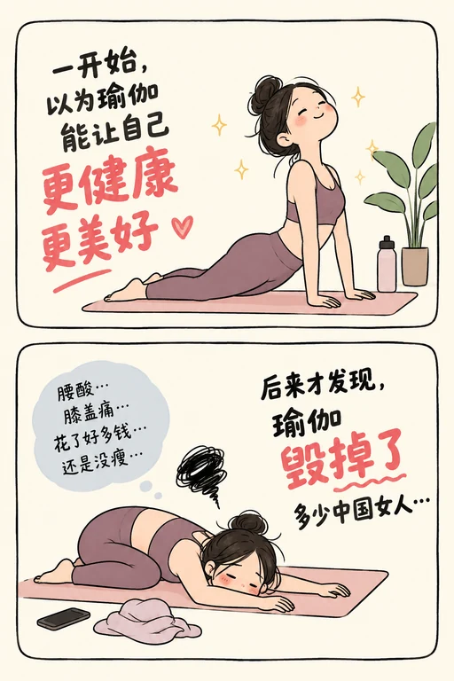 **SC-004** · Two-Panel Split Section Card 

View Layout Prompt
 Xiaohongshu social-media card. Layout: no separate headline; create from the theme. Two framed panels stacked vertically; every panel has an image area and a text area. The text area may sit above, left, or right of the image and contains concise copy without excessive expansion. Solid-color background, generous negative space, highly simplified characters, and a simple composition.
 |  **SC-005** · Thought-Bubble Character Card 

View Layout Prompt
 Xiaohongshu social-media card. Layout: no separate headline; the visual focus is a thought-bubble text based on the theme, with a thinking IP character placed in the lower-left or lower-right. Keep the composition simple with generous negative space.
 |  **SC-006** · Three-Tier Headline Graphic Card 

View Layout Prompt
 Xiaohongshu social-media card. Use a three-level layout: place the main headline in the upper section, a small simple supporting illustration in the middle, and a secondary headline in the lower section. Use a solid-color background, generous negative space, and a simple overall composition.
 |
|  **SC-007** · Quote Keyword Typography Card 

View Layout Prompt
 Xiaohongshu text-led social-media card. Layout: place a prominent opening quotation mark in the upper-left, present the theme copy in the center with key words emphasized, and add an underline in the lower-right. An emoji may appear at the end of the sentence, sized to match the text. Keep the composition simple and typography-led.
 |  **SC-008** · Image-Above-Text Whitespace Card 

View Layout Prompt
 Xiaohongshu social-media card. Use an image-above-text layout, with a highly simplified character or scene illustration above and the theme copy below. Do not add a visible boundary between the image and text; let them flow together naturally. Use a solid-color background, generous negative space, and a simple overall composition.
 |  **SC-009** · Centered Text Corner Graphic Card 

View Layout Prompt
 Xiaohongshu text-led social-media card. Layout: make the theme text the visual focus and center it in the composition; place a small simple illustration in the lower-right corner as supporting content without competing with the text. Keep the overall composition simple.
 |
|  **SC-010** · Two-Panel List & Graphic Card 

View Layout Prompt
 Xiaohongshu social-media card. Layout: create two stacked framed panels based on the theme, without a separate overall headline. Each panel contains a one-line heading, a concise two- or three-line list, and a simple supporting illustration. Keep the copy brief without over-expanding it, avoid a visible boundary between text and image, use a solid-color background with generous negative space, simplify the characters, and keep the composition simple.
 |  **SC-011** · Central Hero Multi-Scene Card 

View Layout Prompt
 Xiaohongshu social-media card. Layout: include a main headline, place one primary illustration in the center, surround it with 3–5 simple information illustrations that match the subject, and add 2–3 brief annotations about the subject. Use a solid-color background, generous negative space, highly simplified characters, and a simple overall composition.
 |  **SC-012** · Center Title Top-Bottom Icon Card 

View Layout Prompt
 Xiaohongshu social-media card. Layout: center the headline vertically, arrange two neat rows of icons above it, and arrange two more neat rows of icons below it to form a balanced structure around the central headline. Keep the icon arrangement clear and the composition simple.
 |
|  **SC-014** · Whitespace-Driven Hero Information Card 

View Layout Prompt
 Xiaohongshu social-media card with generous negative space. Place a prominent one- or two-line short headline at the top, clearly separated from the main subject area. In the middle and lower area, place one large primary visual occupying most of the composition; it may be centered, left-weighted, or right-weighted rather than locked to one position. Let the primary visual's silhouette, pose, and spatial footprint naturally create several areas of open space. Insert 4–6 smaller information units into those open spaces, each made of a small visual element and extremely short text. Let their positions follow the space left by the primary visual rather than preset columns; do not distribute them evenly around the subject or create regular side-by-side columns. Keep the small units clearly smaller than the primary visual and close to the gaps created by its outline, with varied vertical positions and density. Do not use uniform card frames, regular grids, tables, or obvious divider lines. A very short summary sentence may appear at the bottom as a closing element. Prioritize the main visual, let whitespace drive the placement, and weave information into the composition so it reads as one complete scene rather than assembled modules.
 |  **SC-015** · Two-Tier Progressive Short-Phrase Card 

View Layout Prompt
 Xiaohongshu social-media card. Use a two-section vertical structure with two similarly sized content areas separated by clear spacing or a subtle divider. Give both sections a consistent visual language and related internal structure so they express contrast, before-and-after, a turn, or progression. Each section begins with a prominent core short phrase as the first visual level and includes one clearly large primary visual, creating an asymmetrical horizontal or diagonal balance with the phrase; adjust the visual's position according to whitespace and overall weight. Place concise two- to four-line supporting text in the remaining space, without making it a separate card or regular list. Keep the two sections similar in visual weight and reading rhythm without mirroring them exactly; vary the title position, visual direction, or whitespace distribution slightly. The second section may include a very short transition, contrast word, or relationship cue. Emphasize “two stacked sections + large short phrases + one primary visual per section + limited supporting copy.” Avoid complex infographics, dense text, regular grids, and excessive decoration; preserve generous negative space, clear hierarchy, and fast mobile reading.
 |  **SC-016** · Minimalist Big-Type Accent Card 

View Layout Prompt
 Xiaohongshu social-media card. Use an extremely minimal, spacious layout with a short piece of large typography as the absolute visual focus. Place the main copy in the upper or upper-middle area, spanning most of the available width and naturally wrapping across two or three lines. Align the text generally to the left without pressing it against the edge, creating a stable block. Make the main copy much larger than every other element with relatively tight line spacing. Emphasize only selected keywords through color, weight, a subtle background mark, or a light accent; do not let multiple words compete for attention. Leave generous space below the copy and place one very small visual accent in the center or slightly to one side as a secondary visual pause, without carrying primary information. The four corners may contain only a few tiny supporting details such as a date, page number, symbol, or decorative dot, all with very low visual weight. Do not use card frames, columns, information lists, or complex text-image combinations. Keep the background simple and emphasize large type, few elements, generous whitespace, and restrained decoration for a light, quiet, fast-to-read social cover.
 |
|  **SC-017** · Freely Annotated Whitespace Card 

View Layout Prompt
 Xiaohongshu social-media card. Layout: include a main headline, then distribute label text freely and naturally across the composition to provide brief annotations for the characters, objects, or scene elements. Let the text participate in the overall composition. Preserve generous negative space, use highly simplified characters, minimize decoration and complex sections, and keep the composition clean.
 |  **SC-018** · Center Hero Surrounding Info Card 

View Layout Prompt
 Xiaohongshu social-media card. Use a central-hero surrounding layout: place two levels of short headlines at the top, with the main headline prominent. Put one large person or object in the center as the absolute visual focus. Distribute 3–6 smaller independent illustrations around it, each accompanied by only an extremely short label or item name. Arrange the small illustrations freely and irregularly, staggered on the left, right, and below the hero rather than in a neat grid, while maintaining visual balance. Preserve generous negative space and clear gaps between the hero, small illustrations, and text to create a hierarchy of “one large subject plus multiple small information points.”
 |  **SC-019** · Central Character Leader-Line Card 

View Layout Prompt
 Xiaohongshu social-media card. Use a clear three-level structure of “top headline + large central person + scattered labels on both sides.” Place one prominent short headline at the top in the largest type, centered or slightly left-aligned. Put one complete person in the center as the absolute visual focus; the person should occupy about 60%–75% of the image height, extend from the upper-middle area toward the bottom, and retain a complete silhouette. Distribute 3–5 extremely short labels on both sides, each limited to one line or a short phrase, with brief thin lines, slashes, or leader lines pointing toward nearby parts of the person. Stagger and distribute the labels freely rather than as a regular list, while keeping left-right balance. Leave generous space between the person and text without covering the subject. Preserve a largely empty background and avoid complex graphic blocks, card frames, tables, or extra decoration for immediate mobile readability.
 |
|  **SC-020** · Asymmetric Hero & Group Cluster Card 

View Layout Prompt
 Xiaohongshu social-media card. Use an asymmetrical “one large visual plus one group” structure. Place a prominent one- or two-line short headline in a dedicated top title area, clearly separated from the body below. In the middle, place one large primary visual occupying most of the content area and weighted toward one side; concentrate 4–6 much smaller information units in one continuous, compact secondary group on the opposite side. The primary visual may be on the left or right, with the information group mirrored accordingly rather than fixed to one direction. Do not scatter the small units around the hero or across both sides. Arrange them with staggered rows, interleaved columns, or varied density; each unit consists of a small visual element and extremely short text. Let the primary visual occupy about 55%–70% of the middle content area and the information group about 25%–40%, separating them through whitespace rather than divider lines, uniform card frames, tables, or regular grids. A very short summary line may appear at the bottom. Emphasize “one large visual block plus one concentrated small information cluster”: asymmetrical but stable, avoiding radial layouts, all-around placement, even distribution, or scattered elements across the whole canvas.
 |  |  |

---

## 2. Infographics (31 Layouts)

Ideal for knowledge sharing, comparison charts, process workflows, and structured data visuals. Includes hierarchy pyramids, central icons, matrices, and multi-column comparison tables.

| Preview | Preview | Preview |
| :---: | :---: | :---: |
| 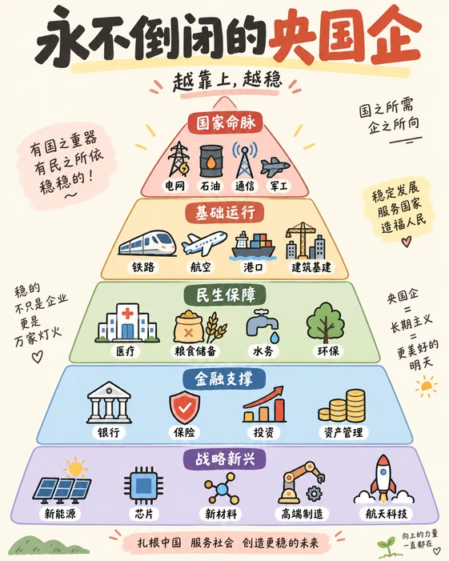 **IG-001** · Pyramid Hierarchy Icon Infographic 

View Layout Prompt
 Xiaohongshu infographic. Layout: place a clear headline at the top, use a tiered pyramid diagram as the main structure, and include multiple labeled icons in each tier to communicate the relationships between information layers clearly.
 | 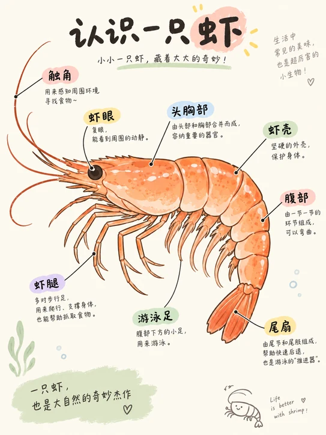 **IG-002** · Central Hero Callout Infographic 

View Layout Prompt
 Xiaohongshu infographic. Layout: place the main illustration in the center, surround it with multiple labeled annotations connected by leader lines, and point each line to a specific part of the subject for clear structural or detail explanations.
 |  **IG-003** · Multi-Row Side-by-Side Comparison 

View Layout Prompt
 Xiaohongshu infographic. Layout: place a main headline at the top, then build the body from multiple comparison rows. Each row uses a consistent left-text and right-image structure, with aligned rows that create a clear line-by-line comparison.
 |
|  **IG-004** · Two-Column Multi-Row Comparison 

View Layout Prompt
 Xiaohongshu infographic. Layout: place a main headline at the top, then organize the comparison into two side-by-side columns. Each column contains multiple corresponding rows; keep the columns clear and the rows aligned to emphasize item-by-item differences between the two subjects.
 |  **IG-005** · Hero Visual Catalog Infographic 

View Layout Prompt
 Xiaohongshu infographic. Use a vertical structure of “oversized headline at the top + large structural hero visual in the middle + catalog-like classification units at the bottom.” Place one prominent headline across a dedicated top title area, clearly larger than all other text, with clear spacing before the content below. Place one large, complete hero visual across most of the middle area as the core of the card; the hero visual may contain several internal regions and short labels embedded directly within it, integrating text with the visual instead of adding external callouts. Arrange multiple smaller independent visual units below in a regular but breathable multi-column layout. Each unit consists of a small visual with a short label underneath; keep sizes consistent and horizontal and vertical spacing stable to create the scanning rhythm of an atlas, directory, or category display. The smaller units may be numerous but must remain clearly subordinate to the central hero visual. Avoid complex card frames and establish order through whitespace, alignment, and repeated structure. The reading order is top headline → central whole structure → lower detailed categories; avoid side-by-side columns, excessive decoration, and irregular collage.
 |  **IG-006** · Multi-Tier Headline Icon Comparison 

View Layout Prompt
 Xiaohongshu infographic. Layout: include a main headline, then organize the body into multiple tiers. Place the tier title on the left of each tier and arrange multiple labeled icons neatly on the right to present comparisons between levels. Use a solid-color background, generous negative space, and a simple overall composition.
 |
|  **IG-007** · Bold Headline Tag Cards 

View Layout Prompt
 Xiaohongshu infographic. Layout: bold headline, multiple small labeled illustrations, one short line at the bottom, solid-color background, no frame, and generous negative space.
 | 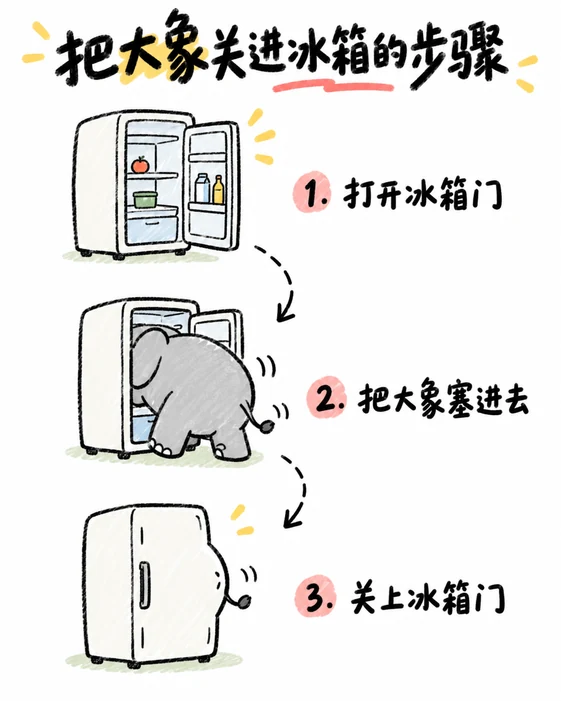 **IG-008** · Multi-Path Process Step Flow 

View Layout Prompt
 Xiaohongshu infographic. Layout: include a main headline and build the body as a process-step diagram. The sequence may use a horizontal, vertical, S-shaped, or another clearly readable path layout. Each step contains only one small illustration and one concise sentence, connected through direction, order, or light guidance. Preserve generous negative space and avoid complex decoration or excessive text.
 | 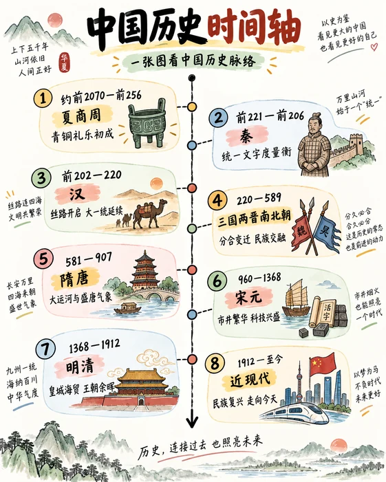 **IG-009** · Timeline Milestone Infographic 

View Layout Prompt
 Xiaohongshu infographic. Layout: include a main headline and build the body as a timeline, with one clear main axis connecting multiple nodes. The timeline may run horizontally or vertically. Each node contains one small illustration, a time marker, and one concise sentence. Keep the sequence clear and the hierarchy legible, preserve generous negative space, and avoid complex decoration or excessive text.
 |
|  **IG-010** · Stage Progression Infographic 

View Layout Prompt
 Xiaohongshu infographic. Layout: stage progression, emphasizing changes in level and advancement from lower to higher stages rather than chronological order. Place a short, prominent headline at the top. Use stairs, an ascending arrow, or a clear hierarchical structure to make the direction of progression immediately readable. Pair each stage with a simple small illustration, a level name, and a brief description. Keep the hierarchy clear and the wording concise. Preserve generous negative space, comfortable spacing between stages, and a simple composition.
 | 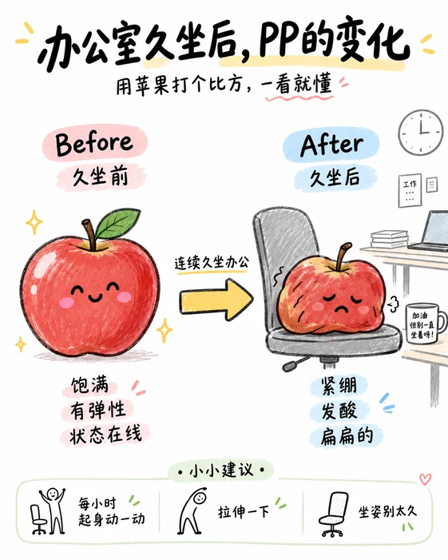 **IG-011** · Before & After Comparison Infographic 

View Layout Prompt
 Xiaohongshu infographic. Layout: Before / After comparison, with the change between the two states as the absolute visual focus. Organize the composition into two primary areas, arranged either side by side or one above the other. Place only an arrow, a date, or very limited explanatory text between them to show the direction of change. Give both Before and After a complete main visual that can be compared directly, and keep labels and wording concise. Preserve generous negative space and avoid complex decoration or excessive supporting information.
 |  **IG-012** · Layered Hierarchy Infographic 

View Layout Prompt
 Xiaohongshu infographic. Layout: layered structure, organizing information around an inherent hierarchy such as top-middle-bottom, inner-middle-outer, surface-deep, or a multi-level structure from foundation to core. Include a clear main headline. Use nested layers, stacked sections, or a bottom-to-top structure to present the hierarchy; each layer may include a concise name, short sentence, or small illustration. Keep the order and reading relationship clear, preserve generous negative space, and avoid complex decoration, dense text, or unrelated modules.
 |
|  **IG-013** · Conversion Funnel Infographic 

View Layout Prompt
 Xiaohongshu infographic. Layout: funnel-shaped, wide at the top and narrow at the bottom, using progressively narrowing layers to show a process from broad entry, filtering, and conversion to elimination and focused retention. Include a clear main headline. Give each funnel layer a concise stage name, short sentence, or small illustration, emphasizing that the people, objects, or scope become smaller while the focus becomes stronger. Keep the hierarchy clear, preserve generous negative space, and avoid complex decoration or excessive text.
 | 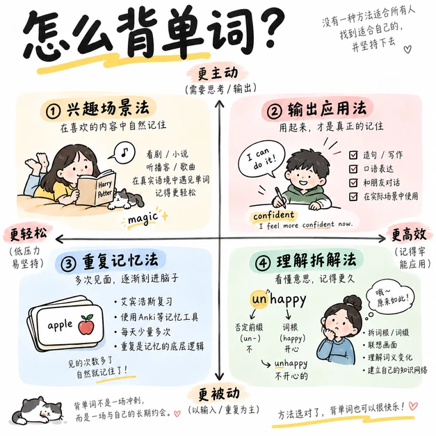 **IG-014** · Four-Quadrant Matrix Infographic 

View Layout Prompt
 Xiaohongshu infographic. Layout: matrix type, using two perpendicular axes to divide the content into four quadrants, preferably as a clear and readable 2×2 structure. Include a main headline and label the horizontal axis, vertical axis, and the meaning of both ends. Place one thematic unit in each quadrant, with a concise title, small illustration, and limited explanation. Keep the four areas aligned, evenly spaced, and easy to compare. Preserve generous negative space and avoid complex decoration or excessive text.
 | 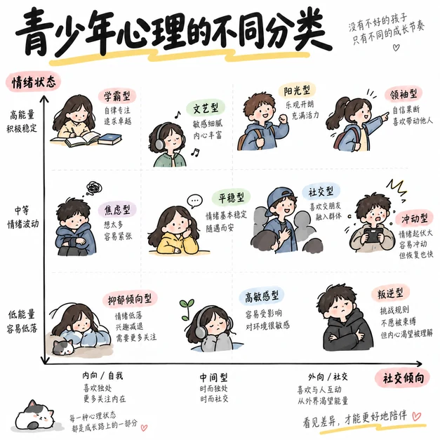 **IG-015** · Coordinate Scatter Plot Infographic 

View Layout Prompt
 Xiaohongshu infographic. Layout: coordinate scatter type, placing multiple different objects within a clear coordinate space and using their positions along the horizontal and vertical axes to express categories, tendencies, or relationships. Include a main headline and clearly label both axes and the meaning of their ends. Represent each object with a simple small illustration, name, and limited explanation; make the positions distinctive and easy to compare. Preserve generous negative space around the coordinate area and avoid complex decoration or excessive text.
 |
|  **IG-016** · Categorical Tree Hierarchy Infographic 

View Layout Prompt
 Xiaohongshu infographic. Layout: category tree or hierarchy tree, beginning with one core category or root node and branching downward into several major subcategories, then continuing into more detailed child or terminal nodes. Include a clear main headline. Place the root at the top or upper center, and use connecting lines to show parent-child relationships and branch paths. Give each node a concise name or minimal explanation; the hierarchy depth, branch order, and reading path must remain clear. Keep appropriate negative space and avoid excessive decoration or unrelated information.
 |  **IG-017** · Mind Map Radial Infographic 

View Layout Prompt
 Xiaohongshu infographic. Layout: mind-map type, with one central topic as the core node and multiple branches extending outward. Each branch contains concise labels or small icons, clearly expressing the hierarchy from the center to subtopics. Avoid rigid tables and dense text; use natural curved connectors, generous negative space, and simplified characters to create a clear reading path.
 | 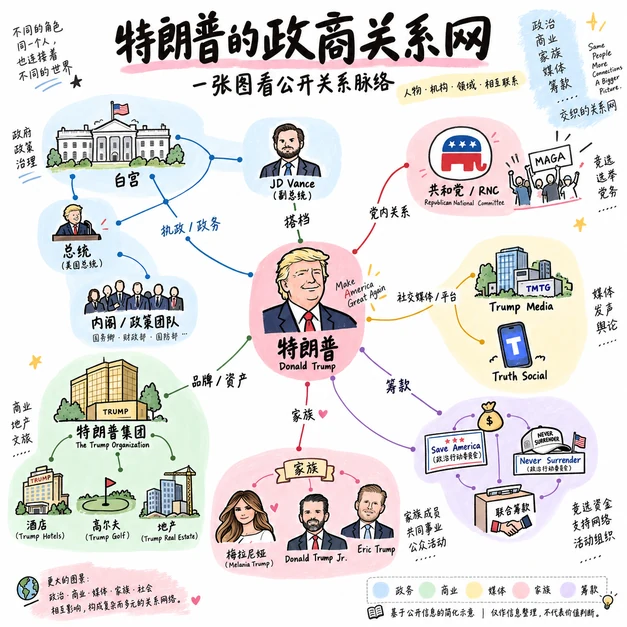 **IG-018** · Relationship Network Infographic 

View Layout Prompt
 Xiaohongshu infographic. Layout: relationship network, with multiple objects distributed across the canvas and connectors of varied color or weight showing collaboration, influence, dependency, or association. A weak center is acceptable and nodes do not need to be evenly distributed. Keep labels concise, preserve generous negative space, and avoid dense tables or explanations.
 |
|  **IG-019** · Closed-Loop Cycle Infographic 

View Layout Prompt
 Xiaohongshu infographic. Layout: closed-loop cycle, with several stages arranged in a circular path and connected by continuous arrows. Emphasize repetition, feedback, and iteration rather than a one-way beginning-to-end process. Keep a title or key conclusion in the center, pair nodes with small visuals and short phrases, and preserve clear negative space.
 | 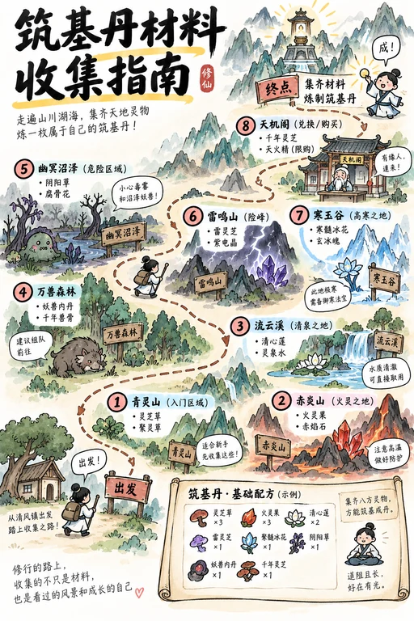 **IG-020** · Narrative Route Map Infographic 

View Layout Prompt
 Xiaohongshu infographic. Layout: path-map type, with one winding or game-map-like route crossing the canvas and several numbered nodes, locations, or stages along it. Pair each node with a small visual and one short explanation, using arrows, dashed lines, or signposts to show direction. It does not need to be a real map; emphasize the route and node relationships while preserving generous negative space.
 |  **IG-021** · Geographic Map with Annotations 

View Layout Prompt
 Xiaohongshu infographic. Layout: real map with annotations, using an authentic map outline, streets, waterways, or regional relationships as the main visual. Place location markers, very short explanations, and a few small icons on the map. Keep annotations away from important features, maintain clear hierarchy, and use a simple legend rather than a dense list.
 |
|  **IG-022** · Big Number Stat Highlight Infographic 

View Layout Prompt
 Xiaohongshu infographic. Layout: oversized-number type, using one or more huge numbers as the absolute visual focus. Surround them only with very short explanations, units, or object names. Let the numbers occupy the main area with strong impact, subordinate all other elements, keep the background generously empty, and avoid complex charts.
 |  **IG-023** · Leaderboard Ranking Infographic 

View Layout Prompt
 Xiaohongshu infographic. Layout: ranking type, arranging objects in an explicit order such as 1, 2, 3, 4, and 5. Pair each object with a small visual, a name, and one core metric. Use a vertical ranking, podium, or staggered tiered structure, emphasizing rank differences and the leading entry rather than making a generic unordered list.
 |  **IG-024** · Part-to-Whole Composition Infographic 

View Layout Prompt
 Xiaohongshu infographic. Layout: part-to-whole composition, using a donut chart, pie chart, 100-person icons, or area blocks to show how much each part contributes to the whole. Include a clear legend and only a few percentage labels. Make the main chart dominant, keep explanations short, distinguish colors clearly, and avoid too many metrics.
 |
|  **IG-025** · Scale Comparison Infographic 

View Layout Prompt
 Xiaohongshu infographic. Layout: scale comparison, arranging multiple objects from small to large according to real or relative size so that visual scale itself communicates the comparison. Keep objects highly simplified, add only very short names or stage labels, and use a baseline, arrow, or a few marks to reinforce progression. Keep the composition simple with generous negative space.
 | 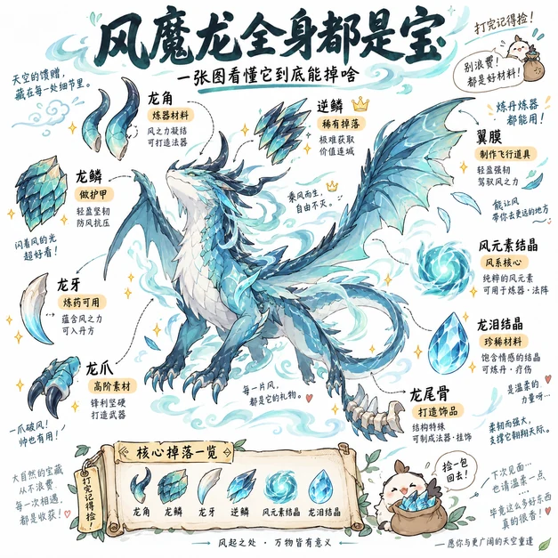 **IG-026** · Exploded Assembly View Infographic 

View Layout Prompt
 Xiaohongshu infographic. Layout: exploded-view type, with one complete object as the main subject and multiple parts separated and expanded around it. Use leader lines to identify each component and explain its purpose or compositional relationship. Emphasize what the object is made of rather than making a generic annotation diagram. Keep characters highly simplified, the composition simple, and the negative space generous.
 | 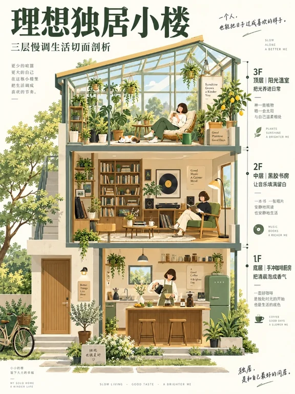 **IG-027** · Cutaway Sectional View Infographic 

View Layout Prompt
 Xiaohongshu infographic. Layout: sectional or cutaway type, slicing an integrated building or object open to reveal its interior spaces, floors, and functional zones. Let the cutaway be the dominant visual, with only a few floor labels or very short notes alongside it. Keep the cut edge and internal structure fully readable, simplify characters, and preserve generous negative space.
 |
|  **IG-028** · Continuous Scene Panoramic Infographic 

View Layout Prompt
 Xiaohongshu infographic. Layout: continuous-scene type, with the entire image forming one connected spatial or temporal scene and multiple information nodes naturally embedded in paths, people, buildings, and props. Do not split it into cards or a rigid grid; connect information through the scene itself, simplify characters, keep the composition clean, and preserve broad areas of sky, ground, or background negative space.
 |  **IG-029** · Character Ensemble Label Infographic 

View Layout Prompt
 Xiaohongshu infographic. Layout: character group with labels, using multiple characters in free positions rather than a rigid grid. Pair each character with one short label or very brief explanation, keeping clear spacing and visual balance. Use posture, props, and size differences to distinguish them. Keep characters highly simplified, leave the background generously empty, and avoid complex decoration.
 |  **IG-030** · Core Hero Knowledge Map Infographic 

View Layout Prompt
 Place one large core illustration occupying the main visual area as the primary subject. Distribute several clearly smaller visual units around it, with each unit paired with a very short label, name, or explanation. Let the smaller units form knowledge relationships around the core topic without requiring a rigid grid or perfectly even distribution. Use negative space, position, and light connections to express the overall relationship. Keep characters highly simplified, use a simple composition, and preserve generous negative space.
 |
|  **IG-031** · Encyclopedic Specimen Information Card 

View Layout Prompt
 Xiaohongshu infographic. Layout: Encyclopedic information card. Structured in three tiers: "top primary specimen display zone + middle asymmetrical multi-module information zone + bottom source reference zone". The top is centered around a primary visual object/specimen, accompanied by the main title, scientific name/subtitle, classification tags, and concise foundational details. The middle section organizes 6–10 information modules through hairline grids, coordinate systems, and golden-ratio compositions, integrating subheadings, short paragraphs, diagrams, comparative charts, data bars, maps, and timelines into a well-ordered, generous typographic balance. The bottom contains an understated numbering, footnote, or reference citation area, presenting a rational design aesthetic combining herbarium archival sheets with contemporary museum exhibition boards.
 |  **IG-032** · Hand-Drawn Editorial Knowledge Infographic 

View Layout Prompt
 Xiaohongshu infographic. Layout: Hand-drawn editorial knowledge infographic. Structured as "top oversized headline + central prominent hero visual + surrounding numbered knowledge modules + bottom summary section". The central hero visual is substantially larger than other elements, serving as the dominant visual focal point. 4 to 8 knowledge modules surround the core illustration naturally, each bearing a prominent numbered badge (such as 01, 02, 03, 04) to establish a clear reading sequence and list structure. Each numbered module contains a concise title, brief explanation, and miniature visual breakdown (such as mini-scene illustrations, icons, comparisons, process flows, thought bubbles, or mini comic panels). Modules flow organically around the core visual rather than adhering to a rigid grid, connected flexibly by arrows, tags, speech bubbles, and handwritten notes. The bottom features a concluding one-line takeaway, keywords, or checklist. The overall composition merges magazine editorial illustration, knowledge infographic diagramming, and light comic narrative into a lively hand-drawn aesthetic. Keep characters highly simplified, use a concise composition, and preserve generous negative space.
 |  |

---

## 3. Comic Storyboards (68 Layouts)

Ideal for multi-panel narratives, webtoons, emotional storylines, and cinematic pacing. Includes standard 4-panel grids, dramatic wide-angle focus, diagonal cuts, and manga storyboards.

| Preview | Preview | Preview |
| :---: | :---: | :---: |
|  **SB-001** · Regular Grid 

View Layout Prompt
 Comic storyboard. Layout: Regular Grid, panels of equal size arranged neatly in a consistent reading order, ideal for slice-of-life and dialogue-driven stories. Let this storyboard mechanism determine the page structure, reading flow, panel hierarchy, and pacing; output a complete single-page comic where panels tell a continuous story with consistent characters.
 | 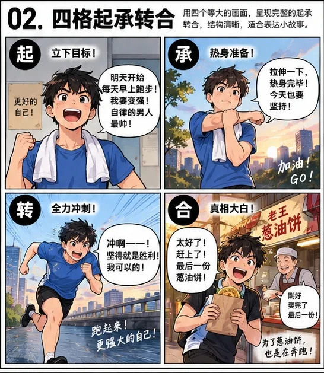 **SB-002** · Four-Panel Kishōtenketsu 

View Layout Prompt
 Comic storyboard. Layout: Four-Panel Kishōtenketsu, four equal panels sequentially presenting introduction, development, twist, and punchline, ideal for short comedic stories. Let this storyboard mechanism determine the page structure, reading flow, panel hierarchy, and pacing; output a complete single-page comic where panels tell a continuous story with consistent characters.
 |  **SB-003** · Hero Panel + Inset Panels 

View Layout Prompt
 Comic storyboard. Layout: Hero Panel + Inset Panels, one prominent large panel occupies primary area, supported by smaller secondary panels for reactions or details. Let this storyboard mechanism determine the page structure, reading flow, panel hierarchy, and pacing; output a complete single-page comic where panels tell a continuous story with consistent characters.
 |
| 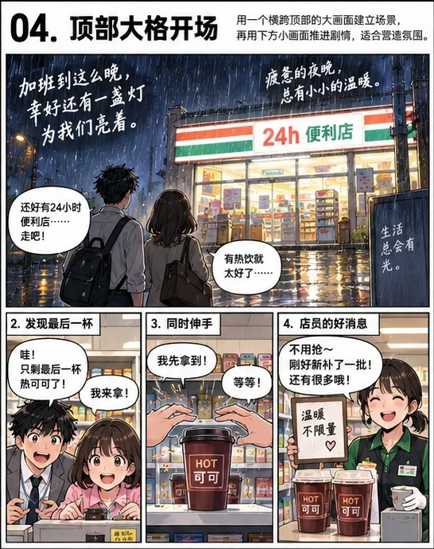 **SB-004** · Top Splash Panel Opening 

View Layout Prompt
 Comic storyboard. Layout: Top Splash Panel Opening, wide banner panel across top establishing scene and characters before subsequent sequential narrative below. Let this storyboard mechanism determine the page structure, reading flow, panel hierarchy, and pacing; output a complete single-page comic where panels tell a continuous story with consistent characters.
 |  **SB-005** · Bottom Climax Panel Ending 

View Layout Prompt
 Comic storyboard. Layout: Bottom Climax Panel Ending, smaller panels build narrative momentum leading to a large impactful bottom panel for climax or reveal. Let this storyboard mechanism determine the page structure, reading flow, panel hierarchy, and pacing; output a complete single-page comic where panels tell a continuous story with consistent characters.
 | 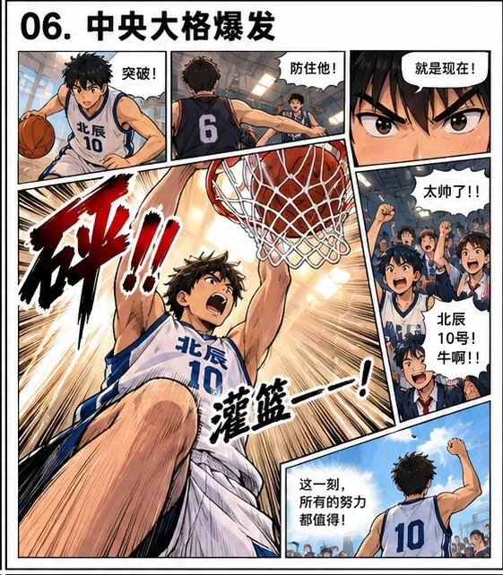 **SB-006** · Center Focal Panel 

View Layout Prompt
 Comic storyboard. Layout: Center Focal Panel, dominant central panel commanding maximum visual attention for action climax or core reveal. Let this storyboard mechanism determine the page structure, reading flow, panel hierarchy, and pacing; output a complete single-page comic where panels tell a continuous story with consistent characters.
 |
| 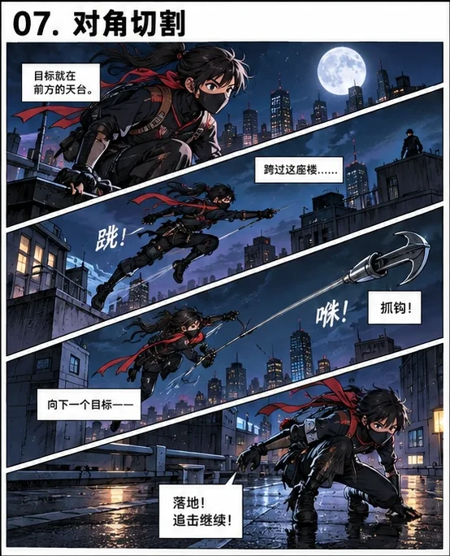 **SB-007** · Diagonal Dynamic Split 

View Layout Prompt
 Comic storyboard. Layout: Diagonal Dynamic Split, panels divided along diagonal angles, intensifying speed, conflict, pursuit, and confrontation. Let this storyboard mechanism determine the page structure, reading flow, panel hierarchy, and pacing; output a complete single-page comic where panels tell a continuous story with consistent characters.
 | 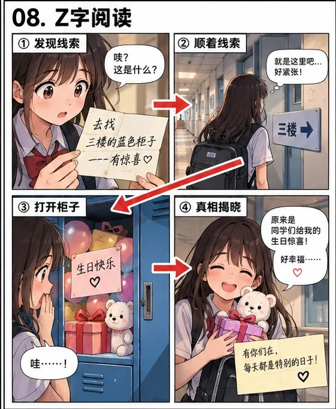 **SB-008** · Z-Pattern Reading Flow 

View Layout Prompt
 Comic storyboard. Layout: Z-Pattern Reading Flow, visual focus flows in a classic Z-path (top-left, top-right, bottom-left, bottom-right) for clear storytelling. Let this storyboard mechanism determine the page structure, reading flow, panel hierarchy, and pacing; output a complete single-page comic where panels tell a continuous story with consistent characters.
 |  **SB-009** · S-Curve Narrative Flow 

View Layout Prompt
 Comic storyboard. Layout: S-Curve Narrative Flow, characters and compositions follow a soft curving path, suitable for whimsical, romantic, or journey narratives. Let this storyboard mechanism determine the page structure, reading flow, panel hierarchy, and pacing; output a complete single-page comic where panels tell a continuous story with consistent characters.
 |
| 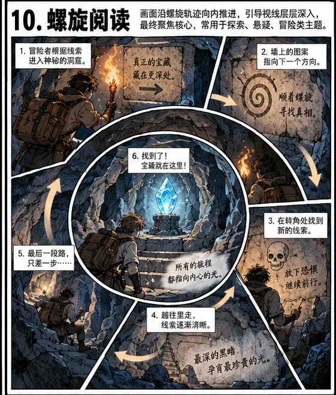 **SB-010** · Spiral Inward Flow 

View Layout Prompt
 Comic storyboard. Layout: Spiral Inward Flow, panels and gaze spiral inwards around center, gradually closing in on core event. Let this storyboard mechanism determine the page structure, reading flow, panel hierarchy, and pacing; output a complete single-page comic where panels tell a continuous story with consistent characters.
 | 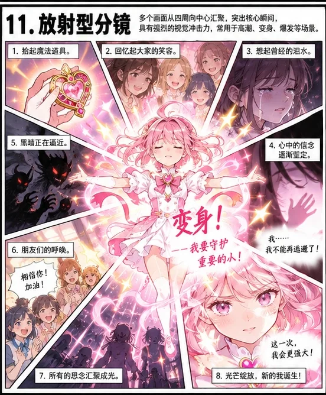 **SB-011** · Radial Converging Panels 

View Layout Prompt
 Comic storyboard. Layout: Radial Converging Panels, multiple panels radiate toward central focus, perfect for explosions, revelations, and high-impact moments. Let this storyboard mechanism determine the page structure, reading flow, panel hierarchy, and pacing; output a complete single-page comic where panels tell a continuous story with consistent characters.
 | 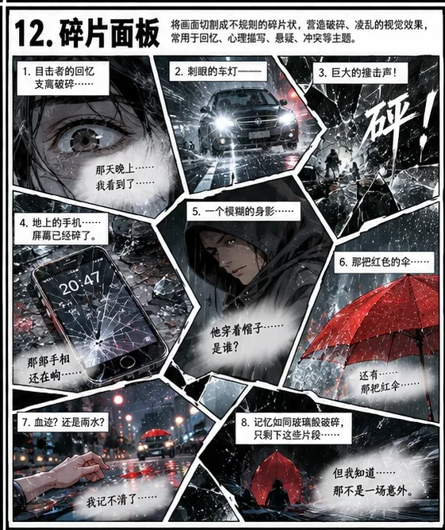 **SB-012** · Shattered Glass Panels 

View Layout Prompt
 Comic storyboard. Layout: Shattered Glass Panels, broken fragmented panels dividing screen like fractured glass, expressing chaos, combat, memories, and psychological shock. Let this storyboard mechanism determine the page structure, reading flow, panel hierarchy, and pacing; output a complete single-page comic where panels tell a continuous story with consistent characters.
 |
|  **SB-013** · Border Break 

View Layout Prompt
 Comic storyboard. Layout: Border Break, characters, actions, or visual effects break through panel boundaries, amplifying power, speed, and dimensional presence. Let this storyboard mechanism determine the page structure, reading flow, panel hierarchy, and pacing; output a complete single-page comic where panels tell a continuous story with consistent characters.
 | 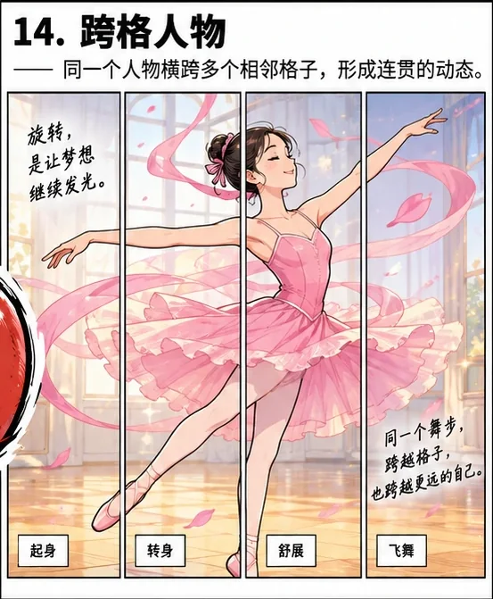 **SB-014** · Multi-Panel Spanning Character 

View Layout Prompt
 Comic storyboard. Layout: Multi-Panel Spanning Character, single character figure extends across multiple panels, creating continuous fluid action. Let this storyboard mechanism determine the page structure, reading flow, panel hierarchy, and pacing; output a complete single-page comic where panels tell a continuous story with consistent characters.
 | 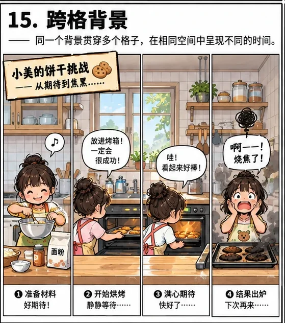 **SB-015** · Continuous Background Across Panels 

View Layout Prompt
 Comic storyboard. Layout: Continuous Background Across Panels, multiple panels share unified continuous panoramic background, with characters shown at different moments. Let this storyboard mechanism determine the page structure, reading flow, panel hierarchy, and pacing; output a complete single-page comic where panels tell a continuous story with consistent characters.
 |
|  **SB-016** · Single Continuous Take 

View Layout Prompt
 Comic storyboard. Layout: Single Continuous Take, entire page represents single unbroken environment, with characters appearing at multiple positions sequentially. Let this storyboard mechanism determine the page structure, reading flow, panel hierarchy, and pacing; output a complete single-page comic where panels tell a continuous story with consistent characters.
 | 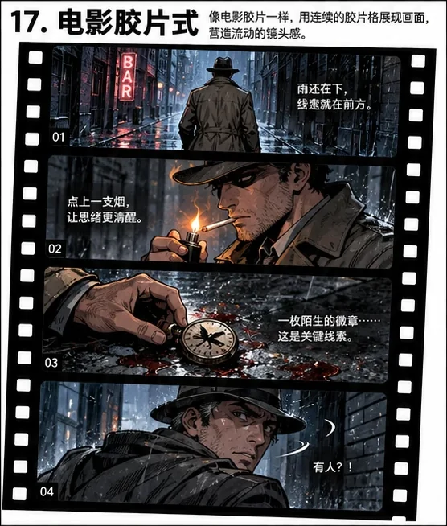 **SB-017** · Cinematic Filmstrip 

View Layout Prompt
 Comic storyboard. Layout: Cinematic Filmstrip, sequential filmstrip-like horizontal panels, emphasizing linear time progression and cinematic pacing. Let this storyboard mechanism determine the page structure, reading flow, panel hierarchy, and pacing; output a complete single-page comic where panels tell a continuous story with consistent characters.
 | 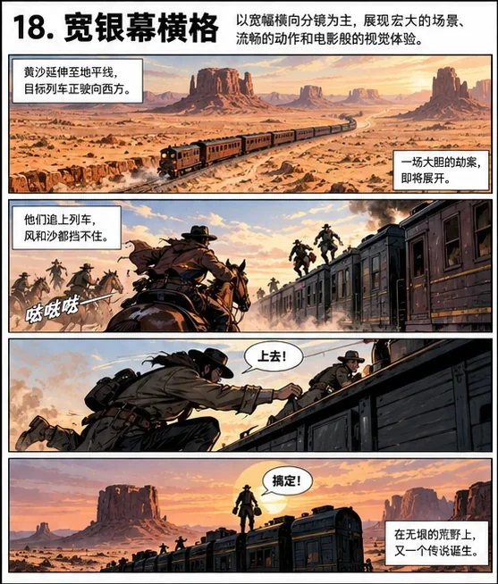 **SB-018** · Widescreen Horizontal Panels 

View Layout Prompt
 Comic storyboard. Layout: Widescreen Horizontal Panels, wide horizontal panels dominating page, ideal for cinematic landscapes, vehicle chases, and expansive scenes. Let this storyboard mechanism determine the page structure, reading flow, panel hierarchy, and pacing; output a complete single-page comic where panels tell a continuous story with consistent characters.
 |
| 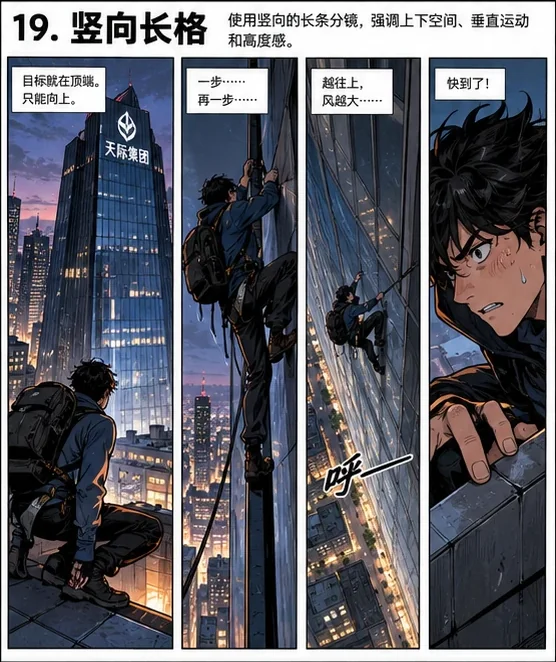 **SB-019** · Vertical Skyscraper Panels 

View Layout Prompt
 Comic storyboard. Layout: Vertical Skyscraper Panels, elongated vertical panels emphasizing falling, high-rise buildings, full-body figures, or upward motion. Let this storyboard mechanism determine the page structure, reading flow, panel hierarchy, and pacing; output a complete single-page comic where panels tell a continuous story with consistent characters.
 | 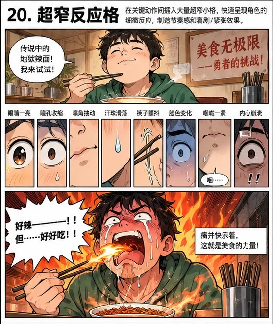 **SB-020** · Ultra-Slim Reaction Insets 

View Layout Prompt
 Comic storyboard. Layout: Ultra-Slim Reaction Insets, narrow slit-like panels inserted rapidly for eyes, mouth, hands, or micro-reactions, boosting pacing. Let this storyboard mechanism determine the page structure, reading flow, panel hierarchy, and pacing; output a complete single-page comic where panels tell a continuous story with consistent characters.
 | 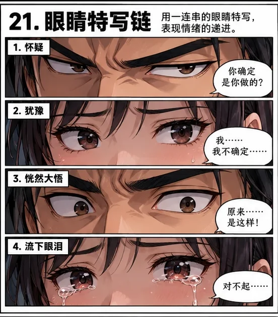 **SB-021** · Eye Close-Up Sequence 

View Layout Prompt
 Comic storyboard. Layout: Eye Close-Up Sequence, successive eye close-ups building confrontation, suspense, hesitation, or escalating tension. Let this storyboard mechanism determine the page structure, reading flow, panel hierarchy, and pacing; output a complete single-page comic where panels tell a continuous story with consistent characters.
 |
| 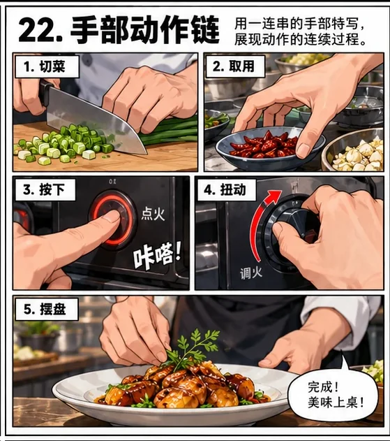 **SB-022** · Hand Action Sequence 

View Layout Prompt
 Comic storyboard. Layout: Hand Action Sequence, consecutive close-ups of hands, buttons, props, or tools driving key tactical actions forward. Let this storyboard mechanism determine the page structure, reading flow, panel hierarchy, and pacing; output a complete single-page comic where panels tell a continuous story with consistent characters.
 |  **SB-023** · Long Shot to Extreme Close-Up 

View Layout Prompt
 Comic storyboard. Layout: Long Shot to Extreme Close-Up, camera zooms from extreme wide shot to close-up, steadily accumulating emotional tension. Let this storyboard mechanism determine the page structure, reading flow, panel hierarchy, and pacing; output a complete single-page comic where panels tell a continuous story with consistent characters.
 | 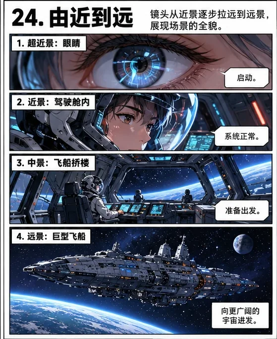 **SB-024** · Extreme Close-Up to Wide Reveal 

View Layout Prompt
 Comic storyboard. Layout: Extreme Close-Up to Wide Reveal, camera pulls back from extreme macro detail to wide environmental reveal, creating contrast. Let this storyboard mechanism determine the page structure, reading flow, panel hierarchy, and pacing; output a complete single-page comic where panels tell a continuous story with consistent characters.
 |
|  **SB-025** · Shot-Reverse-Shot 

View Layout Prompt
 Comic storyboard. Layout: Shot-Reverse-Shot, alternating character close-ups facing camera, perfect for dialogue, verbal sparring, and psychological duel. Let this storyboard mechanism determine the page structure, reading flow, panel hierarchy, and pacing; output a complete single-page comic where panels tell a continuous story with consistent characters.
 | 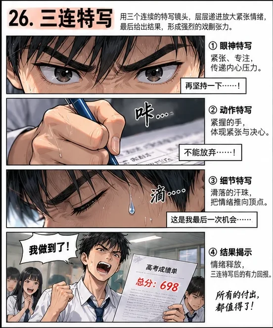 **SB-026** · Triple Rapid Close-Ups 

View Layout Prompt
 Comic storyboard. Layout: Triple Rapid Close-Ups, three consecutive rapid detail shots switching dynamically (e.g. eyes, finger, trigger). Let this storyboard mechanism determine the page structure, reading flow, panel hierarchy, and pacing; output a complete single-page comic where panels tell a continuous story with consistent characters.
 | 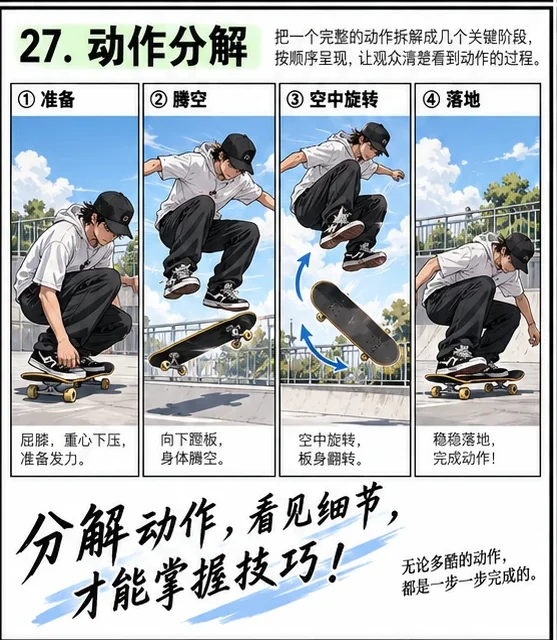 **SB-027** · Action Breakdown 

View Layout Prompt
 Comic storyboard. Layout: Action Breakdown, single dynamic action dissected into preparation, motion, contact, and aftermath across sequential panels. Let this storyboard mechanism determine the page structure, reading flow, panel hierarchy, and pacing; output a complete single-page comic where panels tell a continuous story with consistent characters.
 |
| 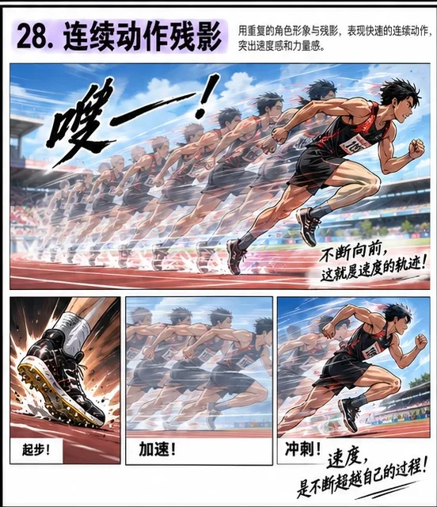 **SB-028** · Motion Trail Strobe Sequence 

View Layout Prompt
 Comic storyboard. Layout: Motion Trail Strobe Sequence, character repeated multiple times within panels depicting high-speed kinetic motion. Let this storyboard mechanism determine the page structure, reading flow, panel hierarchy, and pacing; output a complete single-page comic where panels tell a continuous story with consistent characters.
 | 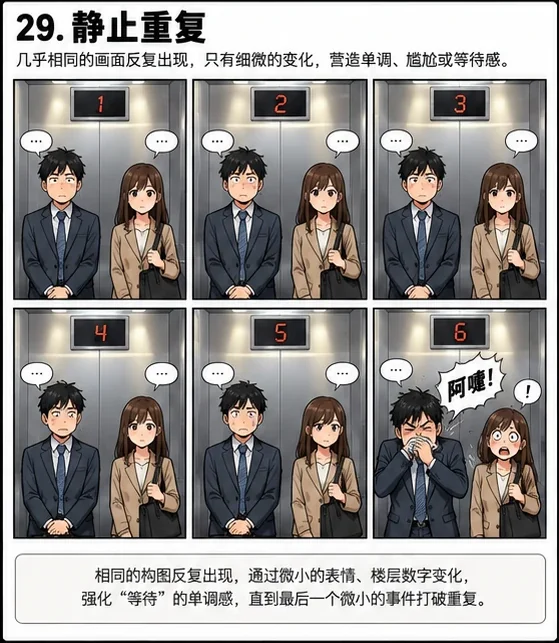 **SB-029** · Static Panel Repetition 

View Layout Prompt
 Comic storyboard. Layout: Static Panel Repetition, successive panels nearly identical with minimal shift, creating deadpan comedy, awkward pause, and comedic timing. Let this storyboard mechanism determine the page structure, reading flow, panel hierarchy, and pacing; output a complete single-page comic where panels tell a continuous story with consistent characters.
 |  **SB-030** · Sudden Pacing Halt 

View Layout Prompt
 Comic storyboard. Layout: Sudden Pacing Halt, rapid dense action suddenly interrupted by large empty negative space or quiet static frame for comedic anti-climax. Let this storyboard mechanism determine the page structure, reading flow, panel hierarchy, and pacing; output a complete single-page comic where panels tell a continuous story with consistent characters.
 |
| 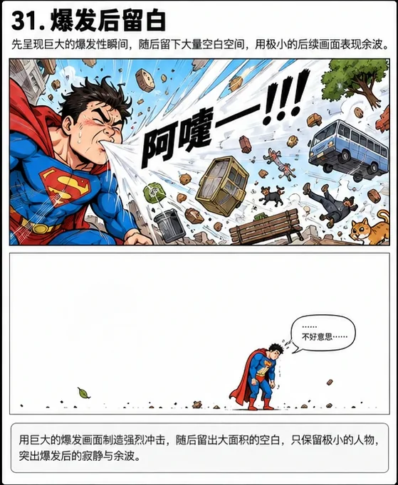 **SB-031** · Post-Climax Negative Space 

View Layout Prompt
 Comic storyboard. Layout: Post-Climax Negative Space, intense explosive action followed by generous white space and tiny silhouette, emphasizing absurdity or lingering mood. Let this storyboard mechanism determine the page structure, reading flow, panel hierarchy, and pacing; output a complete single-page comic where panels tell a continuous story with consistent characters.
 | 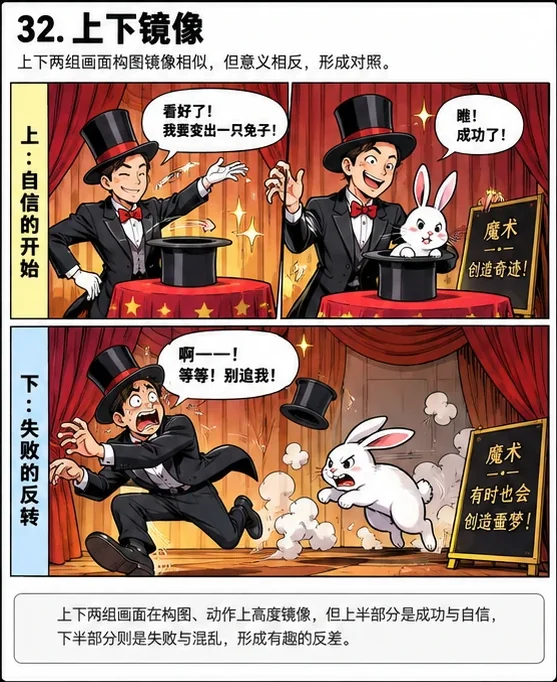 **SB-032** · Vertical Mirroring 

View Layout Prompt
 Comic storyboard. Layout: Vertical Mirroring, top and bottom halves feature symmetrical compositions with contrasted or inverted content for before-after comparison. Let this storyboard mechanism determine the page structure, reading flow, panel hierarchy, and pacing; output a complete single-page comic where panels tell a continuous story with consistent characters.
 | 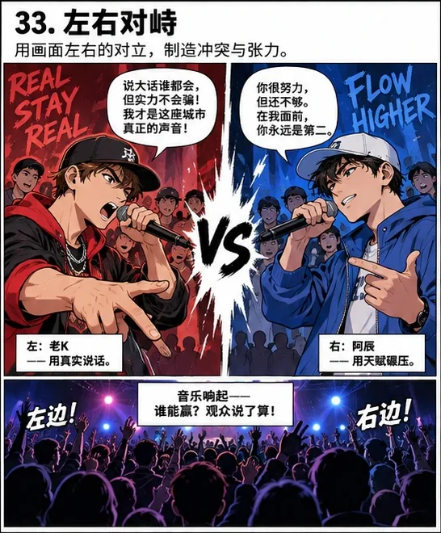 **SB-033** · Split-Side Confrontation 

View Layout Prompt
 Comic storyboard. Layout: Split-Side Confrontation, opposing characters or factions occupy left and right sides of page, creating direct visual tension. Let this storyboard mechanism determine the page structure, reading flow, panel hierarchy, and pacing; output a complete single-page comic where panels tell a continuous story with consistent characters.
 |
|  **SB-034** · Dual Parallel Storylines 

View Layout Prompt
 Comic storyboard. Layout: Dual Parallel Storylines, two simultaneous story tracks or locations progressing down page, converging at single point. Let this storyboard mechanism determine the page structure, reading flow, panel hierarchy, and pacing; output a complete single-page comic where panels tell a continuous story with consistent characters.
 |  **SB-035** · Cross-Cutting Parallel Action 

View Layout Prompt
 Comic storyboard. Layout: Cross-Cutting Parallel Action, rapid alternating sequence between events A and B, amplifying suspense or misunderstanding. Let this storyboard mechanism determine the page structure, reading flow, panel hierarchy, and pacing; output a complete single-page comic where panels tell a continuous story with consistent characters.
 | 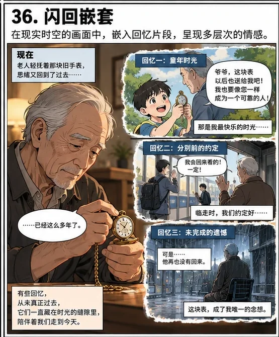 **SB-036** · Inset Memory Flashback 

View Layout Prompt
 Comic storyboard. Layout: Inset Memory Flashback, main panels embedded with smaller vintage or bordered insets representing memories or past events. Let this storyboard mechanism determine the page structure, reading flow, panel hierarchy, and pacing; output a complete single-page comic where panels tell a continuous story with consistent characters.
 |
| 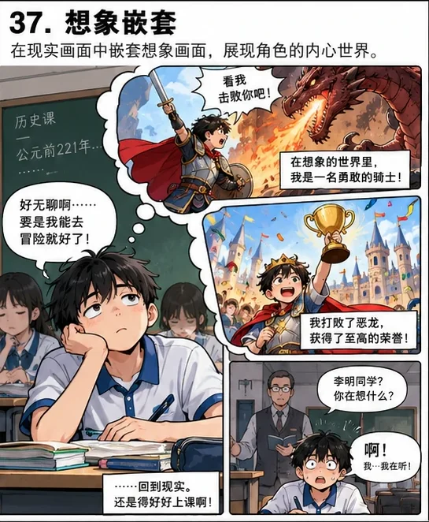 **SB-037** · Inset Fantasy Bubble 

View Layout Prompt
 Comic storyboard. Layout: Inset Fantasy Bubble, reality scenes overlaid with dream-bubble panels depicting character's internal imagination or comic thoughts. Let this storyboard mechanism determine the page structure, reading flow, panel hierarchy, and pacing; output a complete single-page comic where panels tell a continuous story with consistent characters.
 | 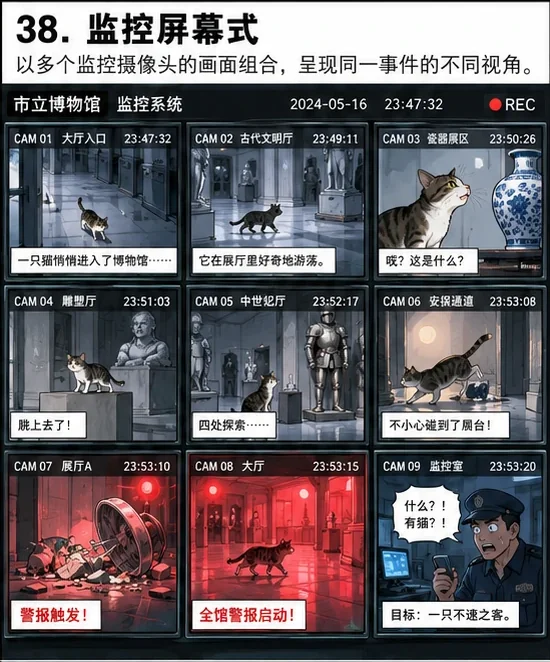 **SB-038** · Multi-CCTV Security Grid 

View Layout Prompt
 Comic storyboard. Layout: Multi-CCTV Security Grid, page structured like multi-channel surveillance monitor feeds, ideal for investigation and thriller narrative. Let this storyboard mechanism determine the page structure, reading flow, panel hierarchy, and pacing; output a complete single-page comic where panels tell a continuous story with consistent characters.
 |  **SB-039** · Smartphone Chat Overlay 

View Layout Prompt
 Comic storyboard. Layout: Smartphone Chat Overlay, real-life scene blended with phone messaging screens and speech bubbles for modern social media narrative. Let this storyboard mechanism determine the page structure, reading flow, panel hierarchy, and pacing; output a complete single-page comic where panels tell a continuous story with consistent characters.
 |
| 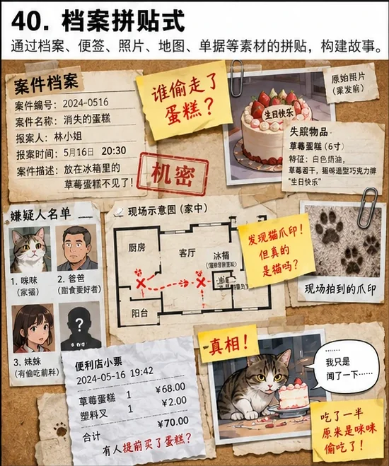 **SB-040** · Detective Case File Collage 

View Layout Prompt
 Comic storyboard. Layout: Detective Case File Collage, mix of photos, sticky notes, confidential memos, evidence pins, and comic panels for investigative stories. Let this storyboard mechanism determine the page structure, reading flow, panel hierarchy, and pacing; output a complete single-page comic where panels tell a continuous story with consistent characters.
 |  **SB-041** · Editorial Magazine Layout 

View Layout Prompt
 Comic storyboard. Layout: Editorial Magazine Layout, bold headlines, character cutouts, captions, and narrative panels composed like high-end editorial spread. Let this storyboard mechanism determine the page structure, reading flow, panel hierarchy, and pacing; output a complete single-page comic where panels tell a continuous story with consistent characters.
 | 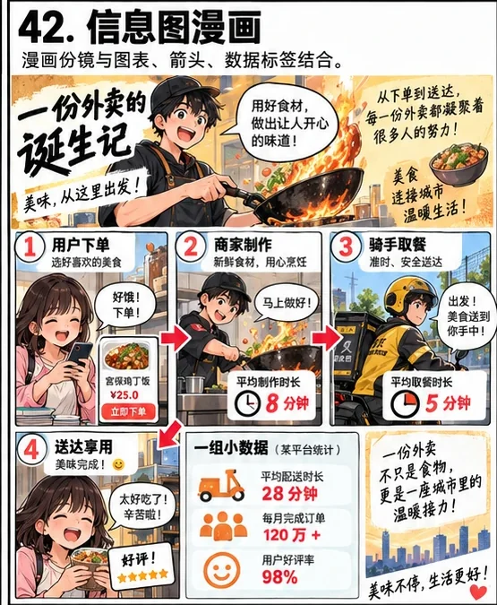 **SB-042** · Infographic Comic Hybrid 

View Layout Prompt
 Comic storyboard. Layout: Infographic Comic Hybrid, comic storytelling integrated with statistical charts, flow arrows, and data annotations for educational narrative. Let this storyboard mechanism determine the page structure, reading flow, panel hierarchy, and pacing; output a complete single-page comic where panels tell a continuous story with consistent characters.
 |
| 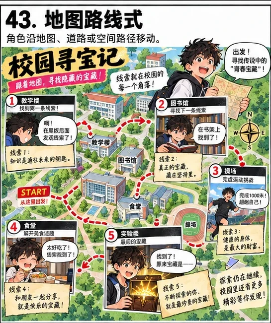 **SB-043** · Map & Trail Journey 

View Layout Prompt
 Comic storyboard. Layout: Map & Trail Journey, characters navigate along route map or spatial path, guiding reader's eye through the journey. Let this storyboard mechanism determine the page structure, reading flow, panel hierarchy, and pacing; output a complete single-page comic where panels tell a continuous story with consistent characters.
 | 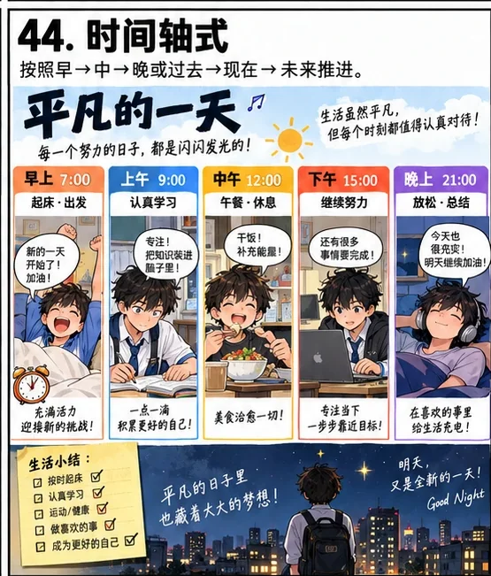 **SB-044** · Chronological Timeline Progression 

View Layout Prompt
 Comic storyboard. Layout: Chronological Timeline Progression, panels sequenced sequentially along time axis (morning to night or past to future). Let this storyboard mechanism determine the page structure, reading flow, panel hierarchy, and pacing; output a complete single-page comic where panels tell a continuous story with consistent characters.
 | 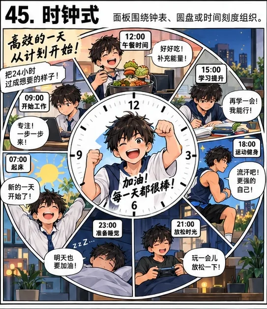 **SB-045** · Clock Face Radial Layout 

View Layout Prompt
 Comic storyboard. Layout: Clock Face Radial Layout, panels organized around circular clock face or timeline dial, ideal for 24-hour cycle or countdown motif. Let this storyboard mechanism determine the page structure, reading flow, panel hierarchy, and pacing; output a complete single-page comic where panels tell a continuous story with consistent characters.
 |
| 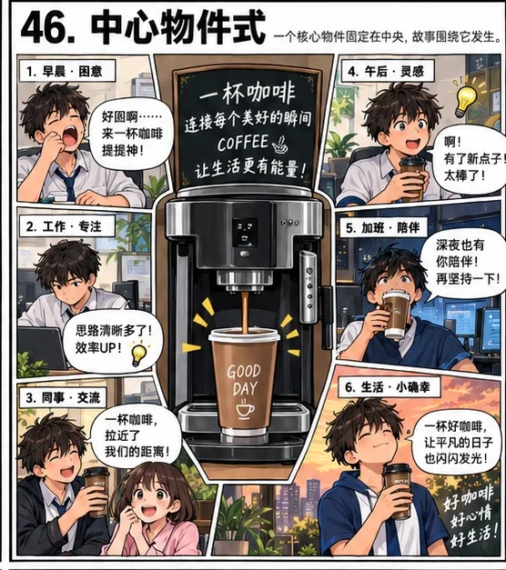 **SB-046** · Central Anchor Prop 

View Layout Prompt
 Comic storyboard. Layout: Central Anchor Prop, core object (coffee cup, phone, doorway, car) anchored in center with story unfolding around it. Let this storyboard mechanism determine the page structure, reading flow, panel hierarchy, and pacing; output a complete single-page comic where panels tell a continuous story with consistent characters.
 |  **SB-047** · Central Anchor Protagonist 

View Layout Prompt
 Comic storyboard. Layout: Central Anchor Protagonist, main protagonist anchored in center of page while surrounding panels rotate around their perspective. Let this storyboard mechanism determine the page structure, reading flow, panel hierarchy, and pacing; output a complete single-page comic where panels tell a continuous story with consistent characters.
 | 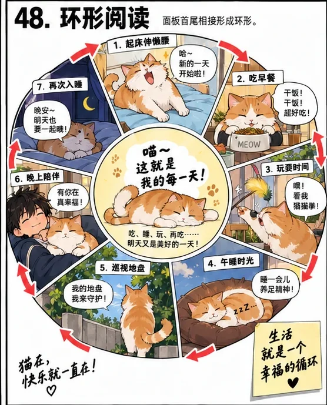 **SB-048** · Circular Loop Narrative 

View Layout Prompt
 Comic storyboard. Layout: Circular Loop Narrative, panels connect head-to-tail in closed loop, conveying recurring cycle, time loop, or karmic fate. Let this storyboard mechanism determine the page structure, reading flow, panel hierarchy, and pacing; output a complete single-page comic where panels tell a continuous story with consistent characters.
 |
| 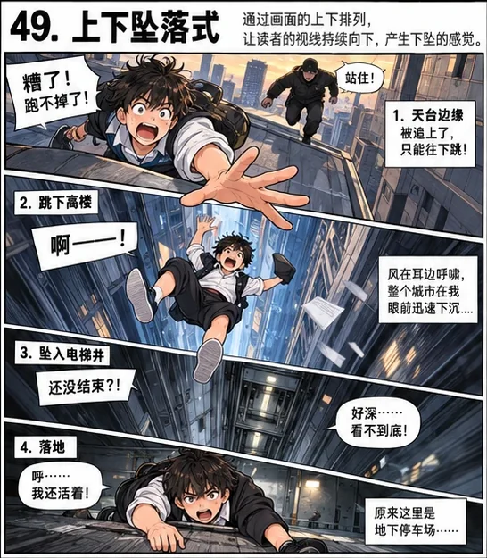 **SB-049** · Downward Plunge Flow 

View Layout Prompt
 Comic storyboard. Layout: Downward Plunge Flow, composition and reading path plunge downwards continuously, emphasizing falling, vertigo, and freefall chase. Let this storyboard mechanism determine the page structure, reading flow, panel hierarchy, and pacing; output a complete single-page comic where panels tell a continuous story with consistent characters.
 | 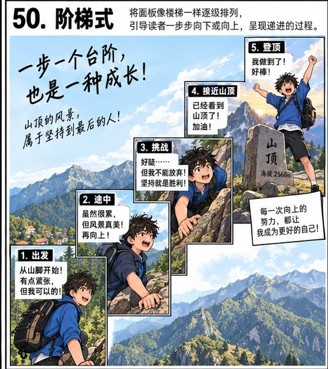 **SB-050** · Stepped Staircase Progression 

View Layout Prompt
 Comic storyboard. Layout: Stepped Staircase Progression, panels stepped diagonally like stairs, visually reinforcing uphill struggle, ascending journey, or level progression. Let this storyboard mechanism determine the page structure, reading flow, panel hierarchy, and pacing; output a complete single-page comic where panels tell a continuous story with consistent characters.
 | 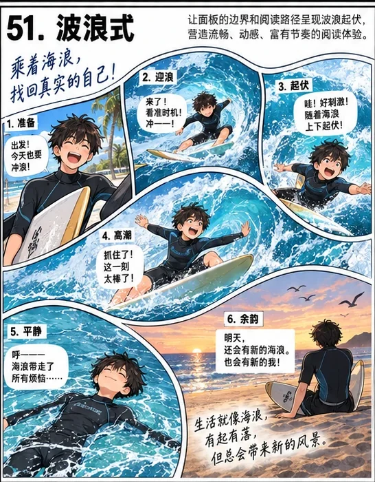 **SB-051** · Undulating Wave Flow 

View Layout Prompt
 Comic storyboard. Layout: Undulating Wave Flow, wavy panel contours and flowing rhythm, ideal for musical scenes, dreamy states, and lighthearted moods. Let this storyboard mechanism determine the page structure, reading flow, panel hierarchy, and pacing; output a complete single-page comic where panels tell a continuous story with consistent characters.
 |
| 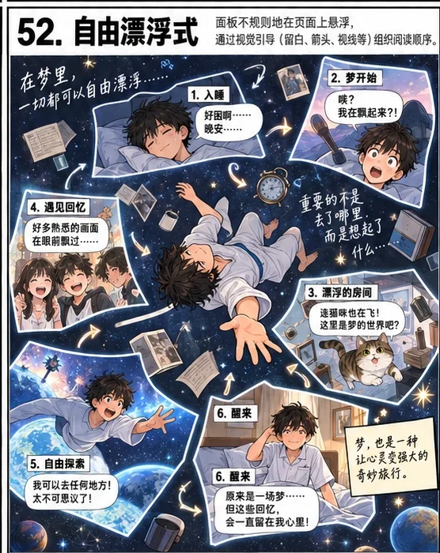 **SB-052** · Free-Floating Unframed Panels 

View Layout Prompt
 Comic storyboard. Layout: Free-Floating Unframed Panels, irregularly positioned panels floating freely across white space, guided by eyelines and speech balloons. Let this storyboard mechanism determine the page structure, reading flow, panel hierarchy, and pacing; output a complete single-page comic where panels tell a continuous story with consistent characters.
 | 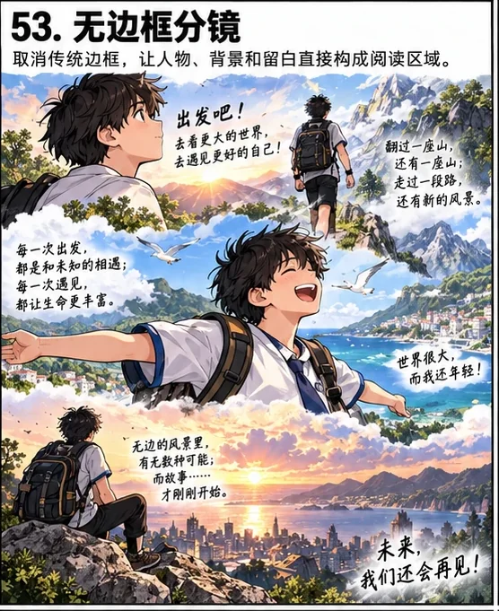 **SB-053** · Frameless Organic Narrative 

View Layout Prompt
 Comic storyboard. Layout: Frameless Organic Narrative, conventional panel borders removed entirely; characters, backgrounds, and negative space form organic reading zones. Let this storyboard mechanism determine the page structure, reading flow, panel hierarchy, and pacing; output a complete single-page comic where panels tell a continuous story with consistent characters.
 |  **SB-054** · Generous Negative Space 

View Layout Prompt
 Comic storyboard. Layout: Generous Negative Space, abundant white space isolating minimal characters and sparse dialogue, conveying quiet, poetic, or awkward atmosphere. Let this storyboard mechanism determine the page structure, reading flow, panel hierarchy, and pacing; output a complete single-page comic where panels tell a continuous story with consistent characters.
 |
| 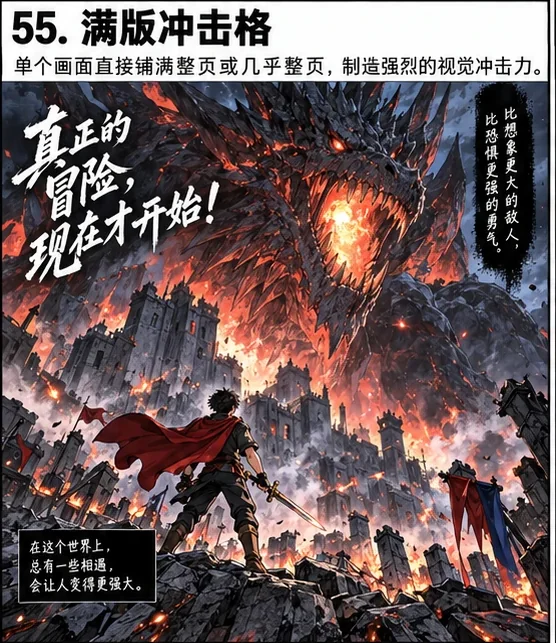 **SB-055** · Full-Bleed Splash Page 

View Layout Prompt
 Comic storyboard. Layout: Full-Bleed Splash Page, single monumental scene filling entire page with zero margin, delivering peak climax and iconic visual impact. Let this storyboard mechanism determine the page structure, reading flow, panel hierarchy, and pacing; output a complete single-page comic where panels tell a continuous story with consistent characters.
 |  **SB-056** · Simulated Double-Page Spread 

View Layout Prompt
 Comic storyboard. Layout: Simulated Double-Page Spread, simulated center gutter dividing page symmetrically, creating epic cinematic widescreen feel on single page. Let this storyboard mechanism determine the page structure, reading flow, panel hierarchy, and pacing; output a complete single-page comic where panels tell a continuous story with consistent characters.
 |  **SB-057** · Poster-Style Narrative 

View Layout Prompt
 Comic storyboard. Layout: Poster-Style Narrative, strong dominant poster-like hero visual surrounded by small supporting narrative panels. Let this storyboard mechanism determine the page structure, reading flow, panel hierarchy, and pacing; output a complete single-page comic where panels tell a continuous story with consistent characters.
 |
| 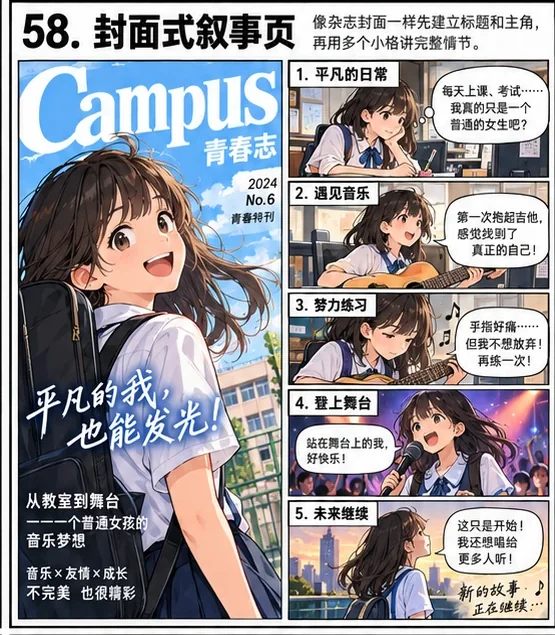 **SB-058** · Magazine Cover Narrative 

View Layout Prompt
 Comic storyboard. Layout: Magazine Cover Narrative, stylized magazine cover masthead and cover star surrounded by episodic panels telling complete story. Let this storyboard mechanism determine the page structure, reading flow, panel hierarchy, and pacing; output a complete single-page comic where panels tell a continuous story with consistent characters.
 | 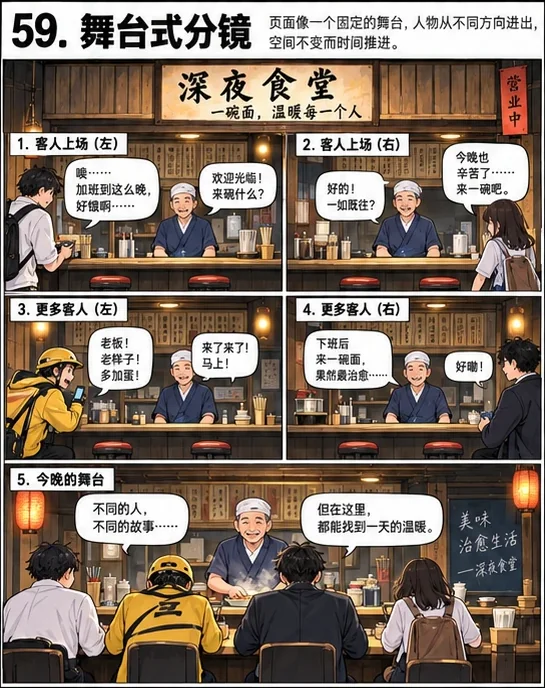 **SB-059** · Fixed Proscenium Stage 

View Layout Prompt
 Comic storyboard. Layout: Fixed Proscenium Stage, single fixed theatrical stage perspective where characters enter and exit while environment remains stationary. Let this storyboard mechanism determine the page structure, reading flow, panel hierarchy, and pacing; output a complete single-page comic where panels tell a continuous story with consistent characters.
 |  **SB-060** · Horizontal Continuous Scroll 

View Layout Prompt
 Comic storyboard. Layout: Horizontal Continuous Scroll, emulating traditional horizontal scroll where character appears multiple times across continuous landscape. Let this storyboard mechanism determine the page structure, reading flow, panel hierarchy, and pacing; output a complete single-page comic where panels tell a continuous story with consistent characters.
 |
| 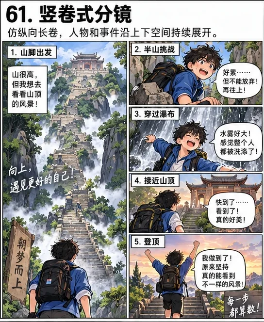 **SB-061** · Vertical Hanging Scroll 

View Layout Prompt
 Comic storyboard. Layout: Vertical Hanging Scroll, emulating vertical scroll where events and characters descend continuously down single tall space. Let this storyboard mechanism determine the page structure, reading flow, panel hierarchy, and pacing; output a complete single-page comic where panels tell a continuous story with consistent characters.
 | 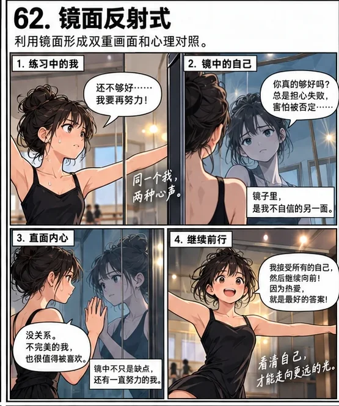 **SB-062** · Mirror Reflection Dualism 

View Layout Prompt
 Comic storyboard. Layout: Mirror Reflection Dualism, mirror surfaces, puddles, or reflections splitting scene into twin perspectives and psychological duality. Let this storyboard mechanism determine the page structure, reading flow, panel hierarchy, and pacing; output a complete single-page comic where panels tell a continuous story with consistent characters.
 | 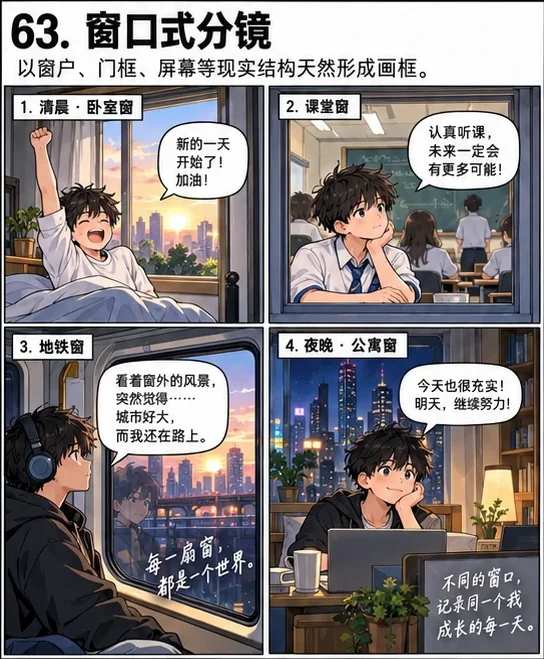 **SB-063** · Architectural Window Framing 

View Layout Prompt
 Comic storyboard. Layout: Architectural Window Framing, windows, door frames, balconies, or screens naturally forming visual panels. Let this storyboard mechanism determine the page structure, reading flow, panel hierarchy, and pacing; output a complete single-page comic where panels tell a continuous story with consistent characters.
 |
|  **SB-064** · Foreground Silhouette Framing 

View Layout Prompt
 Comic storyboard. Layout: Foreground Silhouette Framing, foreground elements (pillars, tree trunks, door jambs) naturally partitioning scene into narrative panels. Let this storyboard mechanism determine the page structure, reading flow, panel hierarchy, and pacing; output a complete single-page comic where panels tell a continuous story with consistent characters.
 |  **SB-065** · Typographic Scaffold Layout 

View Layout Prompt
 Comic storyboard. Layout: Typographic Scaffold Layout, monumental sound-effect characters or titles act as structural skeleton, with panels built around lettering. Let this storyboard mechanism determine the page structure, reading flow, panel hierarchy, and pacing; output a complete single-page comic where panels tell a continuous story with consistent characters.
 | 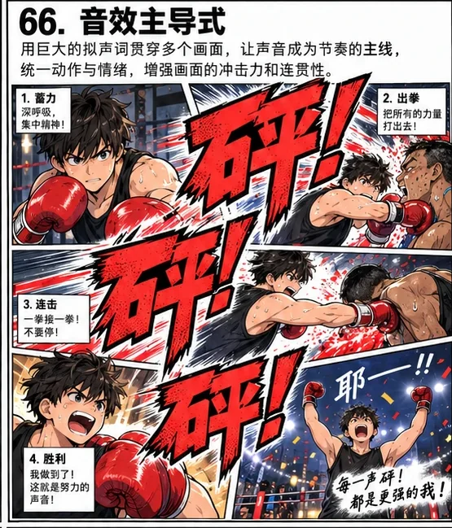 **SB-066** · Onomatopoeia Trail 

View Layout Prompt
 Comic storyboard. Layout: Onomatopoeia Trail, giant sound effect words cutting across panels, uniting kinetic rhythm and visual direction. Let this storyboard mechanism determine the page structure, reading flow, panel hierarchy, and pacing; output a complete single-page comic where panels tell a continuous story with consistent characters.
 |
| 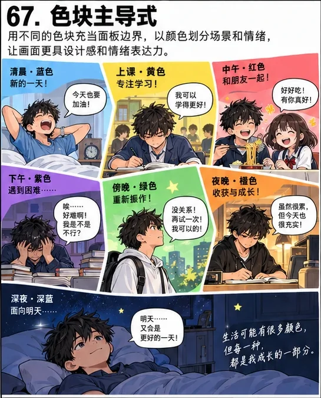 **SB-067** · Color Block Panel Partitions 

View Layout Prompt
 Comic storyboard. Layout: Color Block Panel Partitions, distinct solid color blocks serving as panel dividers and emotional mood zones rather than black lines. Let this storyboard mechanism determine the page structure, reading flow, panel hierarchy, and pacing; output a complete single-page comic where panels tell a continuous story with consistent characters.
 | 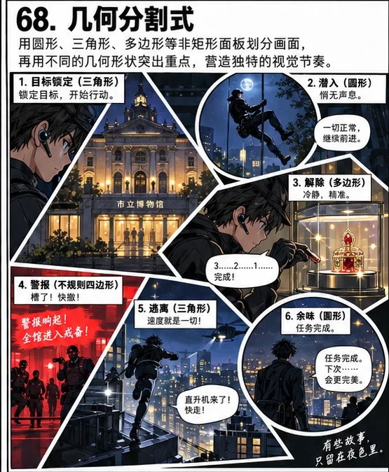 **SB-068** · Non-Rectangular Geometric Mosaic 

View Layout Prompt
 Comic storyboard. Layout: Non-Rectangular Geometric Mosaic, circular, triangular, and polygon panels dividing page, creating stylized geometric rhythm. Let this storyboard mechanism determine the page structure, reading flow, panel hierarchy, and pacing; output a complete single-page comic where panels tell a continuous story with consistent characters.
 |  |

---
