

  <a href="LAYOUTS.md">中文</a> | <strong>English</strong>

# Layout Composition Visual Sheet (165 Layouts)

> Visual previews and layout prompts for all **165 layout compositions** (Social Cards, Infographics, Comic Storyboards, IP Design, E-commerce). Specify layout IDs (e.g. `SC-001`, `IG-003`, `SB-002`, `IP-001`, `EC-001`) during AI image generation to control compositions, text placements, and visual hierarchy.

> 💡 **Layout Architecture Modes**:
> - **Deterministic Static Layouts (Direct Template Concatenation)**: Covers most layouts (`SC-001`~`SC-020`, `IG` series, `SB` series) with fixed topologies directly assembled with chosen styles;
> - **Dynamic Generative Frameworks (Skill-level Reasoning & Resolution)**: Exemplified by `SC-021` (Adaptive Split Photo-to-Art), functioning as an expressive visual syntax system where the AI assistant acts as Art Director to resolve specific composition mechanics (e.g. Boundary Break, Miniature Diorama, Memory Knolling) and enforce background purging before outputting singular, high-contrast prompts.

## Table of Contents

- [1. Social Cards (22 Layouts)](#social-cards)
- [2. Infographics (35 Layouts)](#infographics)
- [3. Comic Storyboards (71 Layouts)](#comic-storyboards)
- [4. IP Design (13 Layouts)](#ip-characters)
- [5. E-commerce (24 Layouts)](#ecommerce)

---

## 1. Social Cards (22 Layouts)

Ideal for Xiaohongshu, Instagram, newsletter hero images, and quote cards. Includes top-bottom split, text-driven cards, two-column contrasts, and sticky notes.

| Preview | Preview | Preview |
| :---: | :---: | :---: |
|  **SC-001** · Text-Above-Image Social Card 

View Layout Prompt
 Xiaohongshu social-media card. Use a text-above-image layout: place the theme copy and concise supporting text in the upper section, with a complete primary or scene illustration below. Keep a clear top-to-bottom reading order, let the text and image relate naturally, and keep the overall composition simple.
 |  **SC-002** · Text-Dominant Bottom-Graphic Card 

View Layout Prompt
 Xiaohongshu social-media card. Layout: text is the visual focal point; a simple graphic at the bottom plays a supporting role, with generous separation between text and image. Solid-color background, ample negative space, and a simple composition.
 |  **SC-003** · Two-Panel Stacked Card 

View Layout Prompt
 Xiaohongshu social-media card. Layout: no separate headline; create from the theme. Two framed panels stacked vertically; each panel has one line of text above an illustration, with no hard text-image division. Solid-color background, generous negative space, highly simplified characters, and a simple composition.
 |
|  **SC-004** · Two-Panel Split Section Card 

View Layout Prompt
 Xiaohongshu social-media card. Layout: no separate headline; create from the theme. Two framed panels stacked vertically; every panel has an image area and a text area. The text area may sit above, left, or right of the image and contains concise copy without excessive expansion. Solid-color background, generous negative space, highly simplified characters, and a simple composition.
 |  **SC-005** · Thought-Bubble Character Card 

View Layout Prompt
 Xiaohongshu social-media card. Layout: no separate headline; the visual focus is a thought-bubble text based on the theme, with a thinking IP character placed in the lower-left or lower-right. Keep the composition simple with generous negative space.
 |  **SC-006** · Three-Tier Headline Graphic Card 

View Layout Prompt
 Xiaohongshu social-media card. Use a three-level layout: place the main headline in the upper section, a small simple supporting illustration in the middle, and a secondary headline in the lower section. Use a solid-color background, generous negative space, and a simple overall composition.
 |
|  **SC-007** · Quote Keyword Typography Card 

View Layout Prompt
 Xiaohongshu text-led social-media card. Layout: place a prominent opening quotation mark in the upper-left, present the theme copy in the center with key words emphasized, and add an underline in the lower-right. An emoji may appear at the end of the sentence, sized to match the text. Keep the composition simple and typography-led.
 |  **SC-008** · Image-Above-Text Whitespace Card 

View Layout Prompt
 Xiaohongshu social-media card. Use an image-above-text layout, with a highly simplified character or scene illustration above and the theme copy below. Do not add a visible boundary between the image and text; let them flow together naturally. Use a solid-color background, generous negative space, and a simple overall composition.
 |  **SC-009** · Centered Text Corner Graphic Card 

View Layout Prompt
 Xiaohongshu text-led social-media card. Layout: make the theme text the visual focus and center it in the composition; place a small simple illustration in the lower-right corner as supporting content without competing with the text. Keep the overall composition simple.
 |
|  **SC-010** · Two-Panel List & Graphic Card 

View Layout Prompt
 Xiaohongshu social-media card. Layout: create two stacked framed panels based on the theme, without a separate overall headline. Each panel contains a one-line heading, a concise two- or three-line list, and a simple supporting illustration. Keep the copy brief without over-expanding it, avoid a visible boundary between text and image, use a solid-color background with generous negative space, simplify the characters, and keep the composition simple.
 |  **SC-011** · Central Hero Multi-Scene Card 

View Layout Prompt
 Xiaohongshu social-media card. Layout: include a main headline, place one primary illustration in the center, surround it with 3–5 simple information illustrations that match the subject, and add 2–3 brief annotations about the subject. Use a solid-color background, generous negative space, highly simplified characters, and a simple overall composition.
 |  **SC-012** · Center Title Top-Bottom Icon Card 

View Layout Prompt
 Xiaohongshu social-media card. Layout: center the headline vertically, arrange two neat rows of icons above it, and arrange two more neat rows of icons below it to form a balanced structure around the central headline. Keep the icon arrangement clear and the composition simple.
 |
|  **SC-014** · Whitespace-Driven Hero Information Card 

View Layout Prompt
 Xiaohongshu social-media card with generous negative space. Place a prominent one- or two-line short headline at the top, clearly separated from the main subject area. In the middle and lower area, place one large primary visual occupying most of the composition; it may be centered, left-weighted, or right-weighted rather than locked to one position. Let the primary visual's silhouette, pose, and spatial footprint naturally create several areas of open space. Insert 4–6 smaller information units into those open spaces, each made of a small visual element and extremely short text. Let their positions follow the space left by the primary visual rather than preset columns; do not distribute them evenly around the subject or create regular side-by-side columns. Keep the small units clearly smaller than the primary visual and close to the gaps created by its outline, with varied vertical positions and density. Do not use uniform card frames, regular grids, tables, or obvious divider lines. A very short summary sentence may appear at the bottom as a closing element. Prioritize the main visual, let whitespace drive the placement, and weave information into the composition so it reads as one complete scene rather than assembled modules.
 |  **SC-015** · Two-Tier Progressive Short-Phrase Card 

View Layout Prompt
 Xiaohongshu social-media card. Use a two-section vertical structure with two similarly sized content areas separated by clear spacing or a subtle divider. Give both sections a consistent visual language and related internal structure so they express contrast, before-and-after, a turn, or progression. Each section begins with a prominent core short phrase as the first visual level and includes one clearly large primary visual, creating an asymmetrical horizontal or diagonal balance with the phrase; adjust the visual's position according to whitespace and overall weight. Place concise two- to four-line supporting text in the remaining space, without making it a separate card or regular list. Keep the two sections similar in visual weight and reading rhythm without mirroring them exactly; vary the title position, visual direction, or whitespace distribution slightly. The second section may include a very short transition, contrast word, or relationship cue. Emphasize “two stacked sections + large short phrases + one primary visual per section + limited supporting copy.” Avoid complex infographics, dense text, regular grids, and excessive decoration; preserve generous negative space, clear hierarchy, and fast mobile reading.
 |  **SC-016** · Minimalist Big-Type Accent Card 

View Layout Prompt
 Xiaohongshu social-media card. Use an extremely minimal, spacious layout with a short piece of large typography as the absolute visual focus. Place the main copy in the upper or upper-middle area, spanning most of the available width and naturally wrapping across two or three lines. Align the text generally to the left without pressing it against the edge, creating a stable block. Make the main copy much larger than every other element with relatively tight line spacing. Emphasize only selected keywords through color, weight, a subtle background mark, or a light accent; do not let multiple words compete for attention. Leave generous space below the copy and place one very small visual accent in the center or slightly to one side as a secondary visual pause, without carrying primary information. The four corners may contain only a few tiny supporting details such as a date, page number, symbol, or decorative dot, all with very low visual weight. Do not use card frames, columns, information lists, or complex text-image combinations. Keep the background simple and emphasize large type, few elements, generous whitespace, and restrained decoration for a light, quiet, fast-to-read social cover.
 |
|  **SC-017** · Freely Annotated Whitespace Card 

View Layout Prompt
 Xiaohongshu social-media card. Layout: include a main headline, then distribute label text freely and naturally across the composition to provide brief annotations for the characters, objects, or scene elements. Let the text participate in the overall composition. Preserve generous negative space, use highly simplified characters, minimize decoration and complex sections, and keep the composition clean.
 |  **SC-018** · Center Hero Surrounding Info Card 

View Layout Prompt
 Xiaohongshu social-media card. Use a central-hero surrounding layout: place two levels of short headlines at the top, with the main headline prominent. Put one large person or object in the center as the absolute visual focus. Distribute 3–6 smaller independent illustrations around it, each accompanied by only an extremely short label or item name. Arrange the small illustrations freely and irregularly, staggered on the left, right, and below the hero rather than in a neat grid, while maintaining visual balance. Preserve generous negative space and clear gaps between the hero, small illustrations, and text to create a hierarchy of “one large subject plus multiple small information points.”
 | 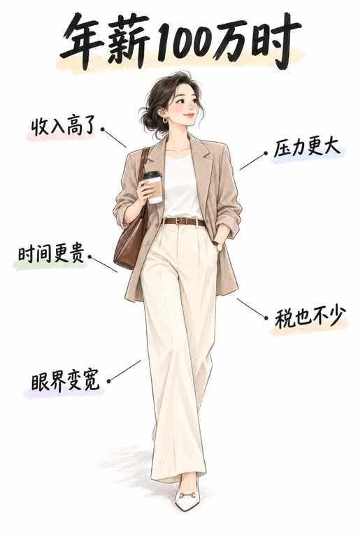 **SC-019** · Central Character Leader-Line Card 

View Layout Prompt
 Xiaohongshu social-media card. Use a clear three-level structure of “top headline + large central person + scattered labels on both sides.” Place one prominent short headline at the top in the largest type, centered or slightly left-aligned. Put one complete person in the center as the absolute visual focus; the person should occupy about 60%–75% of the image height, extend from the upper-middle area toward the bottom, and retain a complete silhouette. Distribute 3–5 extremely short labels on both sides, each limited to one line or a short phrase, with brief thin lines, slashes, or leader lines pointing toward nearby parts of the person. Stagger and distribute the labels freely rather than as a regular list, while keeping left-right balance. Leave generous space between the person and text without covering the subject. Preserve a largely empty background and avoid complex graphic blocks, card frames, tables, or extra decoration for immediate mobile readability.
 |
|  **SC-020** · Asymmetric Hero & Group Cluster Card 

View Layout Prompt
 Xiaohongshu social-media card. Use an asymmetrical “one large visual plus one group” structure. Place a prominent one- or two-line short headline in a dedicated top title area, clearly separated from the body below. In the middle, place one large primary visual occupying most of the content area and weighted toward one side; concentrate 4–6 much smaller information units in one continuous, compact secondary group on the opposite side. The primary visual may be on the left or right, with the information group mirrored accordingly rather than fixed to one direction. Do not scatter the small units around the hero or across both sides. Arrange them with staggered rows, interleaved columns, or varied density; each unit consists of a small visual element and extremely short text. Let the primary visual occupy about 55%–70% of the middle content area and the information group about 25%–40%, separating them through whitespace rather than divider lines, uniform card frames, tables, or regular grids. A very short summary line may appear at the bottom. Emphasize “one large visual block plus one concentrated small information cluster”: asymmetrical but stable, avoiding radial layouts, all-around placement, even distribution, or scattered elements across the whole canvas.
 |  **SC-021** · Adaptive Split Photo-to-Art Social Card 

View Layout Prompt
 Xiaohongshu social-media card. Layout: Adaptive split photo-to-art translation layout. Supports both direct text-prompt generation (fully synthesized by the image generation model) and image-to-image photo translation. Strictly preserve the original photo's native aspect ratio without stretching or distortion; the complete canvas is formed by seamlessly joining two equal halves: for portrait photos using a 1:1 side-by-side vertical split, the canvas maintains the photo's original height with total width exactly twice (2×) the original photo's width (source photo on left 50%, art panel on right 50%); for landscape photos / default using a 1:1 stacked horizontal split, the canvas maintains the photo's original width with total height exactly twice (2×) the original photo's height (source photo on upper 50%, art panel on lower 50%). The image generation model autonomously renders a cohesive before-and-after dialogue between "Authentic Photography × Stylized Artwork":  [Authentic Photography Panel (Upper for Landscape / Left for Portrait)]: The image model generates an ultra-realistic photograph matching the theme (or follows the uploaded photo if provided), strictly preserving the original aspect ratio and composition without stretching, distortion, or cropping. Maintains photographic depth of field, natural lighting, authentic skin/fur textures, and snapshot atmosphere without illustration redraws, establishing the realistic photographic baseline.  [Artistic Translation Panel (Lower for Landscape / Right for Portrait) — Radical De-Photorealism & Singular Compositional Transfer]: 1. Radical De-Photorealism & Style Redraw (Strictly NOT a Photo Filter): The translated panel must form a dramatic cross-medium contrast with the photography panel! Strictly avoid slapping filters, grain, or shading onto the photo's 3D anatomy. Extract only the subject's iconic facial features, posture, and scene contours, redrawing them entirely from scratch in the chosen artistic style as pure 2D hand-drawn illustration with maximized stylistic linework, brushwork, and palette fidelity.  2. Strict Elimination of Environmental Clutter (Negative Space is Essential; Never Copy Full Background): Strictly avoid duplicating the photographic background (e.g. full stone walls, pathways, dense trees, skies) into the translated panel! The translated panel MUST preserve generous, clean negative space and breathing margins (40%–80%) around all four outer edges on warm ivory/oatmeal paper ground. Hero subjects and typography must breathe inward, strictly never touching or bleeding over borders.  3. Singular Compositional Syntax & Round-Robin Rotation Policy (Strict Round-Robin; Never Monotonous): When the user does not explicitly specify a composition, the AI prompt generator MUST rotate through the 5 core playstyles in strict Round-Robin order (prohibiting consecutive repeats) and emit a singular, deterministic, exclusive instruction: - [Playstyle 1: Boundary Break / Out-of-Bounds]: Subject is mostly framed inside a single geometric color block, with iconic parts (head, limbs, branches) naturally breaking out past the borders to create spatial penetration; - [Playstyle 2: Miniature Diorama / Floating Island]: Subject is drastically scaled down to 10%–25% as a delicate paper-relief vignette resting on a gestural ribbon or pedestal, surrounded by vast serene negative space; - [Playstyle 3: Memory Knolling / Fragment Collage]: Deconstructs single scenes; places the main subject alongside 3–6 deconstructed memory stickers/artifacts with NO. index tags and breathing gaps; - [Playstyle 4: Classic Suspended / Grounded Hero]: Balanced scale (40%–55%), centered or slightly off-center, anchored solely by a single gestural ground friction line; - [Playstyle 5: Gestalt Positive-Negative Interlock]: Highly stylized silhouette interlocked with background negative forms.  4. Editorial Micro-Typography in Negative Space: Embed subtle editorial typography (hand-lettered artistic headline, delicate English phrases, edition/number tags, or poetic captions) within the open negative space.  Overall Requirement: Strictly preserve the original photograph's aspect ratio without stretching; with the artistic translation panel added, the final canvas is exactly twice the width (side-by-side) or twice the height (stacked) of the original photo. The two split panels must join seamlessly at the midpoint with zero gaps or extra borders; the artistic translation panel must maintain generous negative space and breathing margins around all four outer edges, fully synthesized by the image generation model as an elegant, high-contrast visual dialogue between authentic photography and stylized artistic minimalism with generous perimeter breathing room.
 |  **SC-022** · Name-to-Four-Signature Showcase Card 

View Layout Prompt
 [Chinese Name]: {e.g., Tang Bohu} [Name Pinyin]: {e.g., TANG BOHU} [Top Background Color]: {e.g., Deep Cobalt Blue} [Aspect Ratio]: 9:16  Render the input [Chinese Name] into a vertical design presentation titled "Name to Four Signature Concepts".  ## 1. Overall Layout  Aspect ratio: 9:16 vertical poster layout.  The top ~40% of the canvas presents the original source name.  The bottom ~60% of the canvas presents four distinct signature design concepts created for the exact same name.  ---  ## 2. Top Name Header Area  The top section uses [Top Background Color].  Small header text centered near the very top:  NAME TO SIGNATURE  The center of the top section features [Chinese Name].  The name must strictly use clean, standard printed typography (serif or sans-serif)—no handwriting, cursive ligatures, artistic distortion, or signature fonts—to clearly establish the original baseline name.  Directly beneath the Chinese name, display:  [Name Pinyin]  The name pinyin must be rendered in clean uppercase Latin letters.  No additional copy, logos, numbers, or graphics in the top area.  ---  ## 3. Bottom Signature Grid Area  The bottom area is divided into a 2×2 four-quadrant grid.  Use thin, subtle dashed dividing lines horizontally and vertically; no outer framing border.  The four quadrants display four signature design concepts for the exact same [Chinese Name]:  Top-left: 飘逸 (Flowing / Elegant) Top-right: 锋势 (Sharp / Dynamic) Bottom-left: 回环 (Looping / Enclosing) Bottom-right: 极简 (Minimalist / Symbolic)  Each quadrant contains strictly: 1. One prominent, large-scale signature design 2. One small-sized style name label underneath  All four signatures must be derived from the exact same [Chinese Name], but must never be mere slight variations of the same handwriting.  Permitted transformations on the name: Stroke omission, stroke merging, cursive ligatures, shared strokes, compression, elongation, abbreviation, deconstruction, recombination, and symbolization.  It is NOT required for every Chinese character to remain fully legible. The key objective is to preserve partial structural identity of the name while establishing four fundamentally distinct signature structural skeletons.  ---  ## 4. Four Signature Gestural Styles  ### 1. 飘逸 (Flowing / Elegant)  Overall horizontal expansive posture. The name characters are highly compressed and continuously joined with shared strokes across characters. Dominated by fluid continuous curves with smooth gestural momentum. May utilize one or two sweeping long strokes that unify the entire signature. Allows an extended horizontal trailing flourish. Structural emphasis: Long strokes, fluid curves, continuous ligatures, expansive rhythm, dynamic flow. Minimize sharp angles and abrupt hard turns.  ---  ### 2. 锋势 (Sharp / Dynamic)  Pronounced rightward thrust and forward momentum. Heavily utilizes: Diagonal slashes, acute angles, tall vertical strokes, rapid cutting strokes, and brisk geometric angular folds. Name characters can be highly compressed, retaining only core skeleton strokes. The entire signature may lean noticeably to the right. Primary strokes form bold upward slashes, downward cuts, and diagonal interlocks. Minimize large circular curves and soft loops. Structural emphasis: Diagonal thrust, acute angles, swift cutting lines, speed, and sharp tension.  ---  ### 3. 回环 (Looping / Enclosing)  Built around one or more large enclosing loops as the primary signature gesture. May incorporate: Open rings, elliptical loops, grand S-curves, continuous whirling lines, and protective surrounding structures. The compressed primary strokes of the name are nestled inside the loops or pierced by the sweeping loop trajectory. The final finishing stroke may break free of the main body with an expressive outward trail. Loops must not look mechanically circular; preserve the organic asymmetry of natural swift calligraphy. Structural emphasis: Whirling loops, enclosure, penetration, continuous curves, large-scale gestures.  ---  ### 4. 极简 (Minimalist / Symbolic)  Does NOT write out the entire name. Extracts only ~4–6 most recognizable structural strokes from [Chinese Name], such as: A long horizontal bar, a dominant vertical, an angular fold, a swift diagonal, a slash/press stroke, or an anchor dot. Recombines them into an ultra-clean, modernized personal signature mark / monogram. Permits radical omission of conventional character anatomy. Stroke count is drastically fewer than the other three concepts. Avoid decorative geometric graphics unrelated to the name. Structural emphasis: Few strokes, generous breathing whitespace, bold essential skeleton, high symbolic abstraction.  ---  ## 5. Differentiation Control  The four concepts must exhibit striking, undeniable structural differences across: - Stroke density and stroke count - Horizontal vs. diagonal directional momentum - Curve-to-straight line ratio - Presence vs. absence of large enclosing loops - Degree of name legibility vs. radical abbreviation - Center of visual gravity - Ligature connection logic - Terminal flourish direction - Overall silhouette profile  The four designs must not simply be one signature with four different tail endings. They must establish four distinct structural philosophies: Flowing: Long curves + continuous ligatures Sharp: Diagonals + acute angles + decisive directional thrust Looping: Monumental curves + enclosing loop architecture Minimalist: Sparse core strokes + radical symbolic abstraction  Final image strictly retains only the name, pinyin, four signatures, and four style labels; no extraneous decorative elements.
 |
| 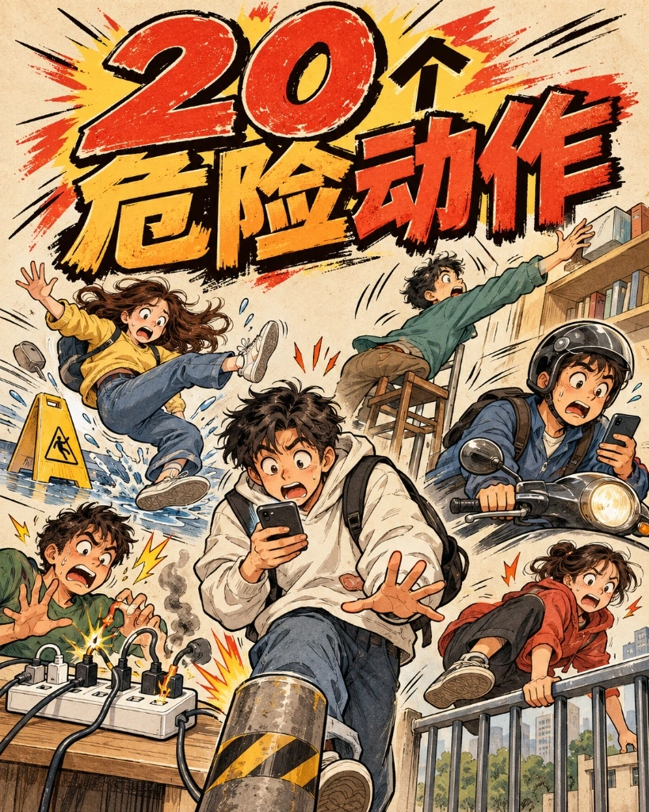 **SC-023** · Representative Scenario Knowledge Cover Card 

View Layout Prompt
 Adopt a vertical 4:5 knowledge cover layout, referencing a composition where a bold headline dominates the top, characters surround compactly below, and storytelling scenes interweave naturally. The top third is dedicated to a prominent main headline split into two to three lines, with key numbers and important keywords noticeably enlarged, accented locally with hand-drawn color blocks for striking visual impact. Only retain the main headline; no other explanatory or body text should appear. Beneath the title, arrange 4 to 6 highly representative vignettes featuring characters as the primary visual elements, minimizing sprawling environments and complex backgrounds. Characters use an interleaved mix of half-body, close-up, and partial full-body framings; position the largest core hero in the lower-center, with other characters arranged around the left, right, and bottom. Create natural foreground-background overlapping, scale contrasts, and interactive gestures between characters to form a tight yet uncrowded ensemble composition. Each vignette conveys a distinct information point, quickly communicating meaning through exaggerated facial expressions, dynamic body language, and minimal key props. Do not use comic panel frames, rigid grid cuts, or fully isolated scenes; allow characters and props to subtly overlap or partially extend beyond the edges, reinforcing the unified feel of a comic cover. Maintain a cohesive background across the entire canvas with a clean, distraction-free headline area. Connect vignettes through natural breathing space and subtle hand-drawn dynamic action lines rather than rigid divider lines. Deliver an overall layout featuring an impactful top headline, richly concentrated characters below, and an unmistakably clear visual focal point.
 |  |  |

---

## 2. Infographics (35 Layouts)

Ideal for knowledge sharing, comparison charts, process workflows, and structured data visuals. Includes hierarchy pyramids, central icons, matrices, and multi-column comparison tables.

| Preview | Preview | Preview |
| :---: | :---: | :---: |
|  **IG-001** · Pyramid Hierarchy Icon Infographic 

View Layout Prompt
 Xiaohongshu infographic. Layout: place a clear headline at the top, use a tiered pyramid diagram as the main structure, and include multiple labeled icons in each tier to communicate the relationships between information layers clearly.
 |  **IG-002** · Central Hero Callout Infographic 

View Layout Prompt
 Xiaohongshu infographic. Layout: place the main illustration in the center, surround it with multiple labeled annotations connected by leader lines, and point each line to a specific part of the subject for clear structural or detail explanations.
 | 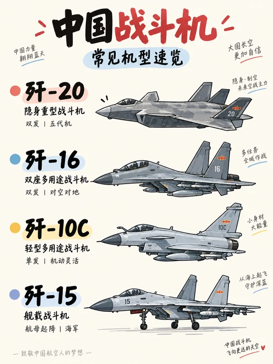 **IG-003** · Multi-Row Left-Text Right-Image Infographic 

View Layout Prompt
 Xiaohongshu infographic. Highly versatile multi-row text-and-image structure. Layout: place a prominent headline area at the top (can include main title, subtitle, date/tag, or category slogan). The main body consists of multiple vertically stacked, uniformly spaced item rows (typically 3–5 tiers). Each row uses a consistent side-by-side structure with text information on the left (timestamp, subhead, tags, descriptive bullets) and the corresponding illustration or photo on the right, maintaining neat horizontal alignment across all rows. The bottom section can include summary notes, practical tips, or a brief closing remark. This layout is broadly versatile, seamlessly supporting daily travel itineraries, timeline routes, catalog overviews, curated lists, step-by-step processes, as well as multi-item comparisons.
 |
|  **IG-004** · Two-Column Multi-Row Comparison 

View Layout Prompt
 Xiaohongshu infographic. Layout: place a main headline at the top, then organize the comparison into two side-by-side columns. Each column contains multiple corresponding rows; keep the columns clear and the rows aligned to emphasize item-by-item differences between the two subjects.
 |  **IG-005** · Hero Visual Catalog Infographic 

View Layout Prompt
 Xiaohongshu infographic. Use a vertical structure of “oversized headline at the top + large structural hero visual in the middle + catalog-like classification units at the bottom.” Place one prominent headline across a dedicated top title area, clearly larger than all other text, with clear spacing before the content below. Place one large, complete hero visual across most of the middle area as the core of the card; the hero visual may contain several internal regions and short labels embedded directly within it, integrating text with the visual instead of adding external callouts. Arrange multiple smaller independent visual units below in a regular but breathable multi-column layout. Each unit consists of a small visual with a short label underneath; keep sizes consistent and horizontal and vertical spacing stable to create the scanning rhythm of an atlas, directory, or category display. The smaller units may be numerous but must remain clearly subordinate to the central hero visual. Avoid complex card frames and establish order through whitespace, alignment, and repeated structure. The reading order is top headline → central whole structure → lower detailed categories; avoid side-by-side columns, excessive decoration, and irregular collage.
 | 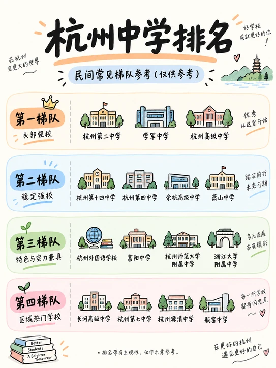 **IG-006** · Multi-Tier Headline Icon Comparison 

View Layout Prompt
 Xiaohongshu infographic. Layout: include a main headline, then organize the body into multiple tiers. Place the tier title on the left of each tier and arrange multiple labeled icons neatly on the right to present comparisons between levels. Use a solid-color background, generous negative space, and a simple overall composition.
 |
|  **IG-007** · Bold Headline Tag Cards 

View Layout Prompt
 Xiaohongshu infographic. Layout: bold headline, multiple small labeled illustrations, one short line at the bottom, solid-color background, no frame, and generous negative space.
 |  **IG-008** · Multi-Path Process Step Flow 

View Layout Prompt
 Xiaohongshu infographic. Layout: include a main headline and build the body as a process-step diagram. The sequence may use a horizontal, vertical, S-shaped, or another clearly readable path layout. Each step contains only one small illustration and one concise sentence, connected through direction, order, or light guidance. Preserve generous negative space and avoid complex decoration or excessive text.
 | 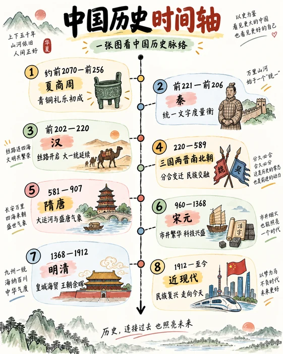 **IG-009** · Timeline Milestone Infographic 

View Layout Prompt
 Xiaohongshu infographic. Layout: include a main headline and build the body as a timeline, with one clear main axis connecting multiple nodes. The timeline may run horizontally or vertically. Each node contains one small illustration, a time marker, and one concise sentence. Keep the sequence clear and the hierarchy legible, preserve generous negative space, and avoid complex decoration or excessive text.
 |
|  **IG-010** · Stage Progression Infographic 

View Layout Prompt
 Xiaohongshu infographic. Layout: stage progression, emphasizing changes in level and advancement from lower to higher stages rather than chronological order. Place a short, prominent headline at the top. Use stairs, an ascending arrow, or a clear hierarchical structure to make the direction of progression immediately readable. Pair each stage with a simple small illustration, a level name, and a brief description. Keep the hierarchy clear and the wording concise. Preserve generous negative space, comfortable spacing between stages, and a simple composition.
 |  **IG-011** · Before & After Comparison Infographic 

View Layout Prompt
 Xiaohongshu infographic. Layout: Before / After comparison, with the change between the two states as the absolute visual focus. Organize the composition into two primary areas, arranged either side by side or one above the other. Place only an arrow, a date, or very limited explanatory text between them to show the direction of change. Give both Before and After a complete main visual that can be compared directly, and keep labels and wording concise. Preserve generous negative space and avoid complex decoration or excessive supporting information.
 |  **IG-012** · Layered Hierarchy Infographic 

View Layout Prompt
 Xiaohongshu infographic. Layout: layered structure, organizing information around an inherent hierarchy such as top-middle-bottom, inner-middle-outer, surface-deep, or a multi-level structure from foundation to core. Include a clear main headline. Use nested layers, stacked sections, or a bottom-to-top structure to present the hierarchy; each layer may include a concise name, short sentence, or small illustration. Keep the order and reading relationship clear, preserve generous negative space, and avoid complex decoration, dense text, or unrelated modules.
 |
| 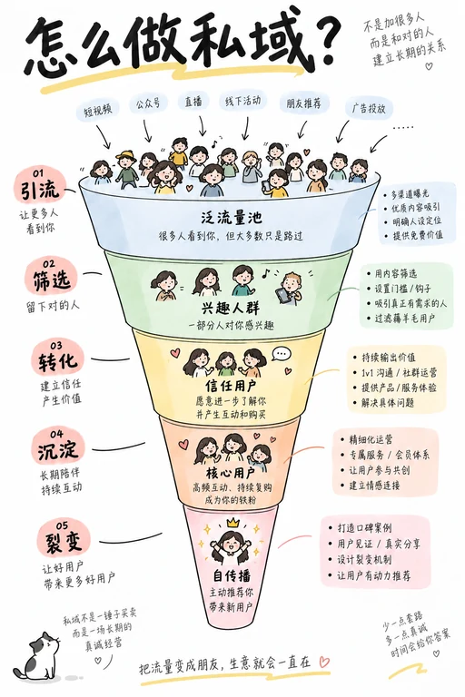 **IG-013** · Conversion Funnel Infographic 

View Layout Prompt
 Xiaohongshu infographic. Layout: funnel-shaped, wide at the top and narrow at the bottom, using progressively narrowing layers to show a process from broad entry, filtering, and conversion to elimination and focused retention. Include a clear main headline. Give each funnel layer a concise stage name, short sentence, or small illustration, emphasizing that the people, objects, or scope become smaller while the focus becomes stronger. Keep the hierarchy clear, preserve generous negative space, and avoid complex decoration or excessive text.
 |  **IG-014** · Four-Quadrant Matrix Infographic 

View Layout Prompt
 Xiaohongshu infographic. Layout: matrix type, using two perpendicular axes to divide the content into four quadrants, preferably as a clear and readable 2×2 structure. Include a main headline and label the horizontal axis, vertical axis, and the meaning of both ends. Place one thematic unit in each quadrant, with a concise title, small illustration, and limited explanation. Keep the four areas aligned, evenly spaced, and easy to compare. Preserve generous negative space and avoid complex decoration or excessive text.
 | 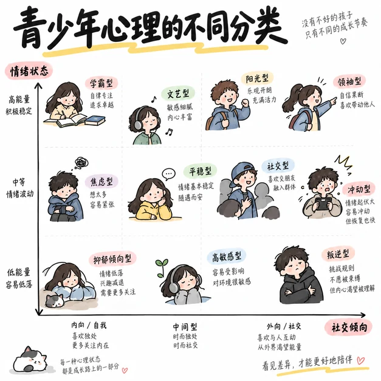 **IG-015** · Coordinate Scatter Plot Infographic 

View Layout Prompt
 Xiaohongshu infographic. Layout: coordinate scatter type, placing multiple different objects within a clear coordinate space and using their positions along the horizontal and vertical axes to express categories, tendencies, or relationships. Include a main headline and clearly label both axes and the meaning of their ends. Represent each object with a simple small illustration, name, and limited explanation; make the positions distinctive and easy to compare. Preserve generous negative space around the coordinate area and avoid complex decoration or excessive text.
 |
|  **IG-016** · Categorical Tree Hierarchy Infographic 

View Layout Prompt
 Xiaohongshu infographic. Layout: category tree or hierarchy tree, beginning with one core category or root node and branching downward into several major subcategories, then continuing into more detailed child or terminal nodes. Include a clear main headline. Place the root at the top or upper center, and use connecting lines to show parent-child relationships and branch paths. Give each node a concise name or minimal explanation; the hierarchy depth, branch order, and reading path must remain clear. Keep appropriate negative space and avoid excessive decoration or unrelated information.
 |  **IG-017** · Mind Map Radial Infographic 

View Layout Prompt
 Xiaohongshu infographic. Layout: mind-map type, with one central topic as the core node and multiple branches extending outward. Each branch contains concise labels or small icons, clearly expressing the hierarchy from the center to subtopics. Avoid rigid tables and dense text; use natural curved connectors, generous negative space, and simplified characters to create a clear reading path.
 |  **IG-018** · Relationship Network Infographic 

View Layout Prompt
 Xiaohongshu infographic. Layout: relationship network, with multiple objects distributed across the canvas and connectors of varied color or weight showing collaboration, influence, dependency, or association. A weak center is acceptable and nodes do not need to be evenly distributed. Keep labels concise, preserve generous negative space, and avoid dense tables or explanations.
 |
|  **IG-019** · Closed-Loop Cycle Infographic 

View Layout Prompt
 Xiaohongshu infographic. Layout: closed-loop cycle, with several stages arranged in a circular path and connected by continuous arrows. Emphasize repetition, feedback, and iteration rather than a one-way beginning-to-end process. Keep a title or key conclusion in the center, pair nodes with small visuals and short phrases, and preserve clear negative space.
 |  **IG-020** · Narrative Route Map Infographic 

View Layout Prompt
 Xiaohongshu infographic. Layout: path-map type, with one winding or game-map-like route crossing the canvas and several numbered nodes, locations, or stages along it. Pair each node with a small visual and one short explanation, using arrows, dashed lines, or signposts to show direction. It does not need to be a real map; emphasize the route and node relationships while preserving generous negative space.
 |  **IG-021** · Geographic Map with Annotations 

View Layout Prompt
 Xiaohongshu infographic. Layout: real map with annotations, using an authentic map outline, streets, waterways, or regional relationships as the main visual. Place location markers, very short explanations, and a few small icons on the map. Keep annotations away from important features, maintain clear hierarchy, and use a simple legend rather than a dense list.
 |
|  **IG-022** · Big Number Stat Highlight Infographic 

View Layout Prompt
 Xiaohongshu infographic. Layout: oversized-number type, using one or more huge numbers as the absolute visual focus. Surround them only with very short explanations, units, or object names. Let the numbers occupy the main area with strong impact, subordinate all other elements, keep the background generously empty, and avoid complex charts.
 |  **IG-023** · Leaderboard Ranking Infographic 

View Layout Prompt
 Xiaohongshu infographic. Layout: ranking type, arranging objects in an explicit order such as 1, 2, 3, 4, and 5. Pair each object with a small visual, a name, and one core metric. Use a vertical ranking, podium, or staggered tiered structure, emphasizing rank differences and the leading entry rather than making a generic unordered list.
 | 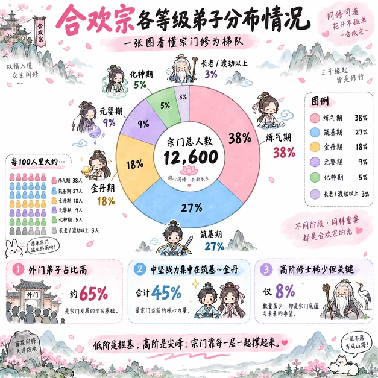 **IG-024** · Part-to-Whole Composition Infographic 

View Layout Prompt
 Xiaohongshu infographic. Layout: part-to-whole composition, using a donut chart, pie chart, 100-person icons, or area blocks to show how much each part contributes to the whole. Include a clear legend and only a few percentage labels. Make the main chart dominant, keep explanations short, distinguish colors clearly, and avoid too many metrics.
 |
|  **IG-025** · Scale Comparison Infographic 

View Layout Prompt
 Xiaohongshu infographic. Layout: scale comparison, arranging multiple objects from small to large according to real or relative size so that visual scale itself communicates the comparison. Keep objects highly simplified, add only very short names or stage labels, and use a baseline, arrow, or a few marks to reinforce progression. Keep the composition simple with generous negative space.
 | 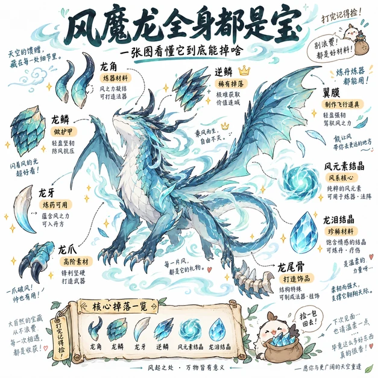 **IG-026** · Exploded Assembly View Infographic 

View Layout Prompt
 Xiaohongshu infographic. Layout: exploded-view type, with one complete object as the main subject and multiple parts separated and expanded around it. Use leader lines to identify each component and explain its purpose or compositional relationship. Emphasize what the object is made of rather than making a generic annotation diagram. Keep characters highly simplified, the composition simple, and the negative space generous.
 | 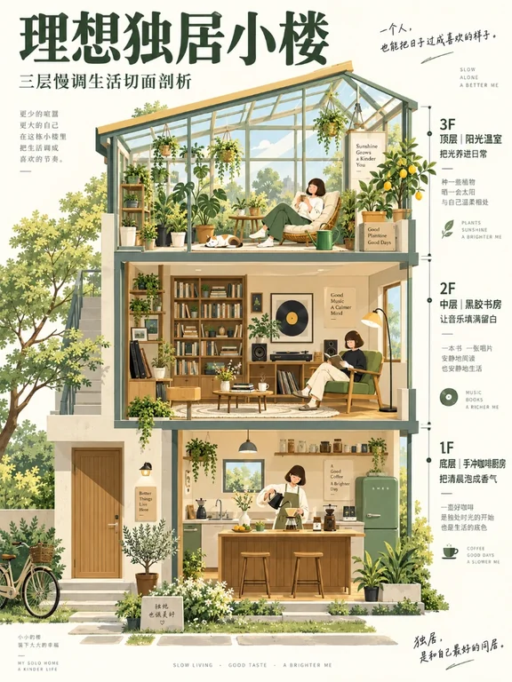 **IG-027** · Cutaway Sectional View Infographic 

View Layout Prompt
 Xiaohongshu infographic. Layout: sectional or cutaway type, slicing an integrated building or object open to reveal its interior spaces, floors, and functional zones. Let the cutaway be the dominant visual, with only a few floor labels or very short notes alongside it. Keep the cut edge and internal structure fully readable, simplify characters, and preserve generous negative space.
 |
|  **IG-028** · Continuous Scene Panoramic Infographic 

View Layout Prompt
 Xiaohongshu infographic. Layout: continuous-scene type, with the entire image forming one connected spatial or temporal scene and multiple information nodes naturally embedded in paths, people, buildings, and props. Do not split it into cards or a rigid grid; connect information through the scene itself, simplify characters, keep the composition clean, and preserve broad areas of sky, ground, or background negative space.
 |  **IG-029** · Character Ensemble Label Infographic 

View Layout Prompt
 Xiaohongshu infographic. Layout: character group with labels, using multiple characters in free positions rather than a rigid grid. Pair each character with one short label or very brief explanation, keeping clear spacing and visual balance. Use posture, props, and size differences to distinguish them. Keep characters highly simplified, leave the background generously empty, and avoid complex decoration.
 |  **IG-030** · Core Hero Knowledge Map Infographic 

View Layout Prompt
 Place one large core illustration occupying the main visual area as the primary subject. Distribute several clearly smaller visual units around it, with each unit paired with a very short label, name, or explanation. Let the smaller units form knowledge relationships around the core topic without requiring a rigid grid or perfectly even distribution. Use negative space, position, and light connections to express the overall relationship. Keep characters highly simplified, use a simple composition, and preserve generous negative space.
 |
|  **IG-031** · Encyclopedic Specimen Information Card 

View Layout Prompt
 Xiaohongshu infographic. Layout: Encyclopedic information card. Structured in three tiers: "top primary specimen display zone + middle asymmetrical multi-module information zone + bottom source reference zone". The top is centered around a primary visual object/specimen, accompanied by the main title, scientific name/subtitle, classification tags, and concise foundational details. The middle section organizes 6–10 information modules through hairline grids, coordinate systems, and golden-ratio compositions, integrating subheadings, short paragraphs, diagrams, comparative charts, data bars, maps, and timelines into a well-ordered, generous typographic balance. The bottom contains an understated numbering, footnote, or reference citation area, presenting a rational design aesthetic combining herbarium archival sheets with contemporary museum exhibition boards.
 |  **IG-032** · Hand-Drawn Editorial Knowledge Infographic 

View Layout Prompt
 Xiaohongshu infographic. Layout: Hand-drawn editorial knowledge infographic. Structured as "top oversized headline + central prominent hero visual + surrounding numbered knowledge modules + bottom summary section". The central hero visual is substantially larger than other elements, serving as the dominant visual focal point. 4 to 8 knowledge modules surround the core illustration naturally, each bearing a prominent numbered badge (such as 01, 02, 03, 04) to establish a clear reading sequence and list structure. Each numbered module contains a concise title, brief explanation, and miniature visual breakdown (such as mini-scene illustrations, icons, comparisons, process flows, thought bubbles, or mini comic panels). Modules flow organically around the core visual rather than adhering to a rigid grid, connected flexibly by arrows, tags, speech bubbles, and handwritten notes. The bottom features a concluding one-line takeaway, keywords, or checklist. The overall composition merges magazine editorial illustration, knowledge infographic diagramming, and light comic narrative into a lively hand-drawn aesthetic. Keep characters highly simplified, use a concise composition, and preserve generous negative space.
 | 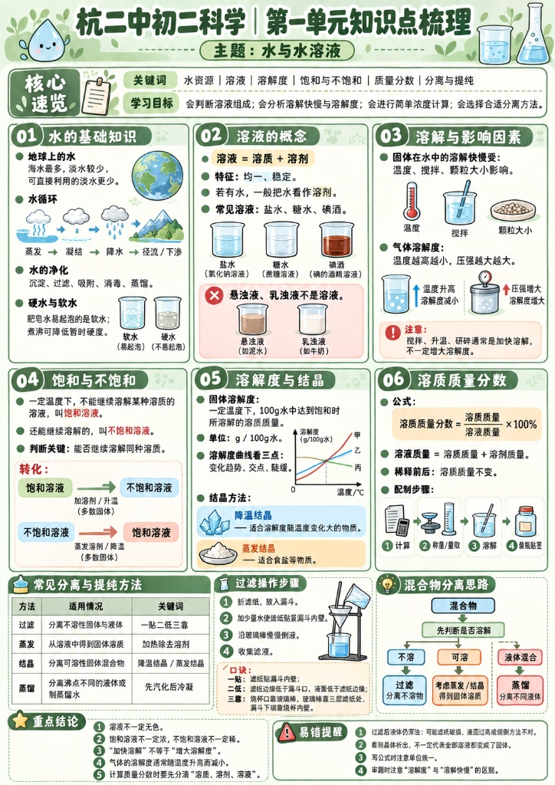 **IG-033** · High-Density Handout Analytical Infographic 

View Layout Prompt
 Xiaohongshu infographic. Layout: High-density handout analytical infographic. A single-page, high-density structured study handout layout following a clear "overview, breakdown, and summary" visual hierarchy. The top features a prominent main header bar paired with a core key takeaways/overview panel. The middle section serves as the core analytical body, composed of multiple sequentially numbered modular cards featuring subheadings, bullet points, formula containers, and localized diagrammatic explanations, flexibly interspersed with structured table containers, step-by-step procedure sequences, and flowchart/decision-tree connection zones to create an engaging visual rhythm across varied block sizes. The bottom anchors the page with full-width key conclusion and warning/error-alert callout sections, complemented by marginal annotations and compact corner callout boxes. The layout follows a strict top-to-bottom, left-to-right reading order with distinct container boundaries and structured card frames; avoids single-focal-point poster composition, avoids rigid equal grids, and strictly excludes decorative imagery outside essential informational diagrams.
 |
| 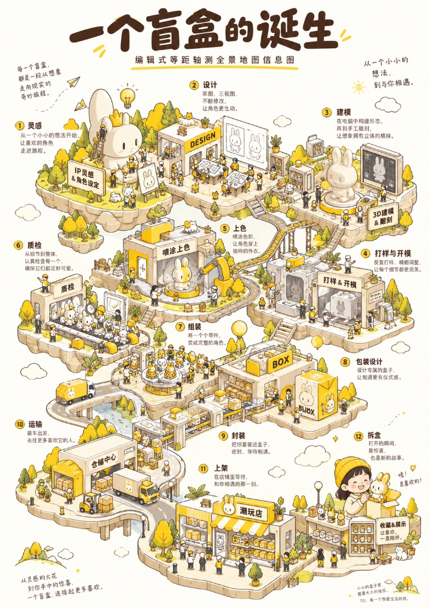 **IG-034** · Editorial Isometric Illustrated Map Infographic 

View Layout Prompt
 Xiaohongshu infographic. Layout: Editorial Isometric Illustrated Map Infographic. A vertical long-format composition featuring a continuously unfolding isometric miniature world as the core visual subject. The main visual resembles a vertically growing miniature city, theme park, or fantasy industrial park, composed of multiple independent scene nodes varying noticeably in scale and form. The entire isometric world is centered in the canvas without filling the edges, reserving ample clean background and breathing room around the perimeter. Scene nodes are not arranged in a rigid grid or divided into uniform process modules; instead, architecture, facilities, shops, workshops, vehicles, and quirky contraptions are arranged irregularly, linked via roads, vehicles, conveyor structures, spatial orientation, and visual flow lines. The composition emphasizes "a complete world map" rather than a step-by-step flowchart; procedural relations may exist, but are seamlessly woven into spatial storytelling without prominent oversized arrows. Core nodes are visibly enlarged while secondary nodes are scaled down, with occasional exaggerated landmarks, billboards, monumental contraptions, or giant whimsical props creating visual rhythm and humor. Text does not cover the canvas: title, numbers, brief descriptions, small legends, and localized annotations are placed in the surrounding negative space with subtle connections to nearby scenes, avoiding bulky white cards, uniform callout boxes, rigid chapter headers, and dense spec sheets. The entire piece adopts a minimalist 2D isometric line-illustration aesthetic: secondary color A fine outlines, secondary color B architectural bodies, primary color background with restrained accent fills, strictly confined to a three-color palette with no gradients, realistic textures, or complex lighting. Buildings and machinery are highly abstracted, iconified, and cartoonish rather than technically accurate, filled with tiny characters, animals, vehicles, and humorous interactions to deliver a "theme park map / magazine editorial map / brand world poster" aesthetic. Focus: generous whitespace, central continuous isometric world, irregular nodes, high scale contrast, scattered peripheral annotations, engaging narrative. Avoid: edge-to-edge industrial zones, rigid partitions, standard process cards, dense text containers, heavy flowchart arrows, realistic factories, blueprints, uniform node sizes.
 |  **IG-035** · 2.5D Isometric Miniature Scene 

View Layout Prompt
 Layout: 2.5D Isometric Miniature Scene. 2.5D perspective, isometric composition, miniature scene.
 |  |

---

## 3. Comic Storyboards (71 Layouts)

Ideal for multi-panel narratives, webtoons, emotional storylines, and cinematic pacing. Includes standard 4-panel grids, dramatic wide-angle focus, diagonal cuts, and manga storyboards.

| Preview | Preview | Preview |
| :---: | :---: | :---: |
| 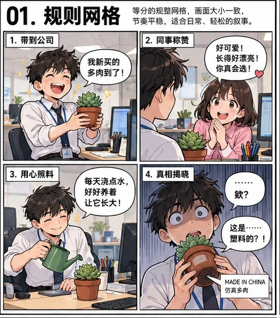 **SB-001** · Regular Grid 

View Layout Prompt
 Comic storyboard. Layout: Regular Grid, panels of equal size arranged neatly in a consistent reading order, ideal for slice-of-life and dialogue-driven stories. Let this storyboard mechanism determine the page structure, reading flow, panel hierarchy, and pacing; output a complete single-page comic where panels tell a continuous story with consistent characters.
 | 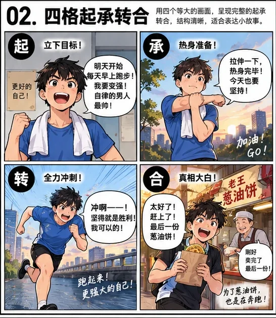 **SB-002** · Four-Panel Kishōtenketsu 

View Layout Prompt
 Comic storyboard. Layout: Four-Panel Kishōtenketsu, four equal panels sequentially presenting introduction, development, twist, and punchline, ideal for short comedic stories. Let this storyboard mechanism determine the page structure, reading flow, panel hierarchy, and pacing; output a complete single-page comic where panels tell a continuous story with consistent characters.
 |  **SB-003** · Hero Panel + Inset Panels 

View Layout Prompt
 Comic storyboard. Layout: Hero Panel + Inset Panels, one prominent large panel occupies primary area, supported by smaller secondary panels for reactions or details. Let this storyboard mechanism determine the page structure, reading flow, panel hierarchy, and pacing; output a complete single-page comic where panels tell a continuous story with consistent characters.
 |
|  **SB-004** · Top Splash Panel Opening 

View Layout Prompt
 Comic storyboard. Layout: Top Splash Panel Opening, wide banner panel across top establishing scene and characters before subsequent sequential narrative below. Let this storyboard mechanism determine the page structure, reading flow, panel hierarchy, and pacing; output a complete single-page comic where panels tell a continuous story with consistent characters.
 |  **SB-005** · Bottom Climax Panel Ending 

View Layout Prompt
 Comic storyboard. Layout: Bottom Climax Panel Ending, smaller panels build narrative momentum leading to a large impactful bottom panel for climax or reveal. Let this storyboard mechanism determine the page structure, reading flow, panel hierarchy, and pacing; output a complete single-page comic where panels tell a continuous story with consistent characters.
 | 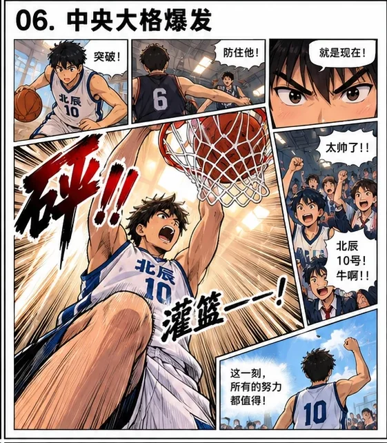 **SB-006** · Center Focal Panel 

View Layout Prompt
 Comic storyboard. Layout: Center Focal Panel, dominant central panel commanding maximum visual attention for action climax or core reveal. Let this storyboard mechanism determine the page structure, reading flow, panel hierarchy, and pacing; output a complete single-page comic where panels tell a continuous story with consistent characters.
 |
|  **SB-007** · Diagonal Dynamic Split 

View Layout Prompt
 Comic storyboard. Layout: Diagonal Dynamic Split, panels divided along diagonal angles, intensifying speed, conflict, pursuit, and confrontation. Let this storyboard mechanism determine the page structure, reading flow, panel hierarchy, and pacing; output a complete single-page comic where panels tell a continuous story with consistent characters.
 |  **SB-008** · Z-Pattern Reading Flow 

View Layout Prompt
 Comic storyboard. Layout: Z-Pattern Reading Flow, visual focus flows in a classic Z-path (top-left, top-right, bottom-left, bottom-right) for clear storytelling. Let this storyboard mechanism determine the page structure, reading flow, panel hierarchy, and pacing; output a complete single-page comic where panels tell a continuous story with consistent characters.
 |  **SB-009** · S-Curve Narrative Flow 

View Layout Prompt
 Comic storyboard. Layout: S-Curve Narrative Flow, characters and compositions follow a soft curving path, suitable for whimsical, romantic, or journey narratives. Let this storyboard mechanism determine the page structure, reading flow, panel hierarchy, and pacing; output a complete single-page comic where panels tell a continuous story with consistent characters.
 |
|  **SB-010** · Spiral Inward Flow 

View Layout Prompt
 Comic storyboard. Layout: Spiral Inward Flow, panels and gaze spiral inwards around center, gradually closing in on core event. Let this storyboard mechanism determine the page structure, reading flow, panel hierarchy, and pacing; output a complete single-page comic where panels tell a continuous story with consistent characters.
 | 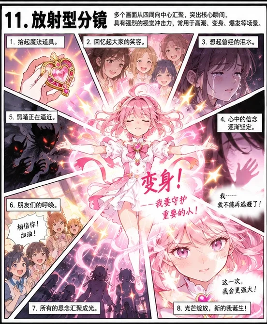 **SB-011** · Radial Converging Panels 

View Layout Prompt
 Comic storyboard. Layout: Radial Converging Panels, multiple panels radiate toward central focus, perfect for explosions, revelations, and high-impact moments. Let this storyboard mechanism determine the page structure, reading flow, panel hierarchy, and pacing; output a complete single-page comic where panels tell a continuous story with consistent characters.
 | 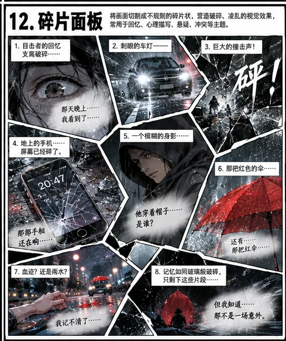 **SB-012** · Shattered Glass Panels 

View Layout Prompt
 Comic storyboard. Layout: Shattered Glass Panels, broken fragmented panels dividing screen like fractured glass, expressing chaos, combat, memories, and psychological shock. Let this storyboard mechanism determine the page structure, reading flow, panel hierarchy, and pacing; output a complete single-page comic where panels tell a continuous story with consistent characters.
 |
| 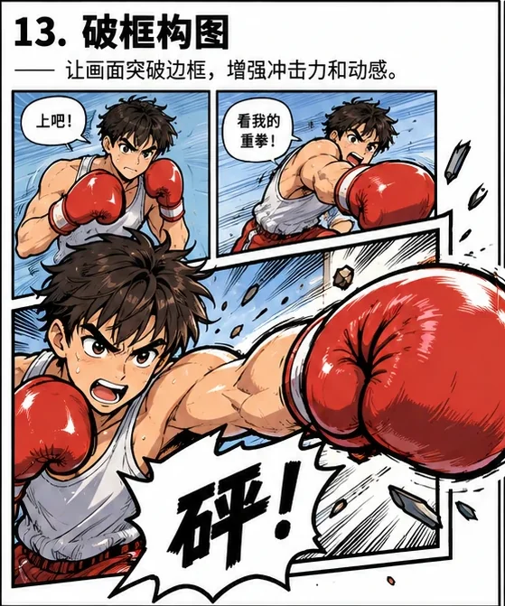 **SB-013** · Border Break 

View Layout Prompt
 Comic storyboard. Layout: Border Break, characters, actions, or visual effects break through panel boundaries, amplifying power, speed, and dimensional presence. Let this storyboard mechanism determine the page structure, reading flow, panel hierarchy, and pacing; output a complete single-page comic where panels tell a continuous story with consistent characters.
 | 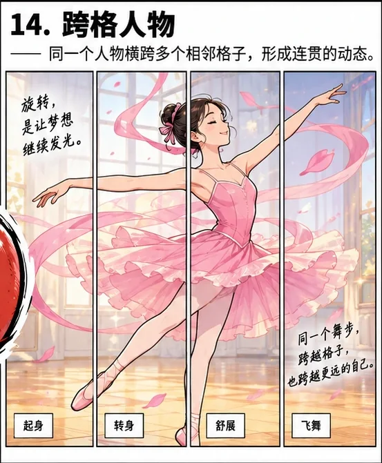 **SB-014** · Multi-Panel Spanning Character 

View Layout Prompt
 Comic storyboard. Layout: Multi-Panel Spanning Character, single character figure extends across multiple panels, creating continuous fluid action. Let this storyboard mechanism determine the page structure, reading flow, panel hierarchy, and pacing; output a complete single-page comic where panels tell a continuous story with consistent characters.
 |  **SB-015** · Continuous Background Across Panels 

View Layout Prompt
 Comic storyboard. Layout: Continuous Background Across Panels, multiple panels share unified continuous panoramic background, with characters shown at different moments. Let this storyboard mechanism determine the page structure, reading flow, panel hierarchy, and pacing; output a complete single-page comic where panels tell a continuous story with consistent characters.
 |
|  **SB-016** · Single Continuous Take 

View Layout Prompt
 Comic storyboard. Layout: Single Continuous Take, entire page represents single unbroken environment, with characters appearing at multiple positions sequentially. Let this storyboard mechanism determine the page structure, reading flow, panel hierarchy, and pacing; output a complete single-page comic where panels tell a continuous story with consistent characters.
 |  **SB-017** · Cinematic Filmstrip 

View Layout Prompt
 Comic storyboard. Layout: Cinematic Filmstrip, sequential filmstrip-like horizontal panels, emphasizing linear time progression and cinematic pacing. Let this storyboard mechanism determine the page structure, reading flow, panel hierarchy, and pacing; output a complete single-page comic where panels tell a continuous story with consistent characters.
 | 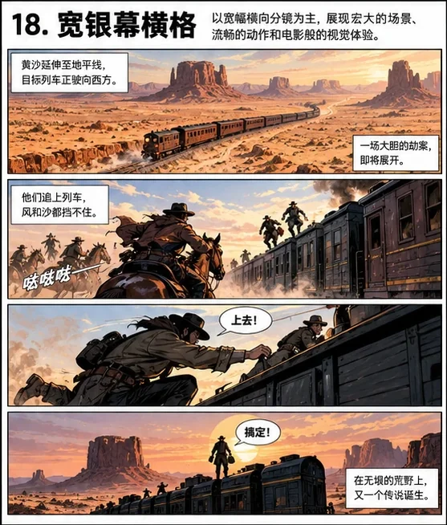 **SB-018** · Widescreen Horizontal Panels 

View Layout Prompt
 Comic storyboard. Layout: Widescreen Horizontal Panels, wide horizontal panels dominating page, ideal for cinematic landscapes, vehicle chases, and expansive scenes. Let this storyboard mechanism determine the page structure, reading flow, panel hierarchy, and pacing; output a complete single-page comic where panels tell a continuous story with consistent characters.
 |
| 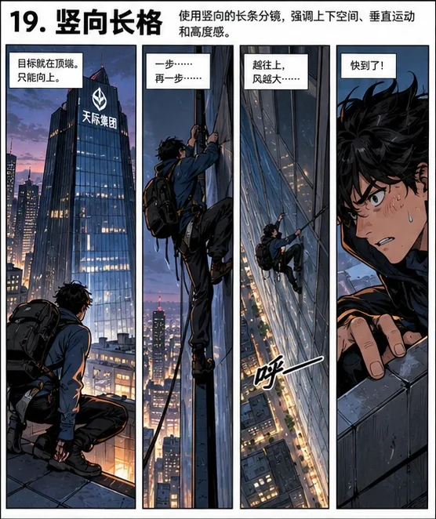 **SB-019** · Vertical Skyscraper Panels 

View Layout Prompt
 Comic storyboard. Layout: Vertical Skyscraper Panels, elongated vertical panels emphasizing falling, high-rise buildings, full-body figures, or upward motion. Let this storyboard mechanism determine the page structure, reading flow, panel hierarchy, and pacing; output a complete single-page comic where panels tell a continuous story with consistent characters.
 |  **SB-020** · Ultra-Slim Reaction Insets 

View Layout Prompt
 Comic storyboard. Layout: Ultra-Slim Reaction Insets, narrow slit-like panels inserted rapidly for eyes, mouth, hands, or micro-reactions, boosting pacing. Let this storyboard mechanism determine the page structure, reading flow, panel hierarchy, and pacing; output a complete single-page comic where panels tell a continuous story with consistent characters.
 |  **SB-021** · Eye Close-Up Sequence 

View Layout Prompt
 Comic storyboard. Layout: Eye Close-Up Sequence, successive eye close-ups building confrontation, suspense, hesitation, or escalating tension. Let this storyboard mechanism determine the page structure, reading flow, panel hierarchy, and pacing; output a complete single-page comic where panels tell a continuous story with consistent characters.
 |
| 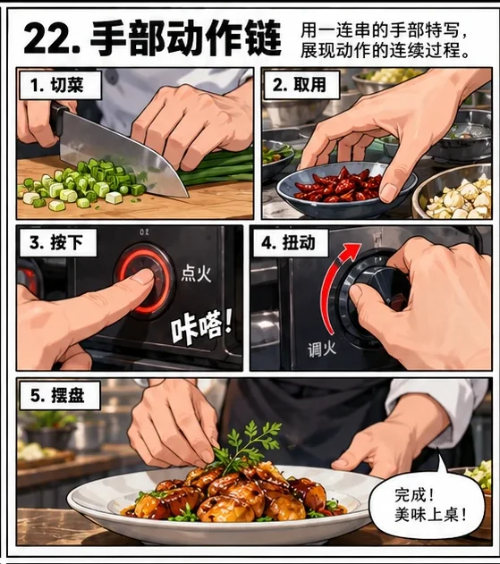 **SB-022** · Hand Action Sequence 

View Layout Prompt
 Comic storyboard. Layout: Hand Action Sequence, consecutive close-ups of hands, buttons, props, or tools driving key tactical actions forward. Let this storyboard mechanism determine the page structure, reading flow, panel hierarchy, and pacing; output a complete single-page comic where panels tell a continuous story with consistent characters.
 |  **SB-023** · Long Shot to Extreme Close-Up 

View Layout Prompt
 Comic storyboard. Layout: Long Shot to Extreme Close-Up, camera zooms from extreme wide shot to close-up, steadily accumulating emotional tension. Let this storyboard mechanism determine the page structure, reading flow, panel hierarchy, and pacing; output a complete single-page comic where panels tell a continuous story with consistent characters.
 |  **SB-024** · Extreme Close-Up to Wide Reveal 

View Layout Prompt
 Comic storyboard. Layout: Extreme Close-Up to Wide Reveal, camera pulls back from extreme macro detail to wide environmental reveal, creating contrast. Let this storyboard mechanism determine the page structure, reading flow, panel hierarchy, and pacing; output a complete single-page comic where panels tell a continuous story with consistent characters.
 |
|  **SB-025** · Shot-Reverse-Shot 

View Layout Prompt
 Comic storyboard. Layout: Shot-Reverse-Shot, alternating character close-ups facing camera, perfect for dialogue, verbal sparring, and psychological duel. Let this storyboard mechanism determine the page structure, reading flow, panel hierarchy, and pacing; output a complete single-page comic where panels tell a continuous story with consistent characters.
 |  **SB-026** · Triple Rapid Close-Ups 

View Layout Prompt
 Comic storyboard. Layout: Triple Rapid Close-Ups, three consecutive rapid detail shots switching dynamically (e.g. eyes, finger, trigger). Let this storyboard mechanism determine the page structure, reading flow, panel hierarchy, and pacing; output a complete single-page comic where panels tell a continuous story with consistent characters.
 |  **SB-027** · Action Breakdown 

View Layout Prompt
 Comic storyboard. Layout: Action Breakdown, single dynamic action dissected into preparation, motion, contact, and aftermath across sequential panels. Let this storyboard mechanism determine the page structure, reading flow, panel hierarchy, and pacing; output a complete single-page comic where panels tell a continuous story with consistent characters.
 |
| 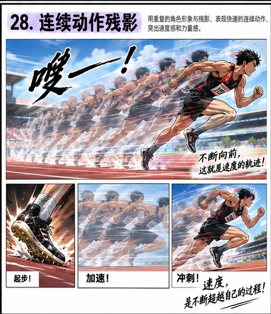 **SB-028** · Motion Trail Strobe Sequence 

View Layout Prompt
 Comic storyboard. Layout: Motion Trail Strobe Sequence, character repeated multiple times within panels depicting high-speed kinetic motion. Let this storyboard mechanism determine the page structure, reading flow, panel hierarchy, and pacing; output a complete single-page comic where panels tell a continuous story with consistent characters.
 | 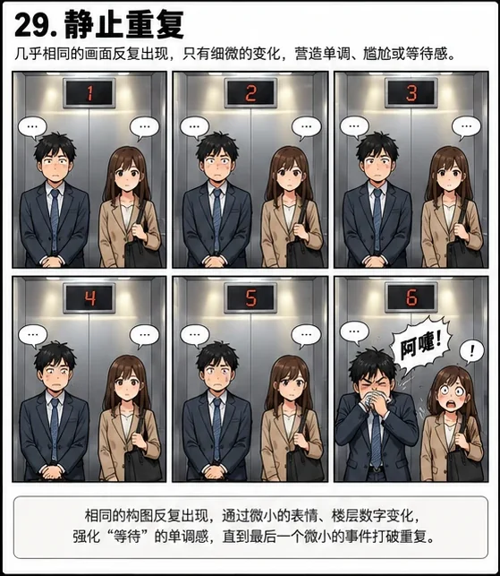 **SB-029** · Static Panel Repetition 

View Layout Prompt
 Comic storyboard. Layout: Static Panel Repetition, successive panels nearly identical with minimal shift, creating deadpan comedy, awkward pause, and comedic timing. Let this storyboard mechanism determine the page structure, reading flow, panel hierarchy, and pacing; output a complete single-page comic where panels tell a continuous story with consistent characters.
 |  **SB-030** · Sudden Pacing Halt 

View Layout Prompt
 Comic storyboard. Layout: Sudden Pacing Halt, rapid dense action suddenly interrupted by large empty negative space or quiet static frame for comedic anti-climax. Let this storyboard mechanism determine the page structure, reading flow, panel hierarchy, and pacing; output a complete single-page comic where panels tell a continuous story with consistent characters.
 |
| 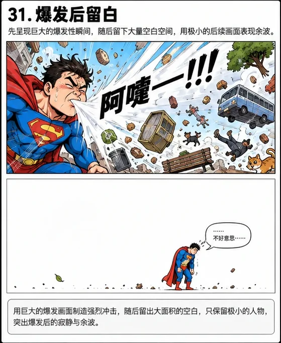 **SB-031** · Post-Climax Negative Space 

View Layout Prompt
 Comic storyboard. Layout: Post-Climax Negative Space, intense explosive action followed by generous white space and tiny silhouette, emphasizing absurdity or lingering mood. Let this storyboard mechanism determine the page structure, reading flow, panel hierarchy, and pacing; output a complete single-page comic where panels tell a continuous story with consistent characters.
 | 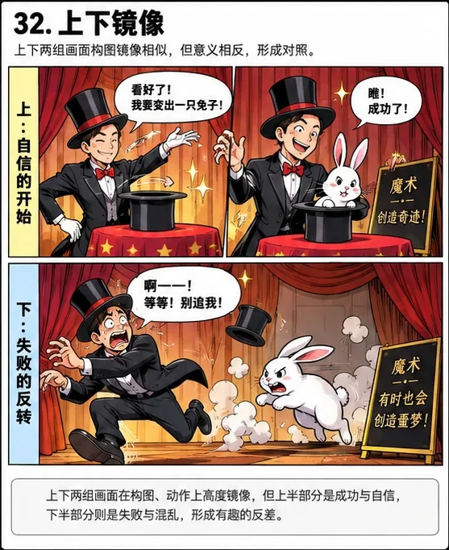 **SB-032** · Vertical Mirroring 

View Layout Prompt
 Comic storyboard. Layout: Vertical Mirroring, top and bottom halves feature symmetrical compositions with contrasted or inverted content for before-after comparison. Let this storyboard mechanism determine the page structure, reading flow, panel hierarchy, and pacing; output a complete single-page comic where panels tell a continuous story with consistent characters.
 |  **SB-033** · Split-Side Confrontation 

View Layout Prompt
 Comic storyboard. Layout: Split-Side Confrontation, opposing characters or factions occupy left and right sides of page, creating direct visual tension. Let this storyboard mechanism determine the page structure, reading flow, panel hierarchy, and pacing; output a complete single-page comic where panels tell a continuous story with consistent characters.
 |
|  **SB-034** · Dual Parallel Storylines 

View Layout Prompt
 Comic storyboard. Layout: Dual Parallel Storylines, two simultaneous story tracks or locations progressing down page, converging at single point. Let this storyboard mechanism determine the page structure, reading flow, panel hierarchy, and pacing; output a complete single-page comic where panels tell a continuous story with consistent characters.
 | 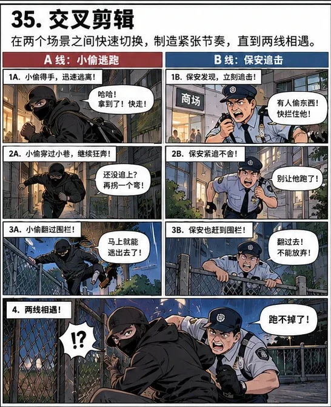 **SB-035** · Cross-Cutting Parallel Action 

View Layout Prompt
 Comic storyboard. Layout: Cross-Cutting Parallel Action, rapid alternating sequence between events A and B, amplifying suspense or misunderstanding. Let this storyboard mechanism determine the page structure, reading flow, panel hierarchy, and pacing; output a complete single-page comic where panels tell a continuous story with consistent characters.
 |  **SB-036** · Inset Memory Flashback 

View Layout Prompt
 Comic storyboard. Layout: Inset Memory Flashback, main panels embedded with smaller vintage or bordered insets representing memories or past events. Let this storyboard mechanism determine the page structure, reading flow, panel hierarchy, and pacing; output a complete single-page comic where panels tell a continuous story with consistent characters.
 |
|  **SB-037** · Inset Fantasy Bubble 

View Layout Prompt
 Comic storyboard. Layout: Inset Fantasy Bubble, reality scenes overlaid with dream-bubble panels depicting character's internal imagination or comic thoughts. Let this storyboard mechanism determine the page structure, reading flow, panel hierarchy, and pacing; output a complete single-page comic where panels tell a continuous story with consistent characters.
 |  **SB-038** · Multi-CCTV Security Grid 

View Layout Prompt
 Comic storyboard. Layout: Multi-CCTV Security Grid, page structured like multi-channel surveillance monitor feeds, ideal for investigation and thriller narrative. Let this storyboard mechanism determine the page structure, reading flow, panel hierarchy, and pacing; output a complete single-page comic where panels tell a continuous story with consistent characters.
 |  **SB-039** · Smartphone Chat Overlay 

View Layout Prompt
 Comic storyboard. Layout: Smartphone Chat Overlay, real-life scene blended with phone messaging screens and speech bubbles for modern social media narrative. Let this storyboard mechanism determine the page structure, reading flow, panel hierarchy, and pacing; output a complete single-page comic where panels tell a continuous story with consistent characters.
 |
| 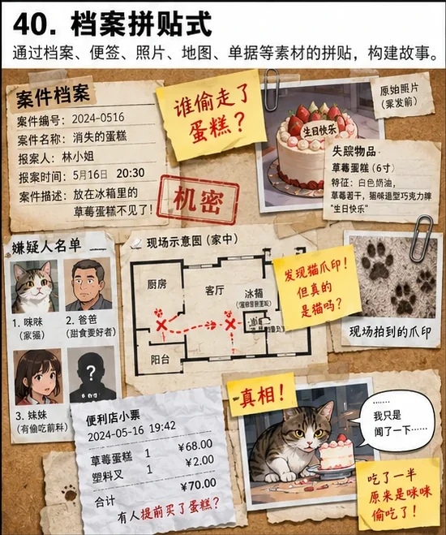 **SB-040** · Detective Case File Collage 

View Layout Prompt
 Comic storyboard. Layout: Detective Case File Collage, mix of photos, sticky notes, confidential memos, evidence pins, and comic panels for investigative stories. Let this storyboard mechanism determine the page structure, reading flow, panel hierarchy, and pacing; output a complete single-page comic where panels tell a continuous story with consistent characters.
 |  **SB-041** · Editorial Magazine Layout 

View Layout Prompt
 Comic storyboard. Layout: Editorial Magazine Layout, bold headlines, character cutouts, captions, and narrative panels composed like high-end editorial spread. Let this storyboard mechanism determine the page structure, reading flow, panel hierarchy, and pacing; output a complete single-page comic where panels tell a continuous story with consistent characters.
 |  **SB-042** · Infographic Comic Hybrid 

View Layout Prompt
 Comic storyboard. Layout: Infographic Comic Hybrid, comic storytelling integrated with statistical charts, flow arrows, and data annotations for educational narrative. Let this storyboard mechanism determine the page structure, reading flow, panel hierarchy, and pacing; output a complete single-page comic where panels tell a continuous story with consistent characters.
 |
|  **SB-043** · Map & Trail Journey 

View Layout Prompt
 Comic storyboard. Layout: Map & Trail Journey, characters navigate along route map or spatial path, guiding reader's eye through the journey. Let this storyboard mechanism determine the page structure, reading flow, panel hierarchy, and pacing; output a complete single-page comic where panels tell a continuous story with consistent characters.
 | 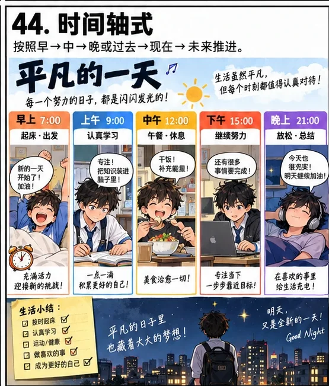 **SB-044** · Chronological Timeline Progression 

View Layout Prompt
 Comic storyboard. Layout: Chronological Timeline Progression, panels sequenced sequentially along time axis (morning to night or past to future). Let this storyboard mechanism determine the page structure, reading flow, panel hierarchy, and pacing; output a complete single-page comic where panels tell a continuous story with consistent characters.
 | 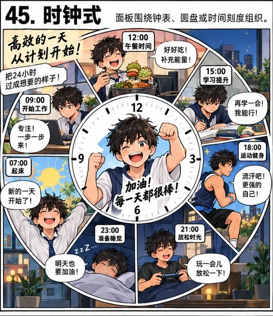 **SB-045** · Clock Face Radial Layout 

View Layout Prompt
 Comic storyboard. Layout: Clock Face Radial Layout, panels organized around circular clock face or timeline dial, ideal for 24-hour cycle or countdown motif. Let this storyboard mechanism determine the page structure, reading flow, panel hierarchy, and pacing; output a complete single-page comic where panels tell a continuous story with consistent characters.
 |
|  **SB-046** · Central Anchor Prop 

View Layout Prompt
 Comic storyboard. Layout: Central Anchor Prop, core object (coffee cup, phone, doorway, car) anchored in center with story unfolding around it. Let this storyboard mechanism determine the page structure, reading flow, panel hierarchy, and pacing; output a complete single-page comic where panels tell a continuous story with consistent characters.
 |  **SB-047** · Central Anchor Protagonist 

View Layout Prompt
 Comic storyboard. Layout: Central Anchor Protagonist, main protagonist anchored in center of page while surrounding panels rotate around their perspective. Let this storyboard mechanism determine the page structure, reading flow, panel hierarchy, and pacing; output a complete single-page comic where panels tell a continuous story with consistent characters.
 |  **SB-048** · Circular Loop Narrative 

View Layout Prompt
 Comic storyboard. Layout: Circular Loop Narrative, panels connect head-to-tail in closed loop, conveying recurring cycle, time loop, or karmic fate. Let this storyboard mechanism determine the page structure, reading flow, panel hierarchy, and pacing; output a complete single-page comic where panels tell a continuous story with consistent characters.
 |
|  **SB-049** · Downward Plunge Flow 

View Layout Prompt
 Comic storyboard. Layout: Downward Plunge Flow, composition and reading path plunge downwards continuously, emphasizing falling, vertigo, and freefall chase. Let this storyboard mechanism determine the page structure, reading flow, panel hierarchy, and pacing; output a complete single-page comic where panels tell a continuous story with consistent characters.
 | 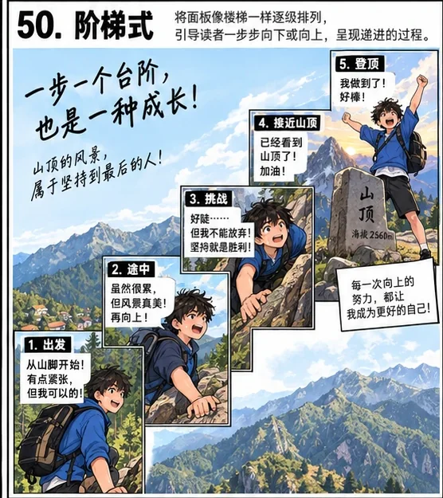 **SB-050** · Stepped Staircase Progression 

View Layout Prompt
 Comic storyboard. Layout: Stepped Staircase Progression, panels stepped diagonally like stairs, visually reinforcing uphill struggle, ascending journey, or level progression. Let this storyboard mechanism determine the page structure, reading flow, panel hierarchy, and pacing; output a complete single-page comic where panels tell a continuous story with consistent characters.
 | 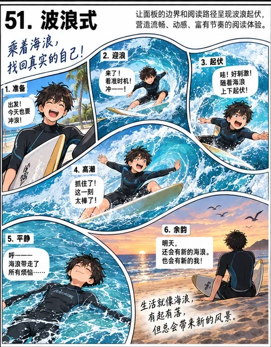 **SB-051** · Undulating Wave Flow 

View Layout Prompt
 Comic storyboard. Layout: Undulating Wave Flow, wavy panel contours and flowing rhythm, ideal for musical scenes, dreamy states, and lighthearted moods. Let this storyboard mechanism determine the page structure, reading flow, panel hierarchy, and pacing; output a complete single-page comic where panels tell a continuous story with consistent characters.
 |
|  **SB-052** · Free-Floating Unframed Panels 

View Layout Prompt
 Comic storyboard. Layout: Free-Floating Unframed Panels, irregularly positioned panels floating freely across white space, guided by eyelines and speech balloons. Let this storyboard mechanism determine the page structure, reading flow, panel hierarchy, and pacing; output a complete single-page comic where panels tell a continuous story with consistent characters.
 | 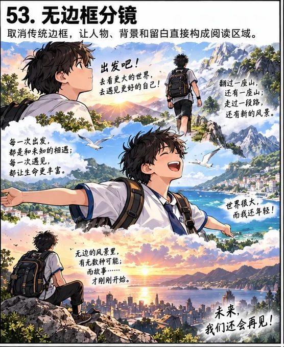 **SB-053** · Frameless Organic Narrative 

View Layout Prompt
 Comic storyboard. Layout: Frameless Organic Narrative, conventional panel borders removed entirely; characters, backgrounds, and negative space form organic reading zones. Let this storyboard mechanism determine the page structure, reading flow, panel hierarchy, and pacing; output a complete single-page comic where panels tell a continuous story with consistent characters.
 |  **SB-054** · Generous Negative Space 

View Layout Prompt
 Comic storyboard. Layout: Generous Negative Space, abundant white space isolating minimal characters and sparse dialogue, conveying quiet, poetic, or awkward atmosphere. Let this storyboard mechanism determine the page structure, reading flow, panel hierarchy, and pacing; output a complete single-page comic where panels tell a continuous story with consistent characters.
 |
|  **SB-055** · Full-Bleed Splash Page 

View Layout Prompt
 Comic storyboard. Layout: Full-Bleed Splash Page, single monumental scene filling entire page with zero margin, delivering peak climax and iconic visual impact. Let this storyboard mechanism determine the page structure, reading flow, panel hierarchy, and pacing; output a complete single-page comic where panels tell a continuous story with consistent characters.
 |  **SB-056** · Simulated Double-Page Spread 

View Layout Prompt
 Comic storyboard. Layout: Simulated Double-Page Spread, simulated center gutter dividing page symmetrically, creating epic cinematic widescreen feel on single page. Let this storyboard mechanism determine the page structure, reading flow, panel hierarchy, and pacing; output a complete single-page comic where panels tell a continuous story with consistent characters.
 | 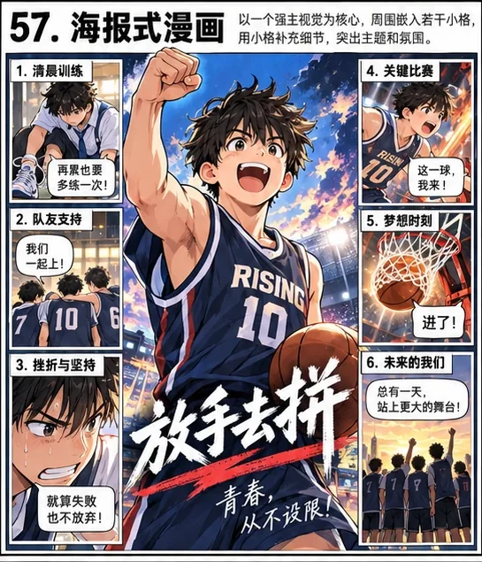 **SB-057** · Poster-Style Narrative 

View Layout Prompt
 Comic storyboard. Layout: Poster-Style Narrative, strong dominant poster-like hero visual surrounded by small supporting narrative panels. Let this storyboard mechanism determine the page structure, reading flow, panel hierarchy, and pacing; output a complete single-page comic where panels tell a continuous story with consistent characters.
 |
|  **SB-058** · Magazine Cover Narrative 

View Layout Prompt
 Comic storyboard. Layout: Magazine Cover Narrative, stylized magazine cover masthead and cover star surrounded by episodic panels telling complete story. Let this storyboard mechanism determine the page structure, reading flow, panel hierarchy, and pacing; output a complete single-page comic where panels tell a continuous story with consistent characters.
 |  **SB-059** · Fixed Proscenium Stage 

View Layout Prompt
 Comic storyboard. Layout: Fixed Proscenium Stage, single fixed theatrical stage perspective where characters enter and exit while environment remains stationary. Let this storyboard mechanism determine the page structure, reading flow, panel hierarchy, and pacing; output a complete single-page comic where panels tell a continuous story with consistent characters.
 |  **SB-060** · Horizontal Continuous Scroll 

View Layout Prompt
 Comic storyboard. Layout: Horizontal Continuous Scroll, emulating traditional horizontal scroll where character appears multiple times across continuous landscape. Let this storyboard mechanism determine the page structure, reading flow, panel hierarchy, and pacing; output a complete single-page comic where panels tell a continuous story with consistent characters.
 |
| 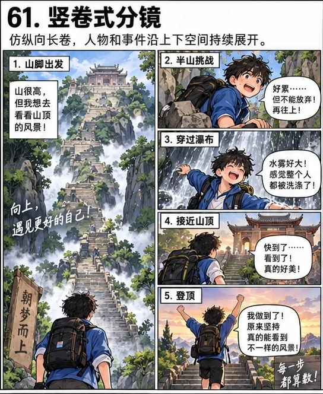 **SB-061** · Vertical Hanging Scroll 

View Layout Prompt
 Comic storyboard. Layout: Vertical Hanging Scroll, emulating vertical scroll where events and characters descend continuously down single tall space. Let this storyboard mechanism determine the page structure, reading flow, panel hierarchy, and pacing; output a complete single-page comic where panels tell a continuous story with consistent characters.
 |  **SB-062** · Mirror Reflection Dualism 

View Layout Prompt
 Comic storyboard. Layout: Mirror Reflection Dualism, mirror surfaces, puddles, or reflections splitting scene into twin perspectives and psychological duality. Let this storyboard mechanism determine the page structure, reading flow, panel hierarchy, and pacing; output a complete single-page comic where panels tell a continuous story with consistent characters.
 | 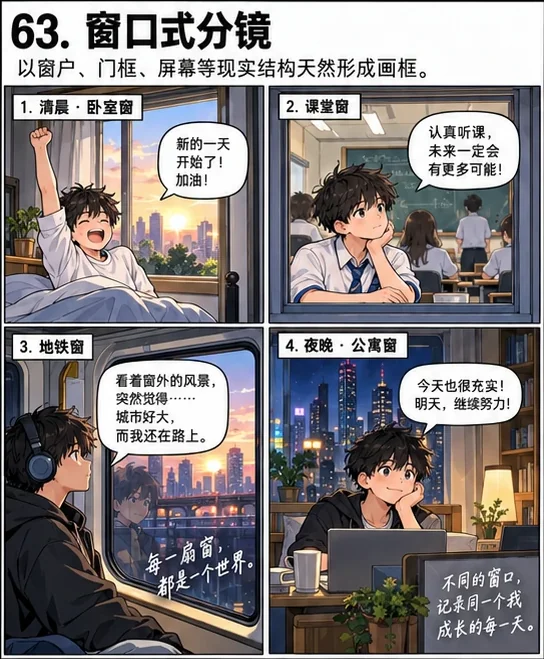 **SB-063** · Architectural Window Framing 

View Layout Prompt
 Comic storyboard. Layout: Architectural Window Framing, windows, door frames, balconies, or screens naturally forming visual panels. Let this storyboard mechanism determine the page structure, reading flow, panel hierarchy, and pacing; output a complete single-page comic where panels tell a continuous story with consistent characters.
 |
|  **SB-064** · Foreground Silhouette Framing 

View Layout Prompt
 Comic storyboard. Layout: Foreground Silhouette Framing, foreground elements (pillars, tree trunks, door jambs) naturally partitioning scene into narrative panels. Let this storyboard mechanism determine the page structure, reading flow, panel hierarchy, and pacing; output a complete single-page comic where panels tell a continuous story with consistent characters.
 | 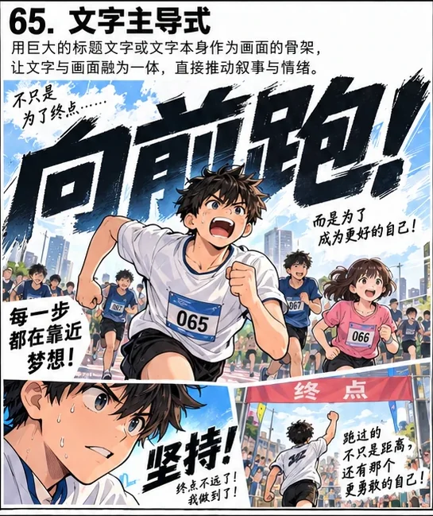 **SB-065** · Typographic Scaffold Layout 

View Layout Prompt
 Comic storyboard. Layout: Typographic Scaffold Layout, monumental sound-effect characters or titles act as structural skeleton, with panels built around lettering. Let this storyboard mechanism determine the page structure, reading flow, panel hierarchy, and pacing; output a complete single-page comic where panels tell a continuous story with consistent characters.
 | 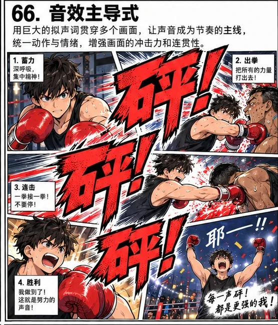 **SB-066** · Onomatopoeia Trail 

View Layout Prompt
 Comic storyboard. Layout: Onomatopoeia Trail, giant sound effect words cutting across panels, uniting kinetic rhythm and visual direction. Let this storyboard mechanism determine the page structure, reading flow, panel hierarchy, and pacing; output a complete single-page comic where panels tell a continuous story with consistent characters.
 |
|  **SB-067** · Color Block Panel Partitions 

View Layout Prompt
 Comic storyboard. Layout: Color Block Panel Partitions, distinct solid color blocks serving as panel dividers and emotional mood zones rather than black lines. Let this storyboard mechanism determine the page structure, reading flow, panel hierarchy, and pacing; output a complete single-page comic where panels tell a continuous story with consistent characters.
 |  **SB-068** · Non-Rectangular Geometric Mosaic 

View Layout Prompt
 Comic storyboard. Layout: Non-Rectangular Geometric Mosaic, circular, triangular, and polygon panels dividing page, creating stylized geometric rhythm. Let this storyboard mechanism determine the page structure, reading flow, panel hierarchy, and pacing; output a complete single-page comic where panels tell a continuous story with consistent characters.
 | 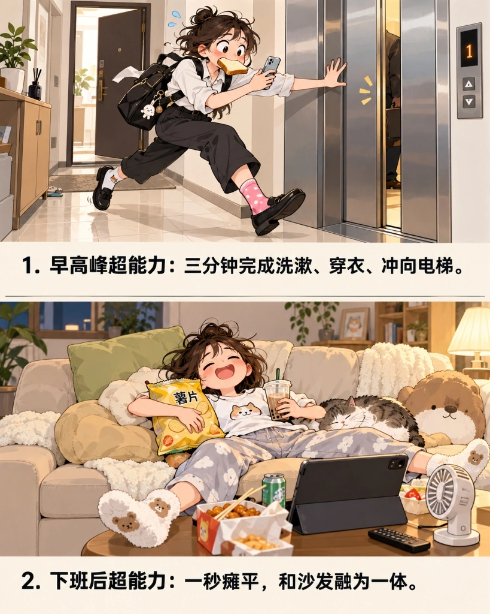 **SB-069** · Two-Panel Vertical Lifestyle Comic Storyboard 

View Layout Prompt
 Adopt a vertical two-panel comic storyboard layout, with two equally sized panels stacked vertically. The overall canvas background color and the text area background color are identical. Each panel uses an "image on top, text below" structure: the upper ~80% area is a complete scene illustration, and the lower ~20% area is a horizontal caption bar. The illustration fills the upper area with no left or right borders, and the caption bar sits directly beneath the illustration against a light background. Text is left-aligned, starting with a sequential number followed by a concise caption with natural line wrapping, keeping all font sizes and weights consistent within the text area. The two panels are separated by a thin horizontal dividing line, maintaining uniform image aspect ratios, caption bar heights, and left/right margins. Each panel depicts an independent everyday life scene, creating a clean, orderly layout without extra decorative clutter.
 |
| 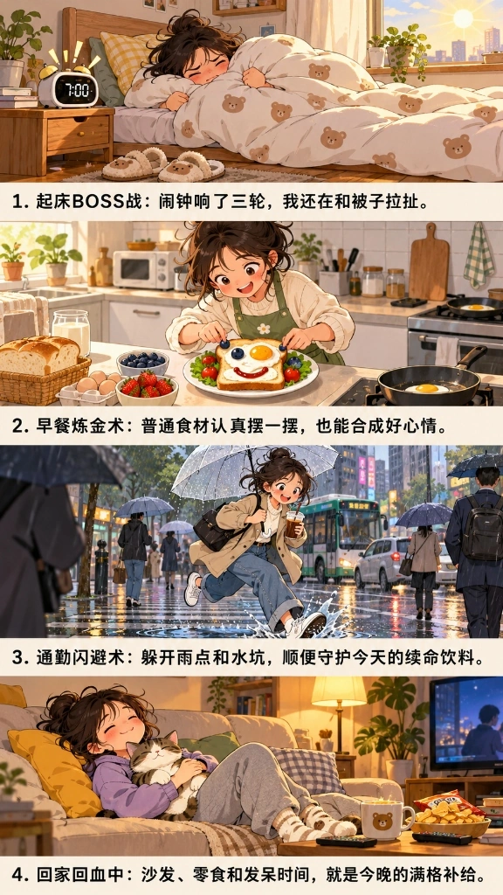 **SB-070** · Four-Panel Vertical Lifestyle Comic Storyboard 

View Layout Prompt
 Adopt a vertical four-panel comic storyboard layout, with four equally sized panels stacked vertically. The overall canvas background color and the text area background color are identical. Each panel uses an "image on top, text below" structure: the upper ~80% area is a complete scene illustration, and the lower ~20% area is a horizontal caption bar. The illustration fills the upper area with no left or right borders, and the caption bar sits directly beneath the illustration against a light background. Text is left-aligned, starting with a sequential number followed by a concise caption with natural line wrapping, keeping all font sizes and weights consistent within the text area. The four panels are separated by thin horizontal dividing lines, maintaining uniform image aspect ratios, caption bar heights, and left/right margins. Each panel depicts an independent everyday life scene, creating a clean, orderly layout without extra decorative clutter.
 | 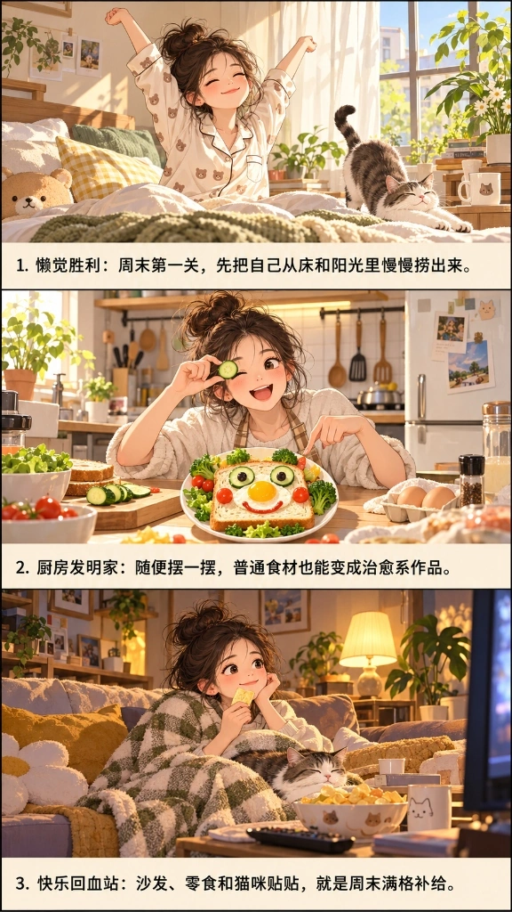 **SB-071** · Three-Panel Vertical Lifestyle Comic Storyboard 

View Layout Prompt
 Adopt a vertical three-panel comic storyboard layout, with three equally sized panels stacked vertically. The overall canvas background color and the text area background color are identical. Each panel uses an "image on top, text below" structure: the upper ~80% area is a complete scene illustration, and the lower ~20% area is a horizontal caption bar. The illustration fills the upper area with no left or right borders, and the caption bar sits directly beneath the illustration against a light background. Text is left-aligned, starting with a sequential number followed by a concise caption with natural line wrapping, keeping all font sizes and weights consistent within the text area. The three panels are separated by thin horizontal dividing lines, maintaining uniform image aspect ratios, caption bar heights, and left/right margins. Each panel depicts an independent everyday life scene, creating a clean, orderly layout without extra decorative clutter.
 |  |

---

## 4. IP Design (13 Layouts)

Ideal for IP character design, mascot positioning cards, character profiles, and specification guides. Includes hero character showcase, positioning slogans, audience profiles, and multi-angle views.

| Preview | Preview | Preview |
| :---: | :---: | :---: |
|  **IP-001** · IP Positioning Card 

View Layout Prompt
 IP Positioning Card. Core purpose: Answer why the IP exists and define its commercial and emotional positioning. Card content: IP name (Chinese/English), one-sentence positioning (identity + core value + emotional effect), 3 core tone tags, target audience profile. Composition: Full-body primary character displayed prominently in the center or off-center, with small annotated callouts highlighting its visual signature, paired with large bold typography for the name and positioning slogan, with generous whitespace and a brand cover feel. Solid-color clean background. High internet presence, highly generalized silhouette, restrained color palette: clean lines if 2D, restrained materials, accessories, and ornaments if not 2D. High recognizability even at thumbnail scale. Default workflow: Analyze design requirements from the theme, design visual metaphors first, then design a fun IP character. Default style: 2D doodle / sketch style; if a specific style is designated, prioritize the designated style. Default IP character: Non-human mascot character. Avoid: Extraneous props (unless they are a fixed part of the IP character), atmospheric decorative elements unrelated to the IP. Theme: {theme description}, please design a fun IP character for me.
 | 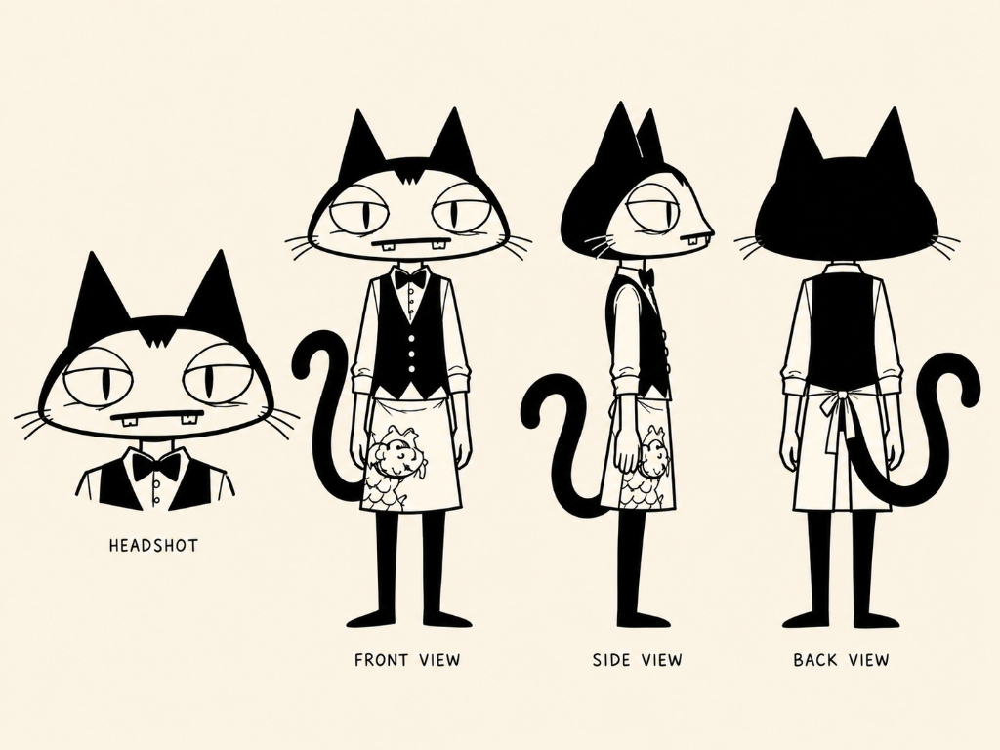 **IP-002** · Character Model Sheet & Turnaround 

View Layout Prompt
 Layout: Character Model Sheet & Turnaround Sheet. A horizontal character reference model sheet with views arranged neatly side by side. On the left is a close-up headshot showing the neck and above (HEADSHOT); on the right, sequentially arranged, are the full-body front view (FRONT VIEW), full-body side view (SIDE VIEW), and full-body back view (BACK VIEW). The character maintains a standard neutral upright standing pose at eye level across all views with consistent proportions and height, accompanied by brief view labels underneath. Avoid: no tilted head, no props, no hands in pockets, no dynamic leaning poses.
 |  **IP-003** · 16-Grid Character WeChat Sticker Sheet 

View Layout Prompt
 Design a 16-grid WeChat emoji and sticker sheet for the character.
 |
|  **IP-004** · IP Outfit & Props Card 

View Layout Prompt
 This is the IP Character Design Outfit & Props Card: Perform visual extension based on the character in the reference image, showcasing multiple everyday outfit variations and iconic personal props. Design it for me.
 |  **IP-005** · IP Content Communication Showcase Card 

View Layout Prompt
 This is the IP Character Design Content Social Showcase Card. Core purpose: Demonstrate multiple single-image social media promotional posters and cover showcases for this IP. Design it for me.
 |  **IP-006** · IP Character Family Lineup Card 

View Layout Prompt
 This is the IP Character Design Family Lineup Card: Uses the reference image for visual extension to design multiple other IP characters from the same family.
 |
|  **IP-007** · IP Commercial Mockup Card 

View Layout Prompt
 This is the IP Character Design Commercial Application Card. Core purpose: Showcase the tangible physical quality of branded merchandise and derivatives. Card content: Core derivative product categories. Design it for me.
 |  **IP-008** · IP Character Relationship Card 

View Layout Prompt
 This is the IP Character Design Character Relationship Card. Core purpose: Demonstrate the interaction dynamics between the protagonist and their companion/rival. Card content: Protagonist and partner names, one-sentence interaction mode.
 |  **IP-009** · IP Character A Day in the Life Photo Album 

View Layout Prompt
 Show a realistic iPhone Photos app album screenshot of this character; if no specific theme is provided, default to a full day in the life of the character. Vertical aspect ratio. Avoid: phone frame.
 |
|  **IP-010** · IP Character Social Feed Moments Card 

View Layout Prompt
 Show a WeChat Moments feed screenshot for this character, displaying Moments posts published by the character's friends. Avoid: posts published by the character itself.
 |  **IP-011** · IP Character WeChat Group Chat Interface Card 

View Layout Prompt
 Show a WeChat chat interface screenshot of this character with friends.
 |  **IP-012** · IP Character Xiaohongshu Profile Interface Card 

View Layout Prompt
 Show a Xiaohongshu account profile interface screenshot for this character. Avoid: phone frame.
 |
|  **IP-013** · IP Signature Poses & Action Lines Card 

View Layout Prompt
 Perform visual extension based on the character in the reference image, showcasing multiple signature poses and dynamic action lines of the character. Design it for me.
 |  |  |

---

## 5. E-commerce (24 Layouts)

Ideal for e-commerce product showcases, PDP hero images, feature callouts, lifestyle scenarios, and buying guides. Includes single product hero, multi-angle views, specs, material breakdown, and comparative advantage.

| Preview | Preview | Preview |
| :---: | :---: | :---: |
|  **EC-001** · Single Product Hero Image 

View Layout Prompt
 E-commerce single product hero image. Core task: Clearly present the product at first glance. Audience: {Input by user, or summarized based on product and user data}. Theme: {Input by user, or summarized based on product data}. Copy: {Provided by user materials or inferred and designed based on the product}. Product subject: {Specified by user, recognized from reference image, or extracted from product data}. Mandatory product identification features: {Summarized based on reference image or data; leave blank if no special requirements}. Render the rest of the visual presentation around "clear subject, prominent product, immediately understandable at first glance". Background scenes and surrounding elements may adopt the specified artistic style, but the product itself must strictly maintain a realistic photographic style.
 | 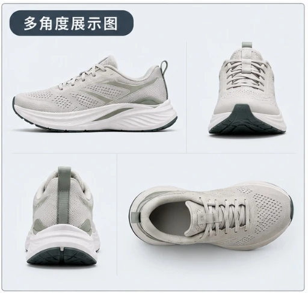 **EC-002** · Multi-Angle Display Image 

View Layout Prompt
 E-commerce multi-angle display image. Core task: Allow users to quickly see the overall product structure and different perspectives. Audience: {Input by user, or summarized based on product and user data}. Theme: {Input by user, or summarized based on product data}. Copy: {Provided by user materials or inferred and designed based on the product}. Product subject: {Specified by user, recognized from reference image, or extracted from product data}. Angles or structures to emphasize: {Specified by user; if unspecified, determine the most informative angles based on product morphology}. Autonomously arrange the multi-angle composition and visual presentation. Background scenes and surrounding elements may adopt the specified artistic style, but the product itself must strictly maintain a realistic photographic style.
 |  **EC-003** · Detail Closeup Image 

View Layout Prompt
 E-commerce detail closeup image. Core task: Highlight the product's most notable local details, craftsmanship, or material texture. Audience: {Input by user, or summarized based on product and user data}. Theme: {Input by user, or summarized based on product data}. Copy: {Provided by user materials or inferred and designed based on the product}. Product subject: {Specified by user, recognized from reference image, or extracted from product data}. Key details: {Specified by user; if unspecified, extract the most valuable authentic details based on product data}. Autonomously determine the closeup angles, framing, lighting, and texture rendering. Background scenes and surrounding elements may adopt the specified artistic style, but the product itself must strictly maintain a realistic photographic style.
 |
|  **EC-004** · Packaging / Set / Contents Display Image 

View Layout Prompt
 E-commerce packaging, set, and contents display image. Core task: Let users quickly see what is actually included upon purchase—products, packaging, accessories, or bundled items. Audience: {Input by user, or summarized based on product and user data}. Theme: {Input by user, or summarized based on product data}. Copy: {Provided by user materials or inferred and designed based on the product}. Product and contents: {Extracted from user input, product list, or reference data; do not invent non-existent accessories or gifts}. Autonomously arrange display composition, hierarchical relations, and visual layout. Background scenes and surrounding elements may adopt the specified artistic style, but the product itself must strictly maintain a realistic photographic style.
 |  **EC-005** · Feature Callout Image 

View Layout Prompt
 E-commerce feature callout image. Core task: Quickly communicate the most compelling reasons to buy. Audience: {Input by user, or summarized based on product and user data}. Theme: {Input by user, or summarized based on product data}. Copy: {Provided by user materials or inferred and designed based on the product}. Product subject: {Specified by user, recognized from reference image, or extracted from product data}. Core selling points: {Prioritize user-provided content; if not specified, extract 3-5 authentic selling points from product data}. Priority of selling points: {Rank based on target audience and purchase decision value}. Autonomously determine annotation methods, visual hierarchy, and overall presentation. Background scenes and surrounding elements may adopt the specified artistic style, but the product itself must strictly maintain a realistic photographic style.
 |  **EC-006** · Function Demonstration Image 

View Layout Prompt
 E-commerce function demonstration image. Core task: Intuitively demonstrate what the product does and how its core functions operate. Audience: {Input by user, or summarized based on product and user data}. Theme: {Input by user, or summarized based on product data}. Copy: {Provided by user materials or inferred and designed based on the product}. Product subject: {Specified by user, recognized from reference image, or extracted from product data}. Core function: {Extracted from user input or product data}. Function target and result: {Summarized strictly from verifiable data, do not fabricate effects}. Autonomously design the action, state representation, function visualization method, and overall visual presentation. Background scenes and surrounding elements may adopt the specified artistic style, but the product itself must strictly maintain a realistic photographic style.
 |
| 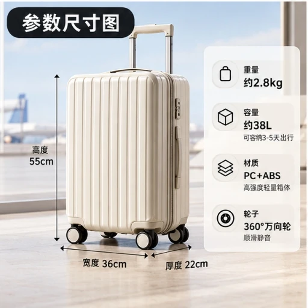 **EC-007** · Specification & Dimension Image 

View Layout Prompt
 E-commerce specification and dimension image. Core task: Let users quickly understand critical specifications and dimensions that influence buying decisions. Audience: {Input by user, or summarized based on product and user data}. Theme: {Input by user, or summarized based on product data}. Copy: {Provided by user materials or inferred and designed based on the product}. Product subject: {Specified by user, recognized from reference image, or extracted from product data}. Key specifications: {Extract genuine dimensions, capacity, weight, specs, etc., from user data; do not guess if data is missing}. Specification priority: {Filter based on product category and purchase decision value}. Autonomously design measurement relations, information layout, and visual presentation. Background scenes and surrounding elements may adopt the specified artistic style, but the product itself must strictly maintain a realistic photographic style.
 | 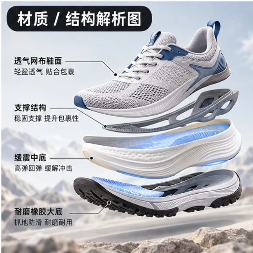 **EC-008** · Material / Structure Exploded Image 

View Layout Prompt
 E-commerce material and structure analysis image. Core task: Explain what the product is made of, and why its materials, structure, or composition matter. Audience: {Input by user, or summarized based on product and user data}. Theme: {Input by user, or summarized based on product data}. Copy: {Provided by user materials or inferred and designed based on the product}. Product subject: {Specified by user, recognized from reference image, or extracted from product data}. Material, composition, or structural information: {Extracted from user input or product data; interpret appropriately as ingredients, fabrics, components, layers, or internal structure depending on product type}. Autonomously select visual techniques such as cross-sections, exploded views, layering, or callout blowups. Background scenes and surrounding elements may adopt the specified artistic style, but the product itself must strictly maintain a realistic photographic style.
 | 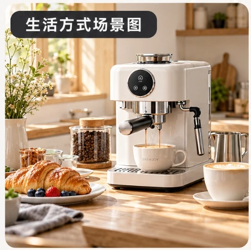 **EC-009** · Lifestyle Scenario Image 

View Layout Prompt
 E-commerce lifestyle scenario image. Core task: Enable users to naturally envision their lifestyle after owning and using the product. Audience: {Input by user, or summarized based on product positioning and data}. Theme: {Input by user, or summarized based on product data and audience}. Copy: {Provided by user materials or inferred and designed based on the product}. Product subject: {Specified by user, recognized from reference image, or extracted from product data}. Lifestyle setting: {Use if specified by user; otherwise summarize the most suitable setting based on product use, audience, and brand tone}. Autonomously design the characters, environment, time of day, lighting, props, and overall atmosphere. Background scenes and surrounding elements may adopt the specified artistic style, but the product itself must strictly maintain a realistic photographic style.
 |
|  **EC-010** · In-Use Demonstration Image 

View Layout Prompt
 E-commerce in-use demonstration image. Core task: Clearly showcase the genuine usage relationship between user and product. Audience: {Input by user, or summarized based on product positioning and data}. Theme: {Input by user, or summarized based on product data}. Copy: {Provided by user materials or inferred and designed based on the product}. Product subject: {Specified by user, recognized from reference image, or extracted from product data}. User persona: {Specified by user; if unspecified, summarize based on target audience}. Usage action: {Specified by user, or summarized based on genuine product usage}. Autonomously design character pose, camera framing, scene setting, and interactive expression. Background scenes and surrounding elements may adopt the specified artistic style, but the product itself must strictly maintain a realistic photographic style.
 | 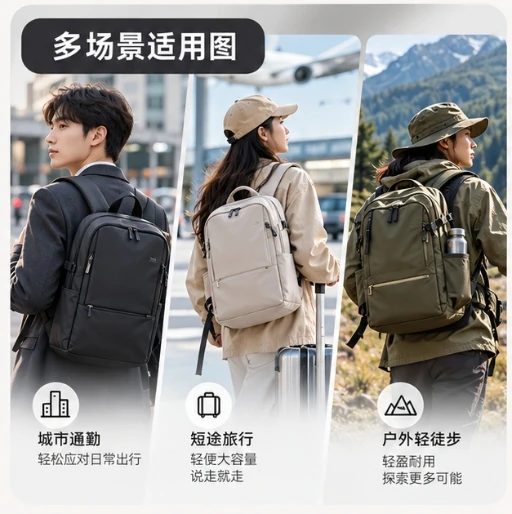 **EC-011** · Multi-Scenario Application Image 

View Layout Prompt
 E-commerce multi-scenario application image. Core task: Showcase the versatility and applicability of the same product across multiple representative scenarios. Audience: {Input by user, or summarized based on product positioning and data}. Theme: {Input by user, or summarized based on product data}. Copy: {Provided by user materials or inferred and designed based on the product}. Product subject: {Specified by user, recognized from reference image, or extracted from product data}. Key usage scenarios: {Prioritize user-provided scenarios; if not provided, summarize 3-5 typical scenarios based on product utility and target audience}. Autonomously determine scene arrangement, visual rhythm, and cohesive presentation. Background scenes and surrounding elements may adopt the specified artistic style, but the product itself must strictly maintain a realistic photographic style.
 |  **EC-012** · Usage Steps / Tutorial Image 

View Layout Prompt
 E-commerce usage steps or tutorial image. Core task: Allow users to quickly grasp how to use the product properly. Audience: {Input by user, or summarized based on product and user data}. Theme: {Input by user, or summarized based on product data}. Copy: {Provided by user materials or inferred and designed based on the product}. Product subject: {Specified by user, recognized from reference image, or extracted from product data}. Usage steps: {Extract from user instructions, manuals, or product data into a clear sequence; do not fabricate key actions}. Precautions: {Extract only verifiable information}. Autonomously design step illustrations, action perspectives, and workflow layout. Background scenes and surrounding elements may adopt the specified artistic style, but the product itself must strictly maintain a realistic photographic style.
 |
| 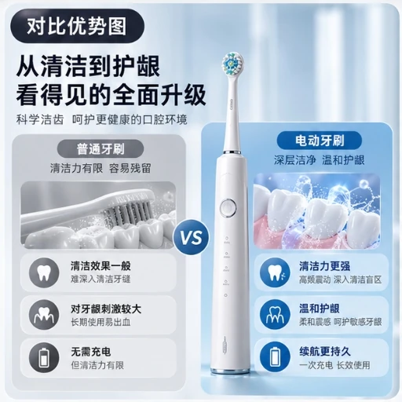 **EC-013** · Comparative Advantage Image 

View Layout Prompt
 E-commerce comparative advantage image. Core task: Allow users to quickly understand key differentiators between this product and alternative options. Audience: {Input by user, or summarized based on product and user data}. Theme: {Input by user, or summarized based on product data}. Copy: {Provided by user materials or inferred and designed based on the product}. This product: {Specified by user, recognized from reference image, or extracted from product data}. Comparison target: {Specified by user; if unspecified, summarize only from existing comparison targets in user data, do not fabricate competitor info}. Comparison criteria: {Extract genuine differences from data and rank by purchase decision value}. Autonomously design comparison layout structure and visual expression. Background scenes and surrounding elements may adopt the specified artistic style, but the product itself must strictly maintain a realistic photographic style.
 |  **EC-014** · Model / SKU Comparison Image 

View Layout Prompt
 E-commerce model and SKU comparison image. Core task: Help users quickly distinguish between different colors, sizes, capacities, configurations, or models. Audience: {Input by user, or summarized based on product and user data}. Theme: {Input by user, or summarized based on product data}. Copy: {Provided by user materials or inferred and designed based on the product}. SKU / model list: {Extracted from user data}. Key differences between versions: {Organized based on authentic data; do not infer non-existent differences}. Autonomously arrange version showcase, grouping, and information hierarchy. Background scenes and surrounding elements may adopt the specified artistic style, but the product itself must strictly maintain a realistic photographic style.
 |  **EC-015** · Fit / Selection Guide Image 

View Layout Prompt
 E-commerce fit and selection guide image. Core task: Help users determine which product, specification, or edition best suits their needs. Audience: {Input by user, or summarized based on product positioning and data}. Theme: {Input by user, or summarized based on product data}. Copy: {Provided by user materials or inferred and designed based on the product}. User conditions: {Input by user, or summarized based on common conditions of target audience}. Selection dimensions: {Extracted from genuine data, such as sizing, capacity, compatible devices, usage scenarios, needs, etc.}. Recommendation logic: {Organized based on rules in user data; do not establish rigid recommendations without evidence}. Autonomously design selection pathways and visual representation. Background scenes and surrounding elements may adopt the specified artistic style, but the product itself must strictly maintain a realistic photographic style.
 |
|  **EC-016** · FAQ / Precautions Image 

View Layout Prompt
 E-commerce FAQ and precautions image. Core task: Centrally address the most crucial pre-purchase questions, constraints, and precautions. Audience: {Input by user, or summarized based on product and user data}. Theme: {Input by user, or summarized based on product data}. Copy: {Provided by user materials or inferred and designed based on the product}. Q&A content: {Prioritize user-provided content; if not provided, compile only verifiable questions and answers from existing product data; do not fabricate policies, promises, or features}. Key precautions: {Extracted from data}. Autonomously organize information grouping and visual layout. Background scenes and surrounding elements may adopt the specified artistic style, but the product itself must strictly maintain a realistic photographic style.
 | 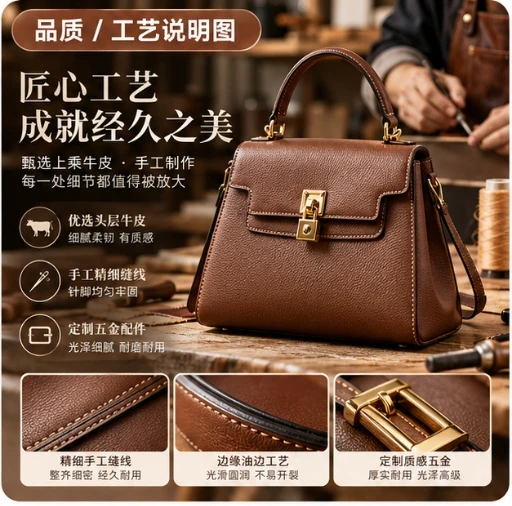 **EC-017** · Quality & Craftsmanship Explanatory Image 

View Layout Prompt
 E-commerce quality and craftsmanship explanatory image. Core task: Establish a sense of value through authentic craftsmanship, manufacturing processes, or quality details. Audience: {Input by user, or summarized based on product and user data}. Theme: {Input by user, or summarized based on product data}. Copy: {Provided by user materials or inferred and designed based on the product}. Product subject: {Specified by user, recognized from reference image, or extracted from product data}. Quality and craftsmanship information: {Extracted from user data and organized into the most persuasive authentic information}. Autonomously design the craftsmanship presentation, detail rendering, and visual arrangement. Background scenes and surrounding elements may adopt the specified artistic style, but the product itself must strictly maintain a realistic photographic style.
 |  **EC-018** · Certification & Data Proof Image 

View Layout Prompt
 E-commerce certification and data proof image. Core task: Build credibility using verifiable certifications, test results, performance metrics, or experimental data. Audience: {Input by user, or summarized based on product and user data}. Theme: {Input by user, or summarized based on product data}. Copy: {Provided by user materials or inferred and designed based on the product}. Certification / data: {Extracted solely from user data or clear sources; leave blank or prompt user if unverifiable, never fabricate certifications, numbers, or lab findings}. Key conclusion: {Compressed summary based on authentic data}. Autonomously determine data visualization methods. Background scenes and surrounding elements may adopt the specified artistic style, but the product itself must strictly maintain a realistic photographic style.
 |
|  **EC-019** · Review & Word-of-Mouth Image 

View Layout Prompt
 E-commerce review and word-of-mouth image. Core task: Establish social proof through authentic customer feedback. Audience: {Input by user, or summarized based on product and user data}. Theme: {Input by user, or summarized based on product data}. Copy: {Provided by user materials or inferred and designed based on the product}. Review content: {Use only genuine user reviews, platform data, or verified reputation data; do not fabricate usernames, ratings, sales counts, or reviews}. Reputation keywords: {Extracted from authentic reviews}. Autonomously determine review presentation formats and visual styling. Background scenes and surrounding elements may adopt the specified artistic style, but the product itself must strictly maintain a realistic photographic style.
 |  **EC-020** · Brand & Origin Story Image 

View Layout Prompt
 E-commerce brand and origin story image. Core task: Help users understand the brand, origin, design philosophy, or production background behind the product. Audience: {Input by user, or summarized based on product and brand data}. Theme: {Input by user, or summarized based on brand and product data}. Copy: {Provided by user materials or inferred and designed based on the product}. Brand / origin information: {Extracted from user data, brand assets, or product background}. Story focus: {Select authentic content that best communicates product value}. Autonomously design narrative visuals and artistic presentation. Background scenes and surrounding elements may adopt the specified artistic style, but the product itself must strictly maintain a realistic photographic style.
 |  **EC-021** · New Arrival Launch Image 

View Layout Prompt
 E-commerce new arrival launch image. Core task: Clearly communicate that "this is a noteworthy new product / new release". Audience: {Input by user, or summarized based on new release positioning and data}. Theme: {Input by user, or summarized based on new release data}. Copy: {Provided by user materials or inferred and designed based on the product}. New product subject: {Specified by user, recognized from reference image, or extracted from product data}. Product highlights: {Provided by user, or extracted as authentic changes and core values from new release data}. Launch date / release info: {Use only when explicitly provided in user data}. Autonomously design the launch energy, visual impact, and graphic presentation. Background scenes and surrounding elements may adopt the specified artistic style, but the product itself must strictly maintain a realistic photographic style.
 |
|  **EC-022** · Promotion & Sales Event Image 

View Layout Prompt
 E-commerce promotion and sales event image. Core task: Enable users to immediately grasp promotional benefits and generate purchase intent. Audience: {Input by user, or summarized based on product and campaign data}. Theme: {Input by user, or summarized based on campaign data}. Copy: {Provided by user materials or inferred and designed based on the product}. Product subject: {Specified by user, recognized from reference image, or extracted from product data}. Campaign mechanics: {Extract genuine discount, tiered reduction, gifts, bundles, or limited-time campaign rules from user data}. Campaign dates and limits: {Use only explicitly provided user info}. Autonomously design promotional atmosphere, focal points, and visual presentation. Background scenes and surrounding elements may adopt the specified artistic style, but the product itself must strictly maintain a realistic photographic style.
 |  **EC-023** · Content Seeding & UGC Image 

View Layout Prompt
 E-commerce content seeding and UGC image. Core task: Convey product experience and recommendation reasons in a natural, organic sharing style. Audience: {Input by user, or summarized based on product and platform data}. Theme: {Input by user, or summarized based on product data}. Copy: {Provided by user materials or inferred and designed based on the product}. Product subject: {Specified by user, recognized from reference image, or extracted from product data}. Experience and recommendation rationale: {Prioritize user-provided content; if absent, summarize based on known product traits without faking customer testimonials}. Platform context: {Specified by user; if unspecified, infer based on task}. Autonomously design the casual snap aesthetic, everyday realism, camera angles, and visual expression. Background scenes and surrounding elements may adopt the specified artistic style, but the product itself must strictly maintain a realistic photographic style.
 |  **EC-024** · Key Visual & Hero Art (KV) 

View Layout Prompt
 E-commerce key visual, hero shot, or key art (KV). Core task: Build an intense, focused, highly communicable core visual concept around the product. Audience: {Input by user, or summarized based on product, brand, and communication data}. Theme: {Input by user, or summarized based on product and communication goals}. Copy: {Provided by user materials or inferred and designed based on the product}. Product subject: {Specified by user, recognized from reference image, or extracted from product data}. Core message: {Provided by user, or distilled from product selling points, brand positioning, and campaign goals}. Creative direction: {Prioritize user-specified direction; if unspecified, select autonomously based on product attributes and core message, e.g. surrealism, miniature world, colossal product, conceptual metaphor, art installation, fluid world, levitation visual, material realm, editorial advertising, etc.}. Except for factual and core messaging data, design the rest of visual creativity autonomously. Background scenes and surrounding elements may adopt the specified artistic style, but the product itself must strictly maintain a realistic photographic style.
 |

---
