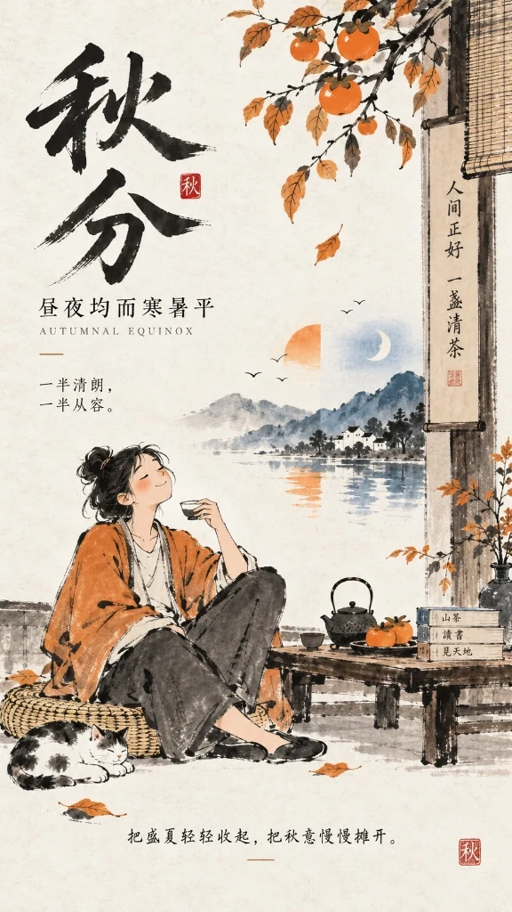
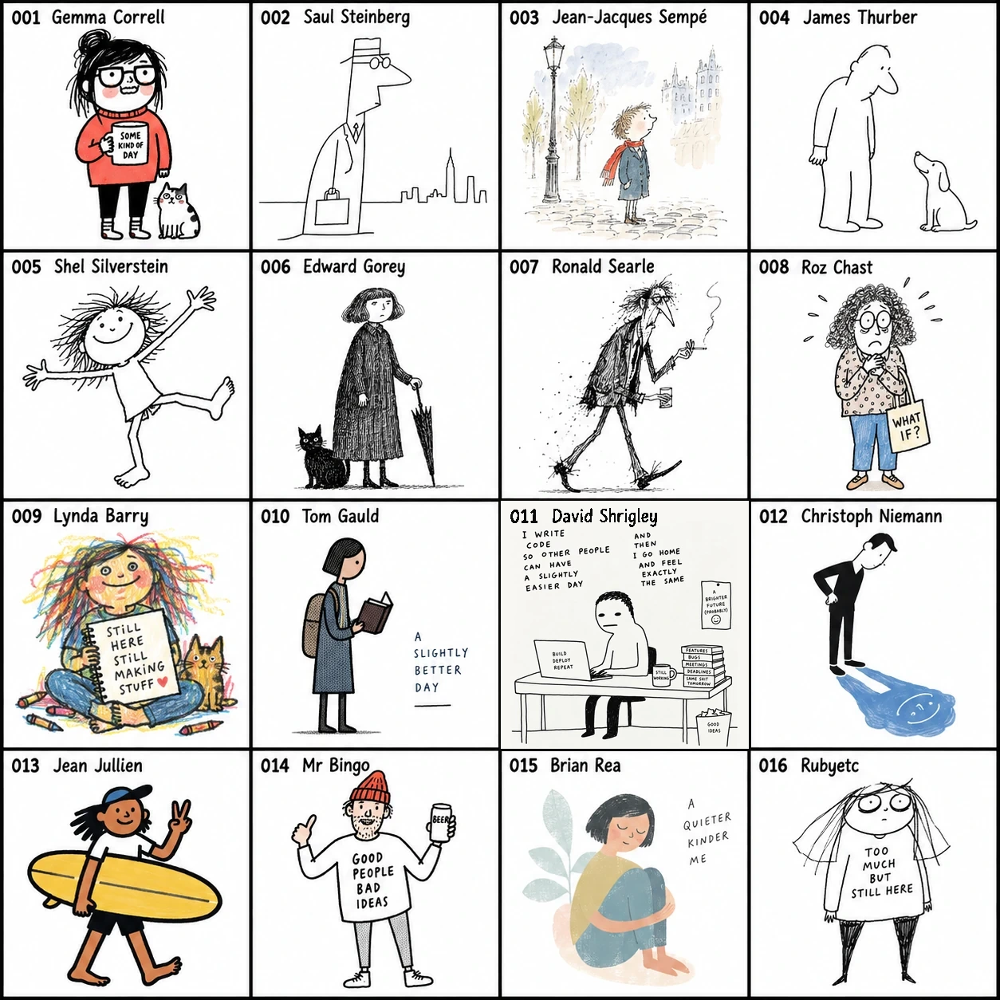
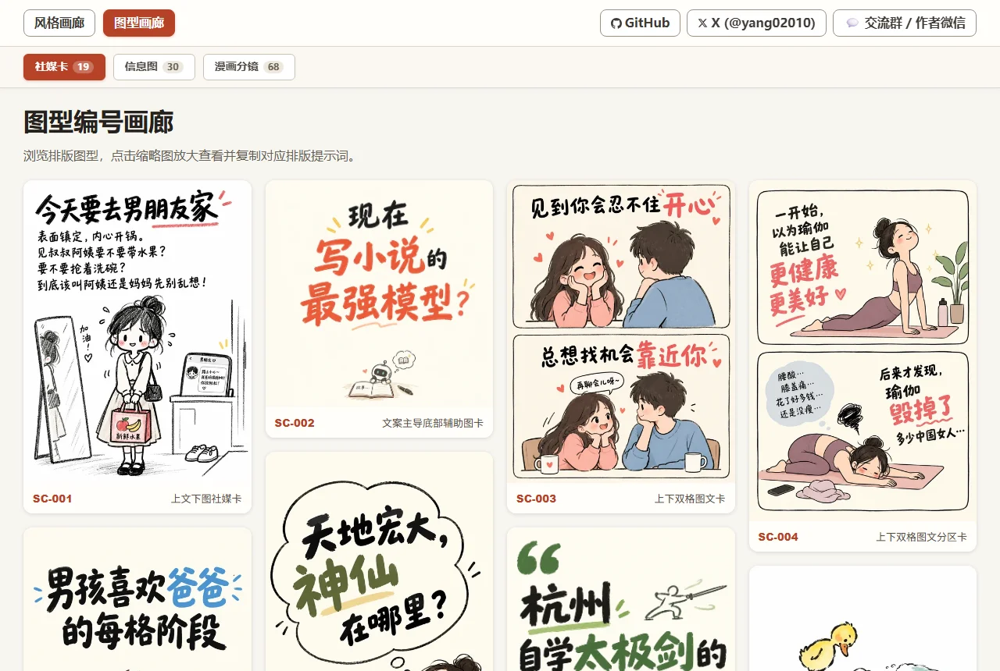
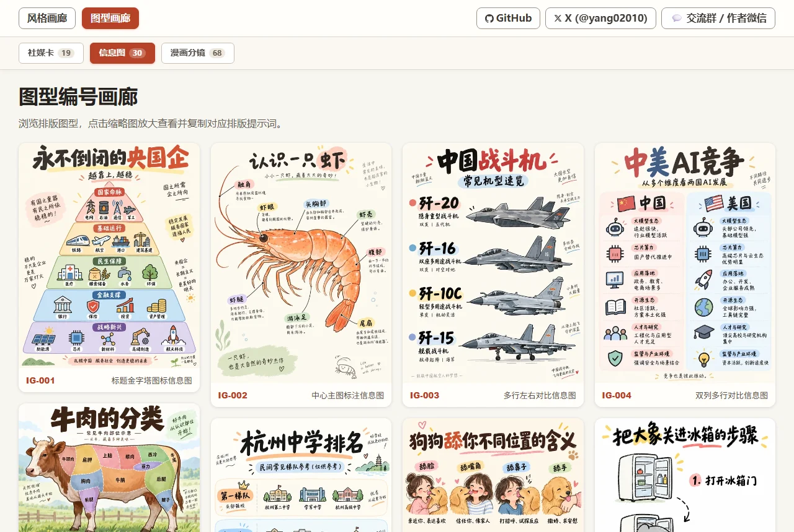
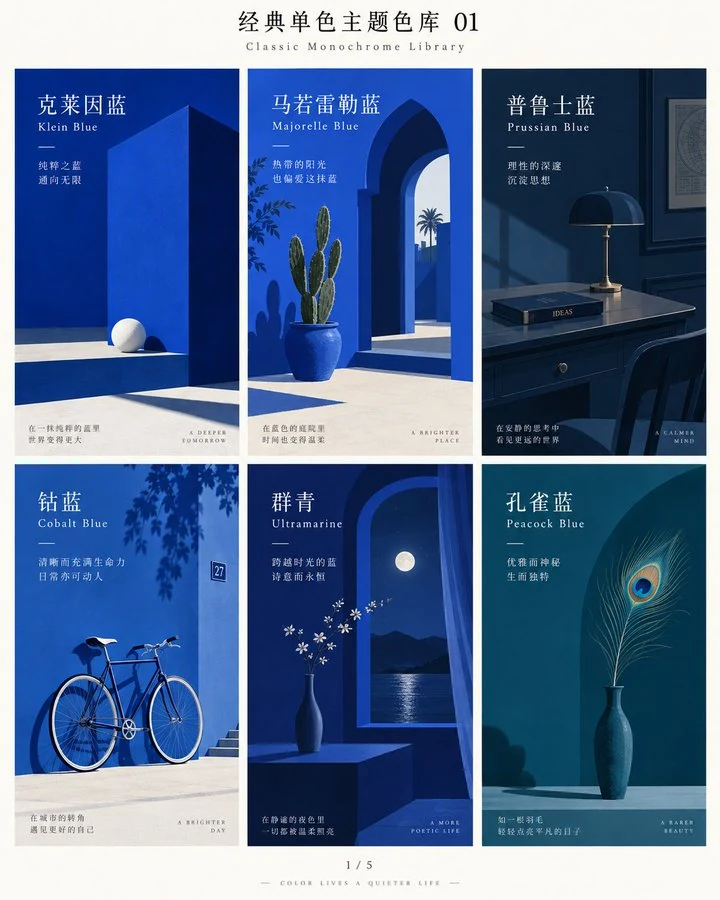

<p align="center">
  <a href="README.md">中文</a> | <strong>English</strong>
</p>

# Hand-drawn Style & Layout Prompter for AI Image Generation

> **Struggling to describe art styles? Trouble structuring visual layouts? Simply pick an index number to generate highly recognizable AI image prompts.**

This repository curates **278 distinct hand-drawn illustration styles** (`001`–`278`), **120 composition layout patterns** (`SC-*` Social Cards, `IG-*` Infographics, `SB-*` Comic Storyboards), and **30 curated classic monochrome colors** (`C-01`–`C-30`).

Whether you are crafting social media post covers, educational infographics, architectural comparisons, or multi-panel narrative comics, you no longer need to memorize obscure art history terminology or struggle with complex compositions. **Simply choose a style number, layout ID, and theme color, supply your topic, and instantly get verified, high-fidelity bilingual prompts ready to paste into Midjourney, DALL-E 3, Flux, Stable Diffusion, or any other image generator.**

---

## 🌟 Core Pain Points & Solutions

| Creator Pain Point | How This Library Solves It |
| :--- | :--- |
| **Vague style descriptions lead to style drift** | **Numbered Indexing**: 278 systematically categorized illustration styles, eliminating guess-and-pray prompting. |
| **Monotonous composition; hard to format complex graphics** | **120 Layout Compositions**: 20 Social Cards, 32 Infographics, 68 Comic Storyboards ready out-of-the-box. |
| **Chaotic color palettes lack a cohesive tonal mood** | **30 Curated Monochrome Colors**: Klein Blue, Sage Green, Hermes Orange, etc., setting pure and sophisticated tones with one click. |
| **Text disconnects from art; awkward typography placement** | **Dual-Mode Workflow**: Seamlessly toggle between "Pure-Image Mode" (pure illustration) and "Graphic-Text Mode" (unified visual-textual composition). |
| **Models ignore style keywords or lack style fidelity** | **Tiered Model Adaptation & Fallback**: Calibrated keyword activation for native models; automatic Reference Image Fallback (4-grid sheets) for all third-party models. |

---

## 🎯 Target Audiences & Use Cases

- **Content Creators & Influencers**: Social media covers (Xiaohongshu, Instagram, X/Twitter), newsletter hero images, viral quote cards.
- **Knowledge & Tech Bloggers**: Comparison lists, architecture pyramids, step-by-step processes, and high-engagement infographics.
- **Comic & Story Creators**: 4-panel strips, emotional webtoons, storyboard drafts, children's storybook illustrations.
- **Visual & Brand Designers**: Rapid concept sketching, creative campaign posters, character design prototypes.

---

## Installation

You can install this skill directly into your AI coding assistant (Codex, Claude Code, Cursor, WorkBuddy, OpenCode):

> **"Install this Skill for me: https://github.com/yang0/handraw-style"**

The assistant will automatically clone the repository and configure all styles, layout templates, and reference assets.

---

## How to Use This Skill

### 1. Smart Recommendation Mode (Zero Friction: No IDs Required)
If you don't want to browse through indexes, **simply describe what you want to illustrate**! The Skill analyzes your theme's mood, domain, and context, then **automatically pairs the best-matching hand-drawn style with an optimal classic monochrome theme color** (including an aesthetic rationale):
- *Zero-parameter prompt*: `Generate a prompt for a healing illustration of a cat sunbathing on a windowsill, pick the style and theme color for me (can combine)`
  > 💡 *Recommended Pairing*: Style `#018 · Minimal Deadpan Dialogue Cartoon` + Color `C-26 · Persimmon Orange` (Rationale: warm, comforting, and relaxed atmosphere), outputting production-ready bilingual prompts immediately.
- *Completion*: If you specify only a style (e.g., `Style 276, Theme: Future of AI`), the Skill auto-recommends a harmonious color (e.g., `C-01 Klein Blue`). If you specify only a color, it auto-recommends a fitting style.

### 2. Precise Manual Selection Mode (Choose Specific IDs)
1. Open the [Style Visual Sheet (STYLES_en.md)](STYLES_en.md), [Layout Visual Sheet (LAYOUTS_en.md)](LAYOUTS_en.md), or [Classic Monochrome Colors Sheet (COLORS_en.md)](COLORS_en.md) to browse visual sheets and pick your desired numbers;
2. Note your chosen ID, such as style `041`, layout `SC-001`, or theme color `C-01`;
3. Send your prompt command to the Skill, for example:
   - **Style only**: `Style: 041, Theme: First milk tea of autumn`
   - **Layout + Style**: `Layout: SC-001, Style: 041, Theme: First milk tea of autumn`
   - **With Theme Color**: `Layout: SC-001, Style: 041, Color: C-01, Theme: First milk tea of autumn`
4. Receive clean, copyable bilingual prompts with precise style definitions, layout geometry, and unified color palette;
5. Copy and paste into Midjourney, DALL-E 3, Stable Diffusion, Flux, or any image generator to create your artwork.

### 3. AI Poster Design Mode (Structured Prompts, Native Integrated Layout)
Need to design festival campaign visuals, key art, or editorial social media posters? Simply tell the Skill your poster theme!
- **Prompt Command**: `请帮我出海报提示词， 主题：秋分` (or `Generate a poster prompt for me, Theme: Autumn Equinox`)
- **Intelligent Synergy**: The Skill analyzes the concept and pairs the best-matching hand-drawn style (e.g., `#268 · Contemporary Literati Ink Cartoon`) with classic theme colors (e.g., `Dominant: C-26 Persimmon Orange + Accent: C-03 Prussian Blue`). It outputs clean, structured prompts across **8 core design dimensions** (Theme, Scene, Audience, Density, Mood, Palette, Editorial Style, Hand-Drawn Style) with typography-composition integration guidelines.
- **Real Generation Showcase**: Passing the prompt directly to an image generation model (e.g., GPT Image 2/2.5) yields seamless native typographic layout and artistic metaphor fusion—large-character calligraphy title, poetic couplet inscriptions, seal stamps, balanced day-and-night imagery, and relaxed literati ink brushwork:

<p align="center">
  
  <br>
  <em>Real Generation Case: Style #268 Contemporary Literati Ink Cartoon + C-26 Persimmon Orange (Dominant) / C-03 Prussian Blue (Accent)</em>
</p>

<details>
<summary>👉 Click to view the full poster design prompt</summary>

```text
主题：秋分·昼夜均而寒暑平
业务场景：二十四节气传统文化海报、文创书店/茶饮节日宣发主视觉、社媒节气签
受众：传统文化爱好者、文艺青年、生活美学追求者、大众社媒读者
内容密度：低
情感基调：松弛闲适、温润拙朴、平衡从容、金秋诗意
主题色：主色为柿子橙（Persimmon Orange），点缀色为普鲁士蓝（Prussian Blue）
editorial风格：Contemporary Literati Ink Cartoon Editorial 风格
画风：风格名称：#268 · Contemporary Literati Ink Cartoon。参考作者/风格名称：当代人文水墨漫画。核心风格特征：现代生活人物、动物和日常小场景；白色或微暖纸面、大面积留白；毛笔和墨线快速画人物；线条松弛、粗细不一、枯湿自然、允许断笔和不闭合轮廓；人物高度概括、比例略笨拙，以姿态和动作表达情绪；人物是画面的主要视觉主体；场景保留少量必要元素；墨色为主，少量朱红、赭石、石绿、湖蓝局部点染；书法题字和朱红印章自然嵌入留白；整体拙朴、松弛、幽默、闲适；现代生活速写与中国写意笔墨结合。【如果主题直白包含画面元素那就按主题出图，文案由你来升华，但是不要直接描述画面。 如果主题比较概念化，那么文案和主题尽量保持一致，如果文案较长由你提炼，由你先设计画面隐喻（人类和非人类都行）再出图   。    文字参与构图，图文一体】
```
</details>

### 4. Pro Tips: The Universal Poster Mindset (Treat Infographics as High-Density Posters)
Feeling constrained by pre-canned infographic layouts? **Don't let rigid grids trap your imagination!**
The essence of an infographic is an information-dense visual poster. Simply tell the Skill your **time slots, core metrics, steps, and usage scenarios**; the model natively weaves timeline nodes, scenery illustrations, and typography into a cohesive editorial layout:
- **Travel Itineraries**: *Chiang Mai 5-Day Roaming (Day 1 Itinerary)* (Timed routes + landmarks + Northern Thai cuisine & tips)
- **Outdoor Gear Guides**: *Ultralight Mountain Camping Packing Guide* (3 core systems knolling lay flat + 8kg limit, workwear style)
- **Lifestyle Skills**: *Beginner Pour-Over Coffee Guide* (1:15 ratio + 3-stage pulse pouring timeline + flavor wheel)

💡 **[👉 Click to read the full Tutorials & Pro Tips Guide (TUTORIALS_en.md)](TUTORIALS_en.md)** (Covers the Universal Poster Mindset, Dynamic Recommendation, Triad Assembly, Dual-Mode Switching, and Multi-Model Tiering with complete copyable prompts).

---

## Two Prompt Modes, Instant Switching

Any number and theme can seamlessly toggle between two modes without changing your style:

- **Pure-Image Mode (纯图模式)**: Let the theme dictate pure pictorial content without in-image text. Ideal for pure illustrations, wallpapers, book covers, and concept art.  
  *Example*: `Pure-image mode, Style: 041, Theme: First milk tea of autumn`
- **Graphic-Text Mode (图文模式)**: Preserves your copy text and guides the AI to design metaphors and integrate typography harmoniously into the visual composition. Ideal for quote posters, meme graphics, and social cards.  
  *Example*: `Graphic-text mode, Style: 267, Theme: There are many things you couldn't figure out back then. Don't worry, give it some time and you might just forget about them.`

Switch modes anytime by typing *"switch to pure-image mode"* or *"switch to graphic-text mode"*. Defaults to pure-image mode when unstated.

### Graphic-Text Mode Demonstration

The illustration below shows text integrated harmoniously with the visual composition (this is a conceptual demonstration and not tied to any single number):


---

### Model Adaptation Mechanism

By default, the Skill crafts copyable prompts. When you explicitly request image generation, it optimizes the output based on verified model capabilities:

- **Explicitly Calibrated Models (e.g., `gpt-image-2`)**: Full activation hierarchy for all 278 styles: Style/Author Name → Positive Core Traits → Reference Image only when traits alone cannot reliably trigger the style, avoiding unnecessary image passing that might over-constrain the composition.
- **Third-Party & General Models (Midjourney, Flux, Stable Diffusion, Imagen, Gemini, etc.)**: Employs the rock-solid **Reference Image Fallback** strategy. The Skill provides a 1024x1024 4-grid standard reference image or file path, ensuring 100% faithful reproduction of linework, texture, and color palette without prompt drift.
- **Open for Community Benchmarks**: Capability definitions reside in `skills/handdraw-style-prompter/references/model_capabilities.json`. Pull requests for other model evaluations are warmly welcomed!

---

## Three Quick Examples

```text
Style: 041, Theme: First milk tea of autumn
Style: 210, Theme: Little boy lighting firecrackers in the snow
Style: 193, Theme: Tang Dynasty Night Banquet
```

---

## Featured Styles Preview

Here is a contact sheet preview of featured hand-drawn illustration styles (001–016):



- 🖼️ **[👉 Browse All Style Sheets (001–278 Full Visual Contact Sheets)](STYLES_en.md)**
- 📄 **[View Detailed Style Metadata (278 Styles Table & Core Traits)](styles_200_reorganized.md)**
- 💻 *(For offline interactive search and enlargement, open `skills/handdraw-style-prompter/gallery/index.html` in your local browser)*

---

## Layout Compositions Showcase

In addition to 278 illustration styles, this library includes **120 composition layout patterns**, covering social cards, data infographics, and multi-panel storyboards. Combine any style with any layout with a single command.

### 1. Social Cards (20 Layouts)

Ideal for Xiaohongshu, Instagram, quote cards, and social media carousels. Includes top-bottom split, text-driven cards, two-column contrasts, and sticky notes.



👉 **[View All Social Card Layouts (20 Visuals & Prompts)](LAYOUTS_en.md#social-cards)**

---

### 2. Infographics (32 Layouts)

Ideal for knowledge breakdowns, comparison checklists, step-by-step processes, and structured data visuals. Includes hierarchy pyramids, central icons, matrices, and multi-column comparison tables.



👉 **[View All Infographic Layouts (32 Visuals & Prompts)](LAYOUTS_en.md#infographics)**

---

### 3. Comic Storyboards (68 Layouts)

Ideal for multi-panel narratives, webtoons, emotional storylines, and cinematic pacing. Includes standard 4-panel grids, dramatic wide-angle focus, diagonal cuts, and manga storyboards.


👉 **[View All Comic Storyboard Layouts (68 Visuals & Prompts)](LAYOUTS_en.md#comic-storyboards)**

---

- 💡 **[👉 Enter Full Layout Visual Sheet to Browse All 120 Layouts & Prompts ↗](LAYOUTS_en.md)**
- 💻 *(For offline interactive search and category filtering, open `skills/handdraw-style-prompter/gallery/layouts.html` in your local browser)*

---

## Classic Monochrome Colors Showcase (30 Colors)

This library curates **30 classic monochrome theme colors** (numbered `C-01` ~ `C-30`, covering Classic Blue, Fresh Green, Vintage Red & Classical, Romantic Pink & Purple, and Warm Sun & Earth).
No matter what illustration style or layout composition you choose, specifying a theme color instantly establishes a cohesive visual tone. You can also copy individual color prompts with one click in the offline gallery.



- 🎨 **[👉 Enter Classic Monochrome Colors Visual Sheet to Browse All 30 Colors & Prompts ↗](COLORS_en.md)**
- 💻 *(For offline interactive search and one-click copy, open `skills/handdraw-style-prompter/gallery/colors.html` in your local browser)*

---

## Author & Community

- **WeChat Community / Author WeChat**: Add WeChat with note **handdraw** to join the creators community:

  

- **X (Twitter)**: [@yang02010](https://x.com/yang02010)
- **GitHub**: [yang0/handraw-style](https://github.com/yang0/handraw-style)
