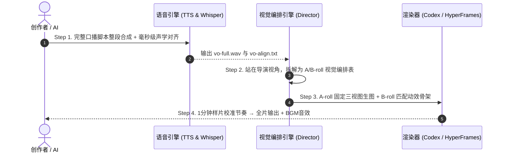

# 🎬 Knowledge Video Director · 知识类视频导演技能

本技能基于前沿 AI 知识类短视频爆款方法论（Codex + A/B-roll 架构），将复杂的软件操作、干货知识或商业教程，重构为具备**高完播率、极强人机对话感与商单级视觉质感**的工业级成片方案。

---

## 一、 核心叙事架构：A/B-roll 双轨轮替模型

视频画面必须明确拆分为两种截然不同的表现轨道，并在全片中保持 **每 10~15 秒交替一次** 的视觉刺激节奏：


### 1. ⚪ A-Roll（讲人、讲情绪、讲场景）
- **核心职能**：人机对话感、经历阐述、情绪共鸣、章节承接、开场钩子。
- **视觉风格**：白色或明亮浅底背景，统一的 IP 形象，突出人物呼吸感与陪伴感。
- **4 种镜头表达视角**：
  1. **主持人视角**：正对镜头，居中站位，胸部以上近景，眼神直视观众。用于开场钩子、章节过渡与总结陈词。
  2. **主角视角**：全景或中景，IP 角色是画面主体，在具体场景中做动作、敲键盘、互动、表现情绪。视线跟随动作，不直视镜头。
  3. **配角视角**：画面主体是新增配角，IP 角色作为旁观者或次要焦点，辅助解释场景。画风笔触与母本保持绝对一致。
  4. **第一人称视角**：主观镜头（POV），画面即 IP 角色眼睛看到的内容，通常看不到自身或仅看到手爪局部。用于强调“我看到了什么”或观察具体对象。

### 2. ⚫ B-Roll（讲知识、讲逻辑、展示实操）
- **核心职能**：承载具体知识增量、证据事实、方案对比、操作录屏与结构拆解。
- **视觉风格**：深色/黑色背景，科技感与设计感兼备，聚焦内容本身。
- **3 种资产分类**：
  1. **有素材型**：真实软件操作录屏、商单数据截图、产品实物特写。
  2. **无素材型**：抽象信息图形（步骤流、多方案横向对比、层级树状图、因果逻辑动效）。
  3. **纯文字型**：金句大字卡、章节导航目录、核心结论强调。

---

## 二、 工业级四步制作工作流 (Production Workflow)



---

## 三、 核心阶段执行标准与提示词模版

### 阶段 1：文案撰写、TTS 整段合成与声学对齐

> [!CAUTION]
> **严禁分句调用语音合成！** 必须将完整文案一次性提交合成单条长音频，否则句与句之间的语调、音量和底噪会出现严重撕裂。

#### 1. 配音与声学对齐提示词模版
```text
帮我完成配音和声学对齐，两步连着做完，中间不用停下来问我。

## 第一步：配音
- 配音文案：【填入文案或文件路径】
- 调用语音服务：火山引擎豆包语音合成 2.0（或指定音色）
- 音色 ID：【填入音色ID】，语速【1.0】，音量默认
- 整段文案一次性合成一整条完整音频。严禁分句合成再拼接，严禁分段调用多次接口。
- 输出路径：audio/vo-full.wav，44100 采样率，单声道
- 合成完成后打印音频总时长，精确到毫秒

## 第二步：声学对齐
- 对 audio/vo-full.wav 做短语级对齐，语言指定中文
- 采用 whisper large-v3（或现有对齐工具）
- 切分粒度是短语（每段控制在 5 到 15 个字），非机械整句
- 对齐结果与原文逐字核对，以原文为准，提取精准时间戳
- 时间轴不允许重叠或空缺，前一段结束时间即后一段开始时间

## 输出格式
写入 audio/vo-align.txt，格式严格如下：
[1249ms-3580ms] 现在的AI已经可以生成非常漂亮的图片了
[3580ms-6120ms] 但大多数人卡在不知道怎么描述画风

## 校验确认
打印：音频总时长、时间轴总段数、最后一段结束时间（必须与总时长一致）。
```

---

### 阶段 2：视觉编排表生成 (Director's Shot List)

站在视觉导演视角，按照配音语义与时间戳生成直接指导剪辑的结构化表格。每个镜头必须回答五个核心问题：
1. **这一段最需要观众理解什么？**
2. **什么画面能让这句话变得更具体、更容易理解？**
3. **画面中的主体发生什么变化？**
4. **镜头最后停留在什么结果上？**
5. **如何承接上一镜，并自然进入下一镜？**

#### 1. 标准视觉编排表格结构
| 镜头号 | 起止时间 (ms) | 配音文案 | 轨道/类型 | 视角 / 资产分类 | 画面设计 (主体/景别/构图) | 动态变化 (按旁白展开) | 画面衔接 |
| :--- | :--- | :--- | :--- | :--- | :--- | :--- | :--- |
| **S001** | 0 - 2450 | 现在的AI已经可以生成非常漂亮的图片了 | A-Roll | 主持人视角 | 白底，IP角色居中，正对镜头微笑伸出单手 | 角色打响指，头顶浮现火花特效 | 镜头微推切入 |
| **S002** | 2450 - 5800 | 但大多数人卡在不知道怎么描述画风 | B-Roll | 无素材/对比动效 | 深色背景，屏幕分屏展示3幅混乱标签 | 红色叉号淡入，文字变成乱码碎片 | 画面向正中收缩 |

#### 2. 全片节奏质检规则
- **避免连续疲劳**：严禁出现连续 3 个镜头以上均为同一轨道（如连续都是 A-Roll 或连续都是 B-Roll）。
- **动效有效性**：入场、呼吸微动、字幕滚动不算有效信息变化；较长镜头必须安排实质内容演进（主体出现 → 放大高亮 → 方案对比 → 结论定格）。

---

### 阶段 3：A-Roll 资产三件套与 IP 一致性约束

> [!IMPORTANT]
> 要想保证每一张 A-Roll 中的角色不崩坏，**严禁只传一张单图作为参考**。必须建立标准三件套基准：

1. **三视图基准图**：正面、侧面、背面同高同宽对齐，中立站姿，明确头身比（如 2.5 头身或 3 头身）。
2. **细节笔触图**：局部放大图，锁定线条粗细、线型、上色材质与笔触质感。
3. **场景风格图**：背景虚化程度、环境光、色调层次基准。

#### 1. A-Roll 出图提示词模版
```text
基于 IP 角色参考三件套和视觉编排表镜头信息，生成对应的 A-roll 画面。

## 参考图（严格参照）
[参考图1-三视图]：角色形象以这张为准，五官、体型、头身比例完全按这张来，严禁自由发挥。
[参考图2-场景图]：场景风格和背景层次以这张为准，保持背景虚化与简化，形成前后纵深。
[参考图3-细节笔触图]：笔画线条粗细、上色方式、手绘质感完全一致。

## 镜头信息与构图
- 镜头编号：【如 S004】
- 选定视角：【主持人视角 / 主角视角 / 配角视角 / 第一人称视角】
- 构图要求：【景别大小、角色站位、视线方向】
- 画面意图：【说明动作、情绪、道具】
```

---

### 阶段 4：B-Roll 动效选型与语义映射

将枯燥的概念根据语义结构映射为高效的动效骨架：

| 语义结构 | 适用内容场景 | 推荐动效骨架 |
| :--- | :--- | :--- |
| **对比 (Compare)** | 纯图 vs 图文、正常留白 vs 留白选多、修改前 vs 修改后 | 左右/上下分屏滑动、中线扫光、红绿标签交替 |
| **流程 (Steps)** | 安装步骤、拼装器三步出图流程、文章回填步骤 | 水平卡片依次点亮、光标连线推进、阶段数字翻牌 |
| **聚合 (Aggregate)** | 280 风格 + 137 图型 + 36 色彩汇聚为一套指令 | 散落粒子/卡片向中心飞入吸附合成大卡片 |
| **层级 (Hierarchy)** | 角色库（CH / PR / SCN）分类架构 | 树状展开、文件夹抽屉层级滑出 |
| **展开 (Expand)** | 8 大海报字段逐项展开、18 张 IP 卡片全景矩阵 | 瀑布流平滑滚动、扇形展开、卡片翻转阵列 |

---

## 四、 快速指令集与调用姿势

当用户调用本 Skill 时，按需执行以下典型指令：

- **从文章生成全套视频分镜**：
  > “使用 `knowledge-video-director`，基于以下文章/产品功能，规划一套 1 主片 + 多短片的 A/B-roll 视觉编排表与逐秒口播脚本。”
- **提取 IP 形象三视图与细节基准**：
  > “基于参考图，提取角色的五官、头身比、色号与笔触，生成 IP-002 标准三视图基准规范。”
- **B-Roll 动效骨架匹配**：
  > “为这段讲解【长文自动配图回填】的文案设计一个 B-Roll 动效方案，给出元素动作与前后衔接逻辑。”
- **全片节奏审查**：
  > “检查当前视觉编排表，审查 A-roll / B-roll 切换节奏是否过于单一，并标记需要实操录屏的镜头。”
